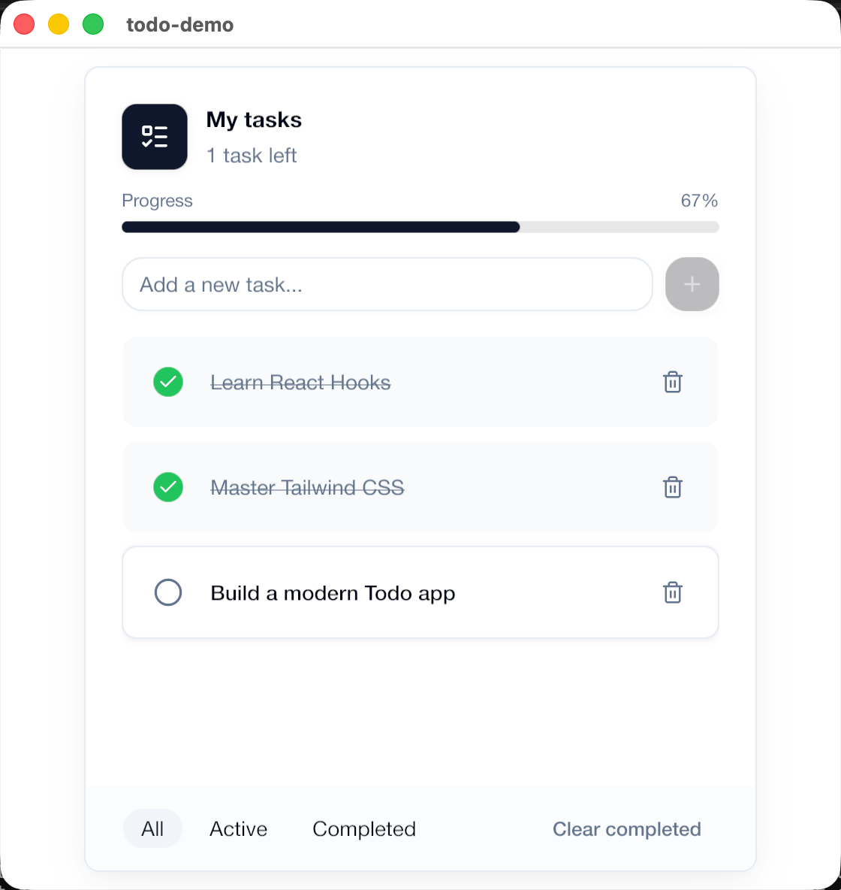
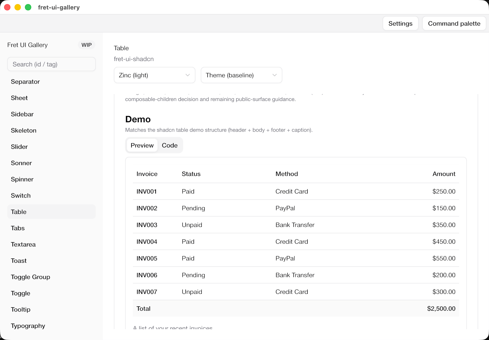
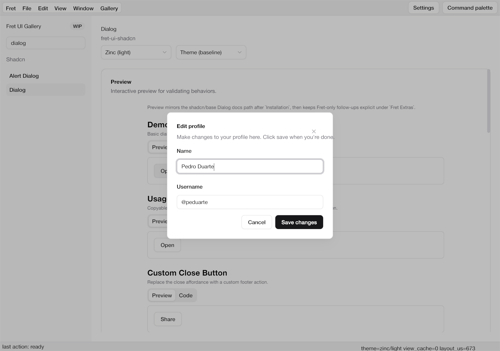
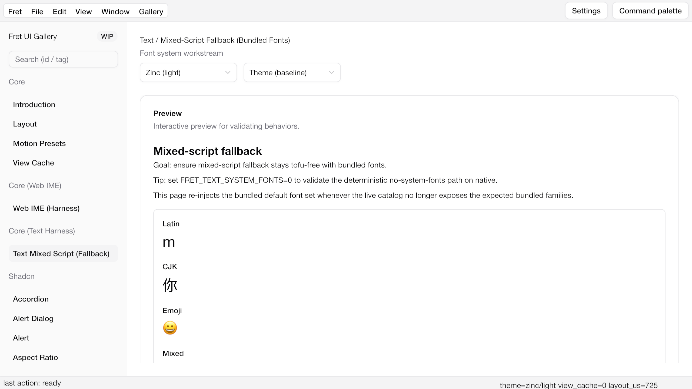

# Fret

<p align="center">
  
</p>

> [!WARNING]
> **Experimental — under heavy development.**
>
> This project is an experiment in AI-driven software development. The vast majority of the code, tests, and documentation were written by AI (Codex). Humans direct architecture, priorities, and design decisions, but have not reviewed most of the code line-by-line. Treat this accordingly — there will be bugs, rough edges, and things that don't work. Use at your own risk.

Fret is a GPU-first Rust UI framework for desktop apps, editor-grade tools, and WebGPU/wasm demos.

Modular by design, ecosystem included: start with small app surfaces today and grow into docking,
overlays, multi-window workflows, and embedded viewports without swapping foundations.

This repo focuses on the **core framework** (`crates/`) and incubates components + tooling
in-tree (`ecosystem/`, `apps/`). Long-term, some ecosystem crates may move to a separate
components repository.

## What Fret looks like

<table>
  <tr>
    <td width="50%" valign="top">
      
      <p><strong>Todo demo</strong><br />Starter-scale app surface built on the default shadcn-based path.</p>
    </td>
    <td width="50%" valign="top">
      
      <p><strong>UI Gallery / Table</strong><br />Component catalog and conformance surface for the shadcn-aligned layer.</p>
    </td>
  </tr>
  <tr>
    <td width="50%" valign="top">
      
      <p><strong>UI Gallery / Dialog</strong><br />Open-state overlay behavior with focus management and shadcn-aligned interaction semantics.</p>
    </td>
    <td width="50%" valign="top">
      
      <p><strong>Text / Mixed-script fallback</strong><br />Deterministic bundled-font rendering across Latin, CJK, and emoji on the native path.</p>
    </td>
  </tr>
</table>

## What Fret focuses on

- **Small apps to editor shells**: start with ordinary desktop/productivity UIs, then scale into
  docking, panels, tear-off windows, overlays, and richer interaction models.
- **GPU-first UI + embedded viewports**: treat GPU-backed surfaces as first-class UI citizens
  rather than special-case integrations.
- **Declarative app authoring in Rust**: the default path centers on `View`, `AppUi`,
  `LocalState`, typed actions, and shadcn-based components.
- **Mechanism/policy separation**: kernel/runtime crates stay policy-light; higher-level
  interaction defaults live in ecosystem crates.
- **Diagnostics and perf tooling**: `fretboard diag` gives app authors a shipped diagnostics core,
  while `fretboard-dev diag` keeps the richer mono-repo maintainer workflows.
- **Modular consumption**: portable core, pluggable platform/runner/render crates, and an explicit
  WebGPU/wasm path.

## Project Direction

Fret draws inspiration from:

- `Zed` / `GPUI` style UX and editor workflows.
- Mature web UI design systems translated into Rust-native APIs (shadcn/Radix-style patterns).

Upstream/reference links live closer to the code that uses them:

- [`ecosystem/fret-ui-shadcn/README.md`](ecosystem/fret-ui-shadcn/README.md) (shadcn/Radix/cmdk/Base UI references)
- [`ecosystem/fret-ui-headless/README.md`](ecosystem/fret-ui-headless/README.md) (behavioral ports like cmdk score + Embla)
- [`docs/reference-stack-ui-behavior.md`](./docs/reference-stack-ui-behavior.md) (APG + Radix + Floating UI + cmdk)

The goal is to provide a smooth, general-purpose application framework that scales from app UIs to editor-class products.

## Quick Start

Need help setting up your toolchain or speeding up local builds? See [docs/setup.md](./docs/setup.md).

Want the shortest onboarding path? Read [docs/first-hour.md](./docs/first-hour.md).

Need help choosing the right example entry point (templates vs cookbook vs gallery vs labs)? See [docs/examples/README.md](./docs/examples/README.md).

Repo CLI split:

- In this workspace, maintainer commands such as `list`, `hotpatch`, and `theme`, plus the
  repo-local `new` workflow, repo demo/cookbook `dev` shortcuts, and maintainer-only `diag`
  taxonomy (`suite`, `campaign`, `registry`, promoted script catalogs) run through
  `cargo run -p fretboard-dev -- ...`.
- The published `fretboard` CLI keeps the public `dev`, `diag`, `assets`, `config`, and starter
  `new` workflows.

Use the onboarding ladder on purpose:

- **Default**: `hello` → `simple-todo` → `todo`
- **Comparison**: `simple_todo_v2_target` only when you want to compare local-state/list ergonomics against the default path
- **Advanced**: gallery, interop, docking, renderer, and maintainer demos

Keep the default app-authoring model intentionally small: start with `LocalState` for view-owned
state, typed actions through `cx.actions()`, and the ladder above before dropping into richer
selector/query or maintainer-only surfaces. See
[docs/README.md](./docs/README.md#state-management-authoring-ergonomics) for the full surface map.

### 1) Run a lightweight cookbook example (recommended)

```bash
cargo run -p fretboard-dev -- dev native --example hello
cargo run -p fretboard-dev -- dev native --example simple_todo
```

### 2) Generate a new native app scaffold

Start with `simple-todo` (minimal baseline):

```bash
cargo run -p fretboard-dev -- new simple-todo --name my-simple-todo
cargo run -p fretboard -- dev native --manifest-path local/my-simple-todo/Cargo.toml
```

Then try the best-practice baseline (`todo`, includes selectors + queries):

```bash
cargo run -p fretboard-dev -- new todo --name my-todo
cargo run -p fretboard -- dev native --manifest-path local/my-todo/Cargo.toml
```

### 3) Explore demos and gallery surfaces

Discover runnable targets:

```bash
cargo run -p fretboard-dev -- list cookbook-examples
cargo run -p fretboard-dev -- list native-demos --all
cargo run -p fretboard-dev -- list web-demos
```

Run the UI gallery (optional; heavier than cookbook):

```bash
cargo run -p fret-ui-gallery
```

Run a web demo (optional):

```bash
cargo run -p fretboard-dev -- dev web --demo ui_gallery
```

### 4) Optional: diagnostics walkthrough (advanced)

Fret includes an optional diagnostics + scripted UI automation toolchain on the public CLI
(`fretboard diag`). Repo-only suite/campaign tooling remains on `fretboard-dev diag`.
If you are new to it, start with the cookbook walkthrough:

- [apps/fret-cookbook/README.md#diagnostics-optional](./apps/fret-cookbook/README.md#diagnostics-optional)
- [docs/ui-diagnostics-and-scripted-tests.md](./docs/ui-diagnostics-and-scripted-tests.md)

## Todo View Example

This is the interface shape the default path aims for: typed actions, `LocalState`, and
shadcn-based components.

```rust
use fret::app::prelude::*;
use fret::style::Space;

mod act {
    fret::actions!([Add = "app.todo.add.v1"]);
}

struct TodoView;

fn install_todo_app(app: &mut App) {
    shadcn::themes::apply_shadcn_new_york(
        app,
        shadcn::themes::ShadcnBaseColor::Slate,
        shadcn::themes::ShadcnColorScheme::Light,
    );
}

impl View for TodoView {
    fn init(_app: &mut App, _window: WindowId) -> Self {
        Self
    }

    fn render(&mut self, cx: &mut AppUi<'_, '_>) -> Ui {
        let draft = cx.state().local::<String>();
        let enabled = !draft.layout_value(cx).trim().is_empty();

        cx.actions().local(&draft).set::<act::Add>(String::new());

        let input = shadcn::Input::new(&draft)
            .a11y_label("New task")
            .placeholder("Add a task...")
            .submit_action(act::Add);

        let add_btn = shadcn::Button::new("Add").disabled(!enabled).action(act::Add);

        ui::h_flex(|cx| ui::children![cx; input, add_btn])
            .gap(Space::N2)
            .items_center()
            .into_element(cx)
            .into()
    }
}

fn main() -> fret::Result<()> {
    FretApp::new("todo")
        .window("todo", (560.0, 520.0))
        .config_files(false)
        .setup(install_todo_app)
        .view::<TodoView>()?
        .run()
}
```

Reference implementation:

- Cookbook: [`apps/fret-cookbook/examples/simple_todo.rs`](./apps/fret-cookbook/examples/simple_todo.rs)
- App-grade example: [`apps/fret-examples/src/todo_demo.rs`](./apps/fret-examples/src/todo_demo.rs)
- Guide: [`docs/examples/todo-app-golden-path.md`](./docs/examples/todo-app-golden-path.md)
- Example taxonomy: [`docs/examples/README.md`](./docs/examples/README.md)

## Ecosystem Coverage (Incubating)

Fret keeps stable boundaries in `crates/` and incubates faster-moving pieces in `ecosystem/`.

- Component systems:
  - [`fret-ui-kit`](./ecosystem/fret-ui-kit)
  - [`fret-ui-shadcn`](./ecosystem/fret-ui-shadcn)
  - [`fret-ui-material3`](./ecosystem/fret-ui-material3) (in progress)
- App architecture helpers:
  - [`fret-router`](./ecosystem/fret-router)
  - [`fret-query`](./ecosystem/fret-query)
  - [`fret-selector`](./ecosystem/fret-selector)
- Editor modules:
  - [`fret-node`](./ecosystem/fret-node)
  - [`fret-docking`](./ecosystem/fret-docking)
  - [`fret-viewport-tooling`](./ecosystem/fret-viewport-tooling)
- Visualization modules:
  - [`fret-chart`](./ecosystem/fret-chart)
  - [`fret-plot`](./ecosystem/fret-plot)
  - [`fret-plot3d`](./ecosystem/fret-plot3d)
- Icon packs and assets:
  - [`fret-icons`](./ecosystem/fret-icons)
  - [`fret-icons-lucide`](./ecosystem/fret-icons-lucide)
  - [`fret-icons-radix`](./ecosystem/fret-icons-radix)
  - [`fret-ui-assets`](./ecosystem/fret-ui-assets)

## Stable Entry Points

We intentionally keep the first-contact crate story small. Other crates in `ecosystem/` matter,
but these are the names we treat as stable entry points for most users:

- `fret`: desktop-first app facade and recommended starting point.
- `fret-ui-shadcn`: default component surface (shadcn/ui-aligned recipes).
- `fret-ui-kit`: component authoring glue and policy helpers.
- `fret-framework`: advanced/manual assembly facade.
- `fretboard`: templates, diagnostics, and native/web demo runner.

## References

- Zed editor: https://github.com/zed-industries/zed
- GPUI crate in Zed: https://github.com/zed-industries/zed/tree/main/crates/gpui

## MSRV and Toolchain

- MSRV is `1.92` (`workspace.package.rust-version`) aligned with current `wgpu` minimum requirements.
- Development toolchain is pinned in `rust-toolchain.toml` for reproducible local and CI behavior.

## License

Licensed under either of:

- MIT License (`LICENSE-MIT`)
- Apache License, Version 2.0 (`LICENSE-APACHE`)
