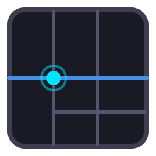

# Fret

<p align="center">
  
</p>

> [!WARNING]
> **Experimental learning project (not production-ready).**
>
> Fret is used to explore architecture and interaction ideas for Rust GUI systems. LLM tooling is used heavily as a development accelerator, and non-trivial changes are manually reviewed for code correctness and architecture direction before adoption. APIs and behavior may change quickly. **Do not use Fret in production systems.**

Fret is the precision fretboard for your Rust UI: a GPU-first framework that turns application logic into crisp, fluid interactions.

## Project Direction

Fret draws inspiration from:

- `Zed` / `GPUI` style UX and editor workflows.
- Mature web UI design systems (shadcn/Radix patterns) translated into Rust-native APIs.

The goal is to provide a smooth, general-purpose application framework that scales from app UIs to editor-class products.

## What Stands Out

- Multi-window editor UX: docking, tear-off windows, cross-window drag, multi-viewport workflows.
- Cross-platform direction: desktop-first (`winit`), with explicit web/wasm runner surfaces.
- Modular architecture: clear split between platform, UI mechanism layer, and renderer.
- GPU-first rendering path: retained scene + backend contracts + `wgpu` backend implementation.
- Documentation/ADR-driven contracts: hard-to-change boundaries are written first, then implemented.
- Ecosystem-first expansion: shadcn components today, Material 3 in progress, more packs over time.

## Quick Start

Create a new native todo app scaffold:

```bash
cargo run -p fretboard -- new todo --name my-todo
```

Run native demo:

```bash
cargo run -p fretboard -- dev native --bin todo_demo
```

Run web demo:

```bash
cargo run -p fretboard -- dev web --demo ui_gallery
```

## Todo App API Taste

This is the interface style we optimize for: typed state, typed messages, and shadcn-based components.

```rust
use std::sync::Arc;
use fret_kit::prelude::*;
use fret_ui_shadcn as shadcn;

#[derive(Clone)]
struct TodoItem {
    id: u64,
    done: Model<bool>,
    text: Arc<str>,
}

#[derive(Debug, Clone)]
enum Msg {
    Add,
    Remove(u64),
}

struct TodoState {
    todos: Model<Vec<TodoItem>>,
    draft: Model<String>,
    router: MessageRouter<Msg>,
    next_id: u64,
}

fn main() -> anyhow::Result<()> {
    fret_kit::app_with_hooks("todo", init_window, view, |d| d.on_command(on_command))?
        .with_main_window("todo", (560.0, 520.0))
        .run()?;
    Ok(())
}
```

```rust
fn view(cx: &mut ElementContext<'_, App>, st: &mut TodoState) -> ViewElements {
    st.router.clear();
    let add_cmd = st.router.cmd(Msg::Add);

    let input = shadcn::Input::new(st.draft.clone())
        .placeholder("Add a task")
        .submit_command(add_cmd.clone())
        .into_element(cx);

    let add_button = shadcn::Button::new("Add")
        .on_click(add_cmd)
        .into_element(cx);

    let card = shadcn::Card::new([
        shadcn::CardHeader::new([
            shadcn::CardTitle::new("Todo").into_element(cx),
            shadcn::CardDescription::new("State + router + shadcn components").into_element(cx),
        ])
        .into_element(cx),
        shadcn::CardContent::new([
            ui::v_flex(cx, |_cx| [input, add_button])
                .gap(Space::N3)
                .into_element(cx),
        ])
        .into_element(cx),
    ])
    .into_element(cx);

    vec![card].into()
}
```

Reference implementation:

- `apps/fret-examples/src/todo_demo.rs`
- `docs/examples/todo-app-golden-path.md`


## Ecosystem Coverage (Incubating)

Fret keeps stable boundaries in `crates/` and incubates faster-moving pieces in `ecosystem/`.

- Component systems:
  - [`fret-ui-kit`](https://github.com/Latias94/fret/tree/main/ecosystem/fret-ui-kit)
  - [`fret-ui-shadcn`](https://github.com/Latias94/fret/tree/main/ecosystem/fret-ui-shadcn)
  - [`fret-ui-material3`](https://github.com/Latias94/fret/tree/main/ecosystem/fret-ui-material3) (in progress)
- App architecture helpers:
  - [`fret-router`](https://github.com/Latias94/fret/tree/main/ecosystem/fret-router)
  - [`fret-query`](https://github.com/Latias94/fret/tree/main/ecosystem/fret-query)
  - [`fret-selector`](https://github.com/Latias94/fret/tree/main/ecosystem/fret-selector)
- Editor modules:
  - [`fret-node`](https://github.com/Latias94/fret/tree/main/ecosystem/fret-node)
  - [`fret-docking`](https://github.com/Latias94/fret/tree/main/ecosystem/fret-docking)
  - [`fret-viewport-tooling`](https://github.com/Latias94/fret/tree/main/ecosystem/fret-viewport-tooling)
- Visualization modules:
  - [`fret-chart`](https://github.com/Latias94/fret/tree/main/ecosystem/fret-chart)
  - [`fret-plot`](https://github.com/Latias94/fret/tree/main/ecosystem/fret-plot)
  - [`fret-plot3d`](https://github.com/Latias94/fret/tree/main/ecosystem/fret-plot3d)
- Icon packs and assets:
  - [`fret-icons`](https://github.com/Latias94/fret/tree/main/ecosystem/fret-icons)
  - [`fret-icons-lucide`](https://github.com/Latias94/fret/tree/main/ecosystem/fret-icons-lucide)
  - [`fret-icons-radix`](https://github.com/Latias94/fret/tree/main/ecosystem/fret-icons-radix)
  - [`fret-ui-assets`](https://github.com/Latias94/fret/tree/main/ecosystem/fret-ui-assets)

## Public Crate Surfaces (v0.1)

- `fret`: framework facade and stable entry point.
- `fret-ui-kit`: component authoring glue and policy helpers.
- `fret-ui-shadcn`: shadcn-inspired component recipes.
- `fret-node`: node-graph foundation for editor workflows.
- `fret-router`: typed message routing for app architecture.

## References

- Zed editor: https://github.com/zed-industries/zed
- GPUI crate in Zed: https://github.com/zed-industries/zed/tree/main/crates/gpui

## MSRV and Toolchain

- MSRV is `1.92` (`workspace.package.rust-version`) aligned with current `wgpu` minimum requirements.
- Development toolchain is pinned in `rust-toolchain.toml` for reproducible local and CI behavior.

## License

Licensed under either of:

- MIT License
- Apache License, Version 2.0
