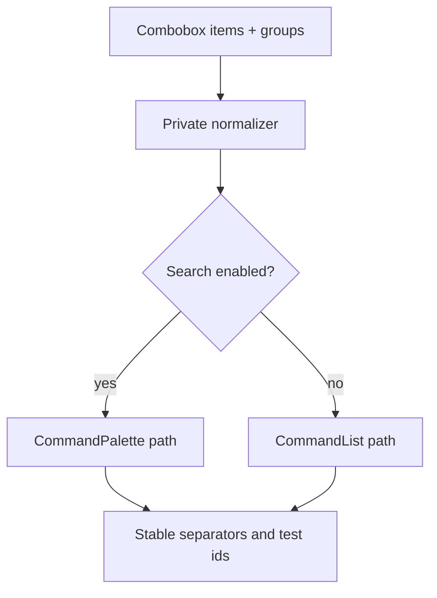

# Refactor shadcn combobox shell duplication

## Summary
This plan trims the duplicated combobox list assembly path in `ecosystem/fret-ui-shadcn/src/combobox.rs`.
The first slice keeps the public `Combobox` surface intact, but routes the search-enabled and non-search branches through one shared private normalizer so item grouping, separator policy, and `test_id` generation are defined once.

The broader family review points to `select`, `combobox`, and `command` as the highest-value surfaces. This plan starts with the clearest duplicate shell in `combobox.rs` and defers the other families until the helper shape proves itself.

---

## Problem Frame
`combobox.rs` is one of the largest shadcn recipe modules, and it repeats the same root-item, grouped-item, separator, and test-id assembly logic in multiple branches. That makes the file harder to maintain and increases the chance of branch drift even when the rendered behavior is supposed to stay identical.

The goal here is not to redesign the component family. The goal is to remove avoidable shell duplication while keeping the current command-palette substrate, selection behavior, and selector surface stable.

---

## Requirements
- R1. The combobox module must normalize root items, labeled groups, empty groups, separators, and `test_id` suffixes through one shared path.
- R2. Search-enabled and non-search combobox rendering must remain behaviorally identical for ordering, grouping, selection, and close-on-select behavior.
- R3. The refactor must not change the public `fret_ui_shadcn` API or the current shadcn composition surface.
- R4. The first slice must stay small enough to prove parity with focused combobox tests rather than a new global harness.

---

## Key Technical Decisions
- Keep the helper private to `ecosystem/fret-ui-shadcn`. This is a recipe cleanup, not a new public API.
- Preserve the current `CommandEntry` / `CommandList` / `CommandPalette` substrate. The plan is to remove duplication, not to swap the underlying list engine.
- Treat `select.rs` and `command.rs` as follow-on surfaces. They are relevant reference points, but they are not part of this first cut.

---

## High-Level Technical Design

---

## System-Wide Impact
Combobox is a public recipe surface used by gallery snippets and app authors. Even a pure refactor needs to preserve stable selectors, separator placement, and selection semantics because those are observable in tests and diag scripts.

The change should stay inside `ecosystem/fret-ui-shadcn` unless the helper shape unexpectedly proves a reusable policy primitive. That would be a separate decision, not an assumption for this slice.

---

## Scope Boundaries
### Deferred for later
- `ecosystem/fret-ui-shadcn/src/select.rs`
- `ecosystem/fret-ui-shadcn/src/command.rs`
- the menu and overlay family (`dropdown_menu`, `context_menu`, `menubar`, `popover`, `dialog`, `alert_dialog`, `drawer`, `sheet`, `tooltip`)

### Outside this plan's identity
- `crates/fret-ui` mechanism changes
- public API redesigns for `fret_ui_shadcn`
- broad docs or gallery rewrites that are not needed to prove combobox parity

---

## Risks & Dependencies
- Separator drift could change the visible list structure even if the item set stays the same.
- `test_id` fallback drift could break stable automation on combobox demos.
- The helper can become too generic if it tries to cover too many future surfaces in the first pass.
- The current combobox unit tests in `ecosystem/fret-ui-shadcn/src/combobox.rs` must stay green while the shell is flattened.

---

## Implementation Units

### U1. Extract the shared combobox list normalizer
**Goal:** Factor the duplicated root-item, group, separator, and `test_id` assembly into one private helper inside `ecosystem/fret-ui-shadcn/src/combobox.rs`.

**Requirements:** R1, R3, R4

**Dependencies:** none

**Files:** `ecosystem/fret-ui-shadcn/src/combobox.rs`

**Approach:** Pull the repeated item/group normalization into a private helper that returns the same ordered command-entry tree for both combobox branches. Keep branch-specific chrome and substrate selection outside the helper.

**Execution note:** Start with characterization coverage for one root-item + one grouped-item case before replacing the duplicated builder path.

**Patterns to follow:** the existing `combobox_group_items` helper in the same module, current command-entry assembly in `combobox.rs`, and the shadcn component style used elsewhere in `ecosystem/fret-ui-shadcn`.

**Test scenarios:**
- Happy path: a combobox with root items and one labeled group still produces the same ordered visible entries.
- Edge case: empty groups are skipped and do not create separators.
- Edge case: explicit `test_id` prefixes still generate the same item and separator suffixes.
- Integration: the selection callback still commits the same item and closes through the existing path.

**Verification:** the duplicated item/group/separator assembly is gone, and the helper produces the same combobox entry order for both branches.

### U2. Route both combobox branches through the shared normalizer
**Goal:** Switch the search-enabled and non-search branches to the shared helper and delete the second copy of the item-body construction.

**Requirements:** R1, R2

**Dependencies:** U1

**Files:** `ecosystem/fret-ui-shadcn/src/combobox.rs`

**Approach:** Keep the search-enabled and non-search branch differences limited to surface-specific chrome and substrate choice. Let the helper own normalization, separator insertion, and test-id fallback so the branches no longer drift.

**Execution note:** Keep the non-search branch behind the characterization coverage until both branches call the same helper.

**Patterns to follow:** the current `CommandPalette` and `CommandList` branch split in `combobox.rs`, and the item-building conventions already used by `combobox_chips`.

**Test scenarios:**
- Happy path: search-enabled and non-search comboboxes still render the same item order for the same data.
- Edge case: grouped items with content children keep the same layout behavior and do not gain extra wrappers.
- Edge case: root-only data still renders without inserting spurious separators.
- Integration: existing open/commit/close combobox tests pass without expectation changes.

**Verification:** both branches share the same normalization path, and the refactor only removes duplicate shell code.

### U3. Lock the refactor with focused combobox parity tests
**Goal:** Strengthen the current combobox tests so the shell refactor is gated by stable ordering, separator, and selector assertions.

**Requirements:** R2, R4

**Dependencies:** U1, U2

**Files:** `ecosystem/fret-ui-shadcn/src/combobox.rs`

**Approach:** Add or adjust the smallest tests that prove the helper did not change item ordering, separator placement, or selector generation. Reuse the existing component-local tests rather than introducing a new harness.

**Patterns to follow:** the current combobox test style in `ecosystem/fret-ui-shadcn/src/combobox.rs`, and the command-palette behavior tests already present in `ecosystem/fret-ui-shadcn/src/command.rs` as a reference point for later family work.

**Test scenarios:**
- Happy path: the refactored combobox still opens and selects the same item set.
- Edge case: empty groups and group separators stay deterministic.
- Edge case: explicit test ids override fallback ids exactly as before.
- Integration: the existing combobox selection and close behavior tests pass unchanged after the refactor.

**Verification:** focused combobox tests pass, and the diff only removes duplicate shell assembly.

---

## Sources / Research
- `docs/shadcn-declarative-progress.md`
- `docs/crate-usage-guide.md`
- `ecosystem/fret-ui-shadcn/src/combobox.rs`
- `ecosystem/fret-ui-shadcn/src/command.rs`
- `ecosystem/fret-ui-kit/src/primitives/combobox.rs`
- `ecosystem/fret-ui-kit/src/primitives/select.rs`
- `repo-ref/ui/apps/v4/registry/new-york-v4/ui/combobox.tsx`
- `repo-ref/ui/apps/v4/registry/new-york-v4/ui/command.tsx`
- `repo-ref/base-ui/packages/react/src/combobox/root/ComboboxRoot.test.tsx`
- `repo-ref/base-ui/packages/react/src/select/root/SelectRoot.test.tsx`
