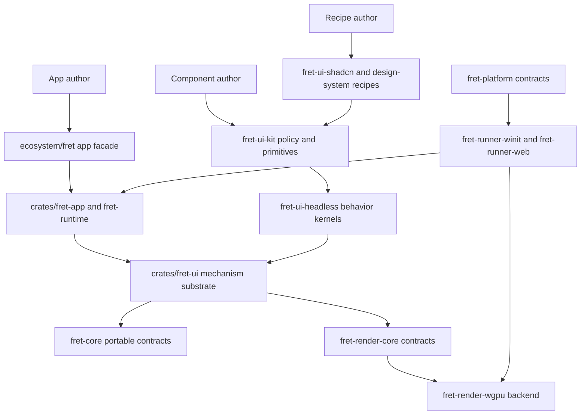
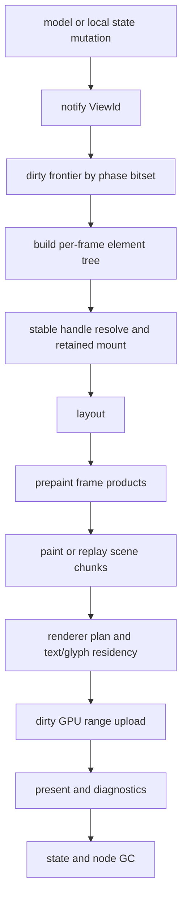
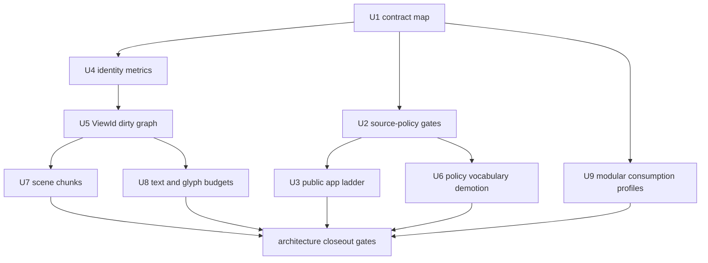

# Refactor Fret UI framework architecture convergence

## Goal Capsule

| Field | Value |
| --- | --- |
| Objective | Converge Fret into a GPUI/Zed-aligned, GPU-first, cross-platform UI framework with explicit runtime contracts, source-policy gates, editor-grade performance guardrails, and copyable real-app authoring paths. |
| Authority | ADRs and workstream closeouts are authoritative over local preference; `repo-ref/zed`, GPUI component patterns, Radix/Base UI/shadcn references, and local audits shape decisions where Fret contracts are still open. |
| Execution profile | Fearless pre-release refactor: break transitional and experimental surfaces when the new contract is clearer, but preserve platform portability, renderer/backend separation, and mechanism-vs-policy ownership. |
| Stop conditions | Stop and add/update an ADR when a slice changes a hard contract for identity, input, focus, overlays, text, rendering, diagnostics, or public authoring. Stop if a proposed change reopens a closed broad lane instead of creating a narrow follow-on. |
| Tail ownership | Each slice must leave a repro, gate, evidence anchors, and deletion/retention note. Progress state belongs in workstreams or engineering memory, not in this plan. |

---

## Product Contract

### Summary

Fret already has the right high-level direction: per-frame declarative elements, retained runtime mechanisms, GPU/WebGPU rendering, modular crate boundaries, and ecosystem policy layers.
The architectural problem is convergence.
The core contracts are spread across ADRs, workstreams, examples, perf logs, and facade docs, while several implementation surfaces still teach or optimize the old mental model.

This plan turns the current direction into an implementation sequence.
The target is a framework where ordinary app authors think in `FretApp`, `View`, `AppUi`, `LocalState`, typed actions, and `notify`, while runtime maintainers reason in `ViewId`, `ViewBoundary`, stable handles, dirty frontiers, prepaint frame products, scene chunks, and renderer/text cache budgets.

### Problem Frame

The audits found four high-impact risks.

First, `crates/fret-ui` has clean dependency boundaries but a widening responsibility surface.
Overlay dismissal, autofocus, outside press, scroll dismiss, and resizable style vocabulary are public runtime names even though ADR 0066 says policy belongs in ecosystem crates.

Second, Fret's GPUI-style model is directionally correct but not yet the default implementation truth.
ADR 0165 still defines dirty views as cache-root-first, identity relies heavily on `GlobalElementId` hashes and mounted retained node repair, and frame outputs are not uniformly owned by a stable `ViewId` or `ViewBoundary`.

Third, performance gates are strong but not yet architectural enough.
Layout, hit-test, dispatch, renderer scene encoding, text caches, and atlas paths have targeted optimizations, but the long-term architecture still risks O(active tree) repair, O(scene ops) encode, and whole-buffer uploads for local edits.

Fourth, the public user journey jumps from todo examples to advanced/gallery/driver surfaces too quickly.
Fret's editor-grade positioning needs a second-hour ladder that proves settings, command palette, data tables, workspace shell, canvas/node graph, async submit, and diagnostics without forcing first-contact users into `FnDriver`, `UiTree`, or raw `ElementContext`.

### Requirements

**Architecture contracts**

- R1. Keep `crates/fret-ui` as the mechanism substrate and move interaction policy vocabulary and defaults into `ecosystem/fret-ui-headless`, `ecosystem/fret-ui-kit`, and recipe crates.
- R2. Make `ViewId`, `ViewBoundary`, `notify`, `prepaint`, `SceneFragment`, stable handles, and dirty frontiers the primary maintainer vocabulary for runtime execution.
- R3. Keep retained runtime internals valid, but prevent retained widget authoring, raw `UiTree`, and node-level invalidation from returning to default app or recipe authoring paths.
- R4. Preserve cross-platform layering: `fret-ui` must not depend on `winit`, `wgpu`, platform SDK crates, or backend implementation crates.

**Performance architecture**

- R5. Add metrics before broad rewrites so identity fallback scans, parent repair, GC reachability, dispatch snapshot misses, scene encoding misses, buffer uploads, text cache size, glyph eviction, and wasm memory pressure are visible.
- R6. Move identity and dirty propagation toward stable handle plus dirty bitset ownership before deleting hash-keyed compatibility paths.
- R7. Move rendering toward retained scene chunks, chunk fingerprints, renderer plan reuse, and dirty GPU range uploads, with flat `Scene` compatibility retained only as an explicit bridge.
- R8. Bound text shaping/layout/glyph residency caches and ensure local text edits invalidate only affected text chunks, not whole-scene encoding.

**Authoring and DX**

- R9. Keep `fret::app::prelude::*` as the first-contact path and gate default tutorials, scaffold templates, and copyable app recipes against raw runtime imports.
- R10. Add a second-hour app ladder that proves `workbench-lite`, settings dialog, command palette, data-admin table, workspace shell, and canvas/node graph starters through public surfaces.
- R11. Keep `fret-framework` as advanced/manual assembly, not the default application crate.

**Verification and governance**

- R12. Convert architecture expectations into source-policy, compile-profile, diagnostics, and perf gates rather than relying on prose.
- R13. Treat existing closed workstreams as evidence and start narrow follow-ons for new implementation scope.
- R14. Update ADR alignment when any slice changes implementation status for accepted hard contracts.

### Acceptance Examples

- AE1. A first-hour starter or copyable app recipe compiles without `use fret_ui::`, `use fret_core::`, `FnDriver`, `UiTree`, or `fret::advanced::prelude::*` unless the file is explicitly labeled advanced.
- AE2. A model or local-state mutation in a `View` marks that `ViewId` dirty, coalesces redraw scheduling, and records diagnostics that explain why the view rebuilt or reused cached frame products.
- AE3. A hover, focus ring, cursor blink, or selection update can run as paint-only or small-chunk work without relayouting unrelated shell structure.
- AE4. A single-line text edit or caret blink in an editor-like surface dirties a small scene/text chunk, preserves renderer plan reuse for clean chunks, and uploads only bounded dirty GPU ranges.
- AE5. A dialog/popover/menu policy change is implemented in ecosystem policy/headless crates while `crates/fret-ui` exposes only generic layer, focus, capture, and outside-interaction mechanisms.
- AE6. A `workbench-lite` scaffold proves command palette, settings dialog, status bar, data/content pane, and one async submit flow without asking the user to learn advanced runtime seams.

### Scope Boundaries

In scope:

- Hardening runtime contracts around identity, dirty propagation, frame phases, diagnostics, scene reuse, renderer upload, text caches, and policy ownership.
- Moving or renaming public runtime vocabulary when it currently encodes component policy.
- Adding source-policy gates, consumption-profile gates, diagnostics counters, and perf budget checks.
- Creating or updating narrow follow-on workstreams when implementation scope outgrows one slice.
- Adding copyable app recipes, starter templates, and docs that prove the intended public authoring ladder.

Can break during this pre-release refactor:

- Transitional `fret-ui` public names that encode policy rather than mechanism.
- Experimental, compatibility, or advanced surfaces not protected by an accepted stable contract.
- In-tree examples that currently teach low-level runtime seams as ordinary app code.
- Private runtime paths replaced by stable handle, boundary, dirty graph, scene chunk, or text cache mechanisms with gates.

Must not break without ADR update:

- `fret-ui` portability and backend independence.
- Mechanism-vs-policy ownership from ADR 0066.
- Declarative element identity and externalized state principles from ADR 0028 and ADR 0319.
- Retained runtime internal/compat posture from ADR 0330.
- Frame Pipeline v2 phase and `ViewBoundary` contract from ADR 0327.
- Font/text cache correctness contracts tracked by text ADRs.

Deferred to follow-up work:

- A new renderer backend beyond wgpu.
- Full out-of-tree ecosystem extraction.
- A complete component library expansion unrelated to proving architecture contracts.
- Product-level redesign of Fret positioning.

---

## Planning Contract

### Key Technical Decisions

| ID | Decision | Rationale |
| --- | --- | --- |
| KTD1 | Keep the GPUI/Zed mental model but not GPUI's platform coupling. | Fret should copy per-frame elements, externalized state, dirty views, prepaint, and frame-product reuse, while preserving portable platform/render crates and wasm/WebGPU boundaries. |
| KTD2 | Promote `ViewId` to the primary dirty-view contract and keep cache-root-first behavior only as a compatibility mapping. | ADR 0165 names the intended direction; the current cache-root-first default is a migration step, not the long-term authoring model. |
| KTD3 | Add stable handle and architecture metrics before replacing hash-keyed runtime paths. | Current identity repair can degrade into scans and parent repair under scale; metrics make the migration measurable and prevent a blind rewrite. |
| KTD4 | Treat prepaint, dispatch snapshots, hitboxes, input handlers, semantics bounds, text layout indexes, and scene fragments as frame products owned by a boundary. | GPUI uses this lifecycle to reuse work safely; Fret's ADR 0327 already accepted the same phase model. |
| KTD5 | Rename or demote policy-coded runtime vocabulary instead of documenting around it. | Names such as `DismissReason` and `scroll_dismiss_elements` make policy look like runtime contract. Pre-release breakage is cheaper than carrying the wrong doctrine. |
| KTD6 | Evolve flat `Scene` into retained scene chunks behind a compatibility bridge. | Whole-scene fingerprints and whole-buffer uploads are not enough for editor-scale local edits, but the existing scene contract and conformance tests should be preserved during migration. |
| KTD7 | Make source-policy checks first-class architecture gates. | Dependency layering checks cannot catch responsibility drift, default-path import leaks, or accidental public API widening. |
| KTD8 | Add second-hour app slices before more component breadth. | The framework's value is not proven by a larger component catalog; it is proven when real tool/editor slices are copyable through the public app surface. |
| KTD9 | Keep modular consumption profiles explicit. | `fret`, `fret-framework`, `fret-ui`, `fret-ui-kit`, and recipe crates serve different consumers; collapsing them into one facade would trade short-term convenience for long-term boundary drift. |

### High-Level Technical Design

#### Target Layering

#### Runtime Execution Model

#### Delivery Dependency

### Assumptions

- The repository is still pre-release enough that breaking internal and experimental public surfaces is acceptable when it prevents a future major rewrite.
- Existing docs and ADRs are close to the desired target; the plan's job is to converge implementation, examples, and gates rather than invent a second architecture.
- `ecosystem/fret-ui-headless` exists and is the right owner for pure behavior kernels that do not require UI rendering policy.
- Perf work should start from metrics and existing diag baselines, then refactor only where worst-bundle attribution points.

### System-Wide Impact

- `crates/fret-ui` becomes smaller as a public contract even if its internal runtime remains powerful.
- `ecosystem/fret-ui-kit` and `ecosystem/fret-ui-headless` gain explicit ownership for dismiss, focus trap/restore, roving focus, typeahead, and related interaction policy.
- `ecosystem/fret` remains the app-facing facade but should be internally split enough that `view.rs` does not become a second monolith.
- `crates/fret-render-wgpu` gains chunk/dirty-range and text/cache budget contracts without leaking wgpu types into UI or app crates.
- `apps`, `docs`, and `crates/fretboard` become part of architecture verification because they teach the mental model users copy.

---

## Implementation Units

### U1. Freeze the convergence contract and owner map

- **Goal:** Convert the current ADR/workstream direction into one current contract map for identity, dirty views, frame phases, policy ownership, renderer/text boundaries, app facade, and modular consumption.
- **Requirements:** R1, R2, R3, R4, R12, R13, R14.
- **Dependencies:** None.
- **Files:** `docs/golden-architecture.md`, `docs/runtime-contract-matrix.md`, `docs/ui-closure-map.md`, `docs/adr/0165-dirty-views-and-notify-gpui-aligned.md`, `docs/adr/0327-frame-pipeline-v2-and-view-boundaries.md`, `docs/adr/0066-fret-ui-runtime-contract-surface.md`, `docs/adr/IMPLEMENTATION_ALIGNMENT.md`, `docs/workstreams/fearless-architecture-convergence-v1/TODO.md`.
- **Approach:** Update only the authoritative map and alignment rows needed to make the target vocabulary unambiguous. Do not reopen the closed Frame Pipeline v2 lane; link new work to narrow follow-ons where the existing lane says future work belongs.
- **Patterns to follow:** `docs/workstreams/fearless-architecture-convergence-v1/DESIGN.md`, `docs/workstreams/ui-frame-pipeline-v2-fearless-refactor-v1/FINAL_CLOSEOUT_AUDIT_2026-05-14.md`, `docs/workstreams/framework-modularity-fearless-refactor-v1/design.md`.
- **Test scenarios:** Test expectation: none - this unit changes contract documentation and alignment metadata only.
- **Verification:** A reader can trace each active hard contract from target vocabulary to an ADR/workstream owner, and `docs/workstreams/fearless-architecture-convergence-v1` either closes or delegates remaining cuts to named follow-ons.

### U2. Add responsibility source-policy gates

- **Goal:** Add automated checks that catch responsibility drift not visible in dependency graphs.
- **Requirements:** R1, R3, R4, R9, R11, R12.
- **Dependencies:** U1.
- **Files:** `tools/check_layering.py`, `tools/check_consumption_profiles.py`, `tools/check_surface_policy.py`, `crates/fret-ui/src/lib.rs`, `ecosystem/fret/src/lib.rs`, `apps/fret-cookbook/src/lib.rs`, `apps/fret-ui-gallery/tests/ui_snippets_deny_gallery_internal_imports.rs`, `docs/first-hour.md`, `docs/examples/README.md`, `crates/fretboard/src/scaffold/templates.rs`.
- **Approach:** Add a source-policy checker with curated allowlists for mechanism crates, app-first examples, advanced examples, and recipe/policy crates. The checker should fail when default app paths import raw `fret_ui`, `fret_core`, `FnDriver`, `UiTree`, retained widget contexts, or policy-coded runtime names without an explicit advanced/compat classification.
- **Patterns to follow:** Existing deny tests in `apps/fret-ui-gallery/tests/ui_snippets_deny_gallery_internal_imports.rs`, authoring surface policy tests in `apps/fret-cookbook/src/lib.rs`, dependency rules in `docs/dependency-policy.md`.
- **Test scenarios:**
  - Add a fixture or sample scan case where a default tutorial imports `fret_ui::ElementContext`; the gate reports the file and forbidden import.
  - Add a case where an advanced/manual example imports `FnDriver`; the gate allows it only when the file is classified advanced.
  - Add a case where `crates/fret-ui/src/lib.rs` exports a policy-coded public name such as a dialog/popover/dismiss recipe term; the gate fails unless the name is explicitly classified as mechanism or compat.
  - Add a case where ecosystem policy crates consume generic runtime mechanism names; the gate allows it.
- **Verification:** `python3 tools/check_layering.py`, `python3 tools/check_consumption_profiles.py`, and the new source-policy checker pass together, with at least one negative fixture proving the new checker is active.

### U3. Build the second-hour public app ladder

- **Goal:** Add copyable app slices that prove Fret's real framework story through the public app facade before users reach advanced/manual surfaces.
- **Requirements:** R9, R10, R11, R12.
- **Dependencies:** U2.
- **Files:** `crates/fretboard/src/scaffold/contracts.rs`, `crates/fretboard/src/scaffold/templates.rs`, `docs/first-hour.md`, `docs/examples/README.md`, `docs/crate-usage-guide.md`, `apps/fret-cookbook/examples/`, `tools/diag-scripts/cookbook/`, `apps/fret-examples/README.md`.
- **Approach:** Add or promote copyable recipes for `workbench-lite`, settings dialog, command palette app integration, data-admin table, workspace-lite shell, and canvas/node starter. The default ladder should stay `fret::app::prelude::*` first; gallery snippets remain component catalog material and advanced demos remain labeled proof surfaces.
- **Patterns to follow:** `crates/fretboard/src/scaffold/templates.rs` for starter generation, `tools/diag-scripts/cookbook/commands-keymap-basics/`, `tools/diag-scripts/cookbook/data-table-basics/`, `tools/diag-scripts/cookbook/canvas-pan-zoom-basics/`.
- **Test scenarios:**
  - Generated `workbench-lite` compiles and includes a command palette, settings dialog, status bar, and content pane using the app prelude.
  - Settings dialog diag opens via command, edits a field, cancels with focus restore, saves to the intended settings surface, and closes with Escape.
  - Command palette diag opens by shortcut, runs an enabled typed action, and shows a disabled action without executing it.
  - Data-admin diag sorts, filters, selects a row, paginates or virtualizes the visible range, and keeps stable `test_id` selectors.
  - Workspace-lite diag switches tabs, handles dirty close, and keeps command scope stable.
  - Canvas starter diag selects, drags, pans, zooms, and keeps overlay ownership stable.
- **Verification:** Starter compile gates and diag scripts prove the default app ladder without raw runtime imports; source-policy gates from U2 protect the new path.

### U4. Instrument stable identity and dirty graph pressure before migration

- **Goal:** Add architecture metrics that reveal identity fallback scans, parent repair, GC reachability, dirty frontier breadth, dispatch snapshot misses, and model/global observation churn.
- **Requirements:** R2, R5, R6, R12.
- **Dependencies:** U1.
- **Files:** `crates/fret-ui/src/elements/hash.rs`, `crates/fret-ui/src/elements/runtime.rs`, `crates/fret-ui/src/declarative/mount.rs`, `crates/fret-ui/src/tree/node_storage.rs`, `crates/fret-ui/src/tree/ui_tree_invalidation.rs`, `crates/fret-ui/src/tree/observation.rs`, `crates/fret-ui/src/tree/dispatch_snapshot.rs`, `crates/fret-diag/src/stats/`, `tools/diag-scripts/ui-gallery/perf/`.
- **Approach:** Add counters first, then introduce `StableNodeHandle { index, generation }` as an internal facade around retained node identity. Keep `GlobalElementId` as authoring/debug identity while making fallback scans, collision handling, stale-handle detection, parent repair, and GC reachability explicit diagnostics.
- **Patterns to follow:** Existing boundary diagnostics in `crates/fret-ui/src/tree/view_boundary.rs`, stats gates in `crates/fret-diag/src/stats/debug_stats_gates.rs`, hit-test dispatch gate in `tools/perf/diag_hit_test_torture_dispatch_gate.py`.
- **Test scenarios:**
  - A 10k-node keyed reorder resolves by seeded handle without fallback scans after warmup.
  - A duplicate/collision diagnostic reports stable identity conflict without corrupting retained state.
  - A view-cache reuse frame records dirty frontier size and reused boundary count without scanning all nodes.
  - A forced stale handle increments stale-handle diagnostics and repairs through the explicit fallback path.
  - Parent repair count remains zero on normal app/gallery frames after warmup.
- **Verification:** New diag stats can gate `identity_fallback_scan_count=0` after warmup, seeded resolve hit rate, parent repair count, GC reachability nodes, and dirty frontier breadth on selected stress scripts.

### U5. Move dirty views and frame products to ViewId-first boundary ownership

- **Goal:** Make `ViewId` and `ViewBoundary` the primary runtime execution units for dirty propagation, phase ownership, and cache/reuse decisions.
- **Requirements:** R2, R3, R5, R6, R12, R14.
- **Dependencies:** U4.
- **Files:** `crates/fret-ui/src/frame_pipeline.rs`, `crates/fret-ui/src/tree/view_boundary.rs`, `crates/fret-ui/src/tree/paint_cache.rs`, `crates/fret-ui/src/tree/dispatch_snapshot.rs`, `crates/fret-ui/src/tree/dispatch/`, `crates/fret-ui/src/elements/runtime.rs`, `crates/fret-ui/src/declarative/mount.rs`, `crates/fret-ui/src/declarative/tests/view_cache.rs`, `docs/adr/0165-dirty-views-and-notify-gpui-aligned.md`, `docs/adr/0327-frame-pipeline-v2-and-view-boundaries.md`.
- **Approach:** Keep the cache-root compatibility layer while making internal dirty sets and diagnostics speak in `ViewId` or boundary IDs. Move prepaint outputs, hitbox inputs, input-handler snapshots, dispatch tree slices, semantics bounds, text-layout indexes, and scene fragments under boundary ownership where the current code still treats them as tree-wide or node-local side channels.
- **Patterns to follow:** ADR 0327 phase model, ADR 0224 view-cache reuse rules, GPUI `request_layout -> prepaint -> paint` lifecycle in `repo-ref/zed/crates/gpui/src/element.rs`, dirty view model in `repo-ref/zed/crates/gpui/src/window.rs`.
- **Test scenarios:**
  - `cx.notify()` marks only the current `ViewId` dirty, schedules one redraw, and invalidates ancestor boundaries only as required for correct replay.
  - A nested view-cache hit preserves element-local state, scroll bindings, hit targets, semantics, and model/global observations.
  - A paint-only hover or focus-visible update does not mark build/layout dirty.
  - A modal overlay with a reused base boundary still blocks background focus, keyboard, pointer, and semantics as before.
  - Dispatch snapshot reuse keeps pointer-move context build bounded on hit-test torture.
- **Verification:** Existing `fret-ui` view-cache, paint-cache, dispatch, focus, outside press, modal barrier, and hit-test tests stay green; diag bundles expose dirty view/boundary counts and reuse rejection reasons.

### U6. Demote policy-coded fret-ui runtime vocabulary

- **Goal:** Rename, move, or feature-gate runtime public names that currently encode component policy.
- **Requirements:** R1, R3, R4, R12, R14.
- **Dependencies:** U2.
- **Files:** `crates/fret-ui/src/action.rs`, `crates/fret-ui/src/lib.rs`, `crates/fret-ui/src/declarative/host_widget/event/dismissible.rs`, `crates/fret-ui/src/tree/layers/types.rs`, `crates/fret-ui/src/tree/layers/impls.rs`, `crates/fret-ui/src/tree/ui_tree_outside_press.rs`, `crates/fret-ui/src/tree/dispatch/window.rs`, `ecosystem/fret-ui-headless/`, `ecosystem/fret-ui-kit/src/primitives/`, `ecosystem/fret-ui-kit/src/window_overlays/`, `ecosystem/fret-ui-shadcn/src/`.
- **Approach:** Introduce generic mechanism vocabulary for layer outside interactions, focus handoff requests, escape/outside/scroll signals, and observer registrations. Put policy names and open-change reason mapping in `fret-ui-headless` or `fret-ui-kit`, then migrate shadcn/material recipes to consume those policy abstractions. Audit resizable/split style exports so `fret-ui` retains layout/pointer constraints while recipe defaults move outward.
- **Patterns to follow:** ADR 0066 overlay substrate contract, `ecosystem/fret-ui-headless` pure behavior fixtures, `ecosystem/fret-ui-kit/src/primitives/dialog.rs`, `ecosystem/fret-ui-kit/src/primitives/popover.rs`, `ecosystem/fret-ui-shadcn/src/dialog.rs`.
- **Test scenarios:**
  - Escape, outside press, focus outside, and scroll interactions still reach dialog/popover/menu policy tests with the same observable open-change reasons.
  - `crates/fret-ui` public root no longer exports recipe style types such as resizable chrome defaults.
  - `fret-ui-kit` policy tests prove focus restore/trap, nested overlays, modal barrier, and outside interaction behavior without adding new runtime policy names.
  - Source-policy gate rejects reintroducing `Dialog`, `Popover`, `Tooltip`, `Dismiss`, `Radix`, or `shadcn` vocabulary on default `fret-ui` public mechanism exports unless explicitly allowed.
- **Verification:** Focused `fret-ui`, `fret-ui-headless`, `fret-ui-kit`, and `fret-ui-shadcn` tests pass; ADR alignment records whether ADR 0066 remains aligned or has named follow-on gaps.

### U7. Introduce retained scene chunks and renderer dirty uploads

- **Goal:** Move rendering from whole-scene fingerprint and full-buffer upload toward chunked scene reuse and dirty GPU range updates.
- **Requirements:** R5, R7, R12, R14.
- **Dependencies:** U5.
- **Files:** `crates/fret-core/src/scene/mod.rs`, `crates/fret-render-core/src/lib.rs`, `crates/fret-render-wgpu/src/renderer/scene_encoding_cache.rs`, `crates/fret-render-wgpu/src/renderer/render_plan.rs`, `crates/fret-render-wgpu/src/renderer/render_plan_compiler.rs`, `crates/fret-render-wgpu/src/renderer/geometry_upload.rs`, `crates/fret-render-wgpu/src/renderer/render_plan_reporting_perf.rs`, `crates/fret-ui/src/tree/paint_cache.rs`, `crates/fret-ui/src/tree/view_boundary.rs`.
- **Approach:** Add a portable chunk or segment representation that can be generated from boundary-owned scene fragments while preserving the current flat `Scene` path as a compatibility bridge. Cache encoding and render plans by chunk fingerprint plus resource generations. Replace always-full stream writes with dirty range writes where the stream layout permits it, and expose miss reasons and upload bytes by stream.
- **Patterns to follow:** Current `SceneRecording` fingerprint and `text_blob_ids` tracking in `crates/fret-core/src/scene/mod.rs`, scene encoding cache in `crates/fret-render-wgpu/src/renderer/scene_encoding_cache.rs`, geometry upload counters in `crates/fret-render-wgpu/src/renderer/geometry_upload.rs`, renderer conformance tests in `crates/fret-render-wgpu/tests/`.
- **Test scenarios:**
  - Cursor blink or selection-only update dirties a small chunk and keeps clean chunk encoding cache hits.
  - Single-line text edit updates only affected text/scene chunk metadata while preserving visual output.
  - Chunk replay produces the same scene output as the flat scene path for representative quads, text, paths, clips, masks, and effects.
  - Dirty upload counters report write count and bytes per stream and stay within chunk-derived budget for local edits.
  - A resource generation change invalidates only chunks that reference the changed resource class.
- **Verification:** Renderer conformance stays green; perf gates include scene chunk dirty count, chunk encode hit rate, scene encoding miss reason histogram, and upload bytes/count by stream.

### U8. Bound text, glyph, and wasm cache budgets

- **Goal:** Make text shaping/layout/glyph residency cache behavior predictable under editor-scale and wasm constraints.
- **Requirements:** R5, R8, R12, R14.
- **Dependencies:** U5, U7.
- **Files:** `crates/fret-render-text/src/cache_tuning.rs`, `crates/fret-render-wgpu/src/text/layout_cache_state.rs`, `crates/fret-render-wgpu/src/text/prepare/cache_flow.rs`, `crates/fret-render-wgpu/src/text/atlas_runtime_state.rs`, `crates/fret-render-wgpu/src/text/frame_perf.rs`, `crates/fret-render-wgpu/src/text/diagnostics.rs`, `docs/adr/0147-font-stack-bootstrap-and-textfontstackkey-v1.md`, `docs/adr/0143-text-layout-cache-boundary-and-glyph-residency.md`, `docs/workstreams/perf-baselines/`.
- **Approach:** Bound the currently broad shape/layout cache with LRU or generation budgets, report entries and bytes, and move editor-like text toward line or paragraph blob identity. Make glyph residency visible range driven, and prevent atlas revision from invalidating unrelated scene chunks where a narrower glyph/resource generation key is sufficient.
- **Patterns to follow:** Existing `TextMeasureCaches`, `TextBlobKey`, `TextFontStackKey`, text pin bucket delta work recorded in `docs/workstreams/ui-perf-zed-smoothness-v1/ui-perf-contract-matrix.md`, GPUI text system reference in `repo-ref/zed/crates/gpui/src/text_system.rs`.
- **Test scenarios:**
  - Mixed-script text, emoji, ZWJ sequences, variation selectors, ellipsis, line clamp, and IME preedit still measure and prepare consistently.
  - Shape cache entries and bytes remain bounded under a text-heavy scrolling diagnostic.
  - Local line edit invalidates only the affected line/paragraph text chunk and does not reset whole-scene encoding.
  - Glyph atlas eviction/reset counters stay under a defined budget for code-editor and text-heavy memory probes.
  - Web/wasm text bootstrap uses bundled fonts and respects smaller cache/upload budgets.
- **Verification:** Text conformance tests, code-editor perf gates, text-heavy memory diagnostics, and wasm smoke/perf gates report bounded cache, glyph, and upload metrics.

### U9. Lock modular consumption and split facade internals

- **Goal:** Keep Fret easy to consume in focused profiles while preventing the app facade from becoming another monolith.
- **Requirements:** R4, R9, R11, R12.
- **Dependencies:** U1, U2.
- **Files:** `docs/crate-usage-guide.md`, `docs/repo-structure.md`, `docs/workstreams/framework-modularity-fearless-refactor-v1/design.md`, `tools/check_consumption_profiles.py`, `ecosystem/fret/src/lib.rs`, `ecosystem/fret/src/view.rs`, `ecosystem/fret/src/app/`, `crates/fret-framework/src/lib.rs`, `crates/fret-framework/Cargo.toml`.
- **Approach:** Keep public names stable while internally splitting `ecosystem/fret/src/view.rs` into narrower modules for local state, actions, data, effects, raw/advanced seams, and view runtime. Update profile gates so contracts-only, portable UI substrate, manual assembly, and batteries-included app paths remain buildable and documented.
- **Patterns to follow:** `docs/workstreams/authoring-surface-and-ecosystem-fearless-refactor-v1/TARGET_INTERFACE_STATE.md`, `docs/workstreams/framework-modularity-fearless-refactor-v1/design.md`, `crates/fret-framework/src/lib.rs`.
- **Test scenarios:**
  - `fret::app::prelude::*` still exports the intended default app names and not raw runtime names.
  - Direct `fret-framework` feature bundles still compile for advanced/manual assembly and stay clearly separate from the default app facade.
  - Contracts-only profile does not pull platform, winit, wgpu, web, or ecosystem policy deps.
  - Portable UI substrate profile can compile without backend crates.
  - Batteries-included `fret` facade compiles with default features and scaffold examples.
- **Verification:** Consumption profile checks pass, facade policy tests pass, and documentation maps each profile to the correct crate/features without contradictory golden paths.

---

## Verification Contract

| Gate | Applies to | Expected signal |
| --- | --- | --- |
| `cargo fmt --all --check` | All code slices | Rust formatting remains stable. |
| `python3 tools/check_layering.py` | All architecture slices | No backend/platform dependency leaks into portable crates or ecosystem policy crates. |
| `python3 tools/check_consumption_profiles.py` | U2, U3, U9 | Contracts-only, UI substrate, manual assembly, and batteries-included profiles remain viable. |
| New source-policy checker | U2, U3, U6, U9 | Default authoring paths and `fret-ui` public exports do not drift back toward raw runtime or policy vocabulary. |
| Focused `cargo nextest run -p fret-ui` gates | U4, U5, U6 | Identity, view-cache, paint-cache, dispatch, focus, outside press, modal barrier, and layout invalidation behavior stays correct. |
| Focused `cargo nextest run -p fret-ui-kit` and `-p fret-ui-shadcn` gates | U3, U6 | Policy behavior and shadcn recipes preserve open/close, focus, dismissal, roving/typeahead, and recipe outcomes. |
| `python tools/perf/audit_perf_baselines.py --matrix docs/workstreams/ui-perf-zed-smoothness-v1/ui-perf-contract-matrix.md --strict` | U4, U7, U8 | Perf baselines have the expected p50/p95/max and renderer payload contract fields where required. |
| Resize and code-editor perf gates | U5, U7, U8 | UI frame, layout, paint, renderer payload, view-cache reuse, and text/glyph metrics stay within checked-in thresholds. |
| New identity/dirty graph diag gates | U4, U5 | Fallback scans, parent repair, dirty frontier breadth, GC reachability, and dispatch snapshot misses are bounded after warmup. |
| New scene/text/upload diag gates | U7, U8 | Scene chunk dirty count, plan cache hit rate, upload bytes/count, shape cache entries/bytes, and glyph eviction/reset are bounded. |
| Starter/scaffold compile and diag gates | U3 | `workbench-lite` and second-hour starters compile and prove expected interactions through public app surfaces. |

---

## Definition of Done

- Every requirement has at least one implemented unit or an explicit deferred follow-on with owner and evidence.
- Hard contract changes have ADR updates and `docs/adr/IMPLEMENTATION_ALIGNMENT.md` status changes.
- Source-policy gates cover mechanism/policy vocabulary, default app imports, advanced example classification, and facade budgets.
- Runtime diagnostics expose identity, dirty graph, boundary reuse, dispatch, scene, upload, text, glyph, and wasm budget signals needed to explain editor-grade costs.
- Existing Frame Pipeline v2, view-cache, dispatch, overlay/focus, renderer conformance, and perf gates remain green or have documented baseline updates with before/after evidence.
- The second-hour public app ladder is copyable through `fret::app::prelude::*` and has compile plus diag evidence.
- Any compatibility or old private path left behind has a named owner, a reason, and a deletion or retention gate.
- Abandoned experiments, temporary adapters, and duplicate code paths from the refactor are removed before closeout.

---

## Appendix

### Sources and Research

- Architecture and layering: `docs/architecture.md`, `docs/golden-architecture.md`, `docs/repo-structure.md`, `docs/dependency-policy.md`, `docs/crate-usage-guide.md`.
- Runtime contracts: `docs/adr/0066-fret-ui-runtime-contract-surface.md`, `docs/adr/0028-declarative-elements-and-element-state.md`, `docs/adr/0165-dirty-views-and-notify-gpui-aligned.md`, `docs/adr/0224-view-cache-subtree-reuse-and-state-retention.md`, `docs/adr/0319-public-authoring-state-lanes-and-identity-contract-v1.md`, `docs/adr/0327-frame-pipeline-v2-and-view-boundaries.md`, `docs/adr/0330-retained-runtime-internal-and-compat-surface.md`.
- Existing convergence work: `docs/workstreams/fearless-architecture-convergence-v1/DESIGN.md`, `docs/workstreams/fearless-architecture-convergence-v1/TODO.md`, `docs/workstreams/ui-frame-pipeline-v2-fearless-refactor-v1/PROGRESS.md`, `docs/workstreams/ui-frame-pipeline-v2-fearless-refactor-v1/FINAL_CLOSEOUT_AUDIT_2026-05-14.md`.
- Authoring and modularity: `docs/workstreams/authoring-surface-and-ecosystem-fearless-refactor-v1/TARGET_INTERFACE_STATE.md`, `docs/workstreams/framework-modularity-fearless-refactor-v1/design.md`.
- Performance: `docs/workstreams/ui-perf-zed-smoothness-v1/ui-perf-contract-matrix.md`, `docs/workstreams/ui-perf-zed-smoothness-v1/ui-perf-zed-smoothness-v1.md`, `docs/workstreams/perf-baselines/README.md`.
- Renderer and text anchors: `crates/fret-core/src/scene/mod.rs`, `crates/fret-render-core/src/lib.rs`, `crates/fret-render-wgpu/src/renderer/scene_encoding_cache.rs`, `crates/fret-render-wgpu/src/renderer/geometry_upload.rs`, `crates/fret-render-wgpu/src/text/layout_cache_state.rs`, `crates/fret-render-wgpu/src/text/prepare.rs`.
- UI runtime anchors: `crates/fret-ui/src/lib.rs`, `crates/fret-ui/src/action.rs`, `crates/fret-ui/src/elements/hash.rs`, `crates/fret-ui/src/elements/runtime.rs`, `crates/fret-ui/src/declarative/mount.rs`, `crates/fret-ui/src/tree/dispatch_snapshot.rs`.
- Reference implementations: `repo-ref/zed/crates/gpui/src/element.rs`, `repo-ref/zed/crates/gpui/src/window.rs`, `repo-ref/zed/crates/gpui/src/app.rs`, `repo-ref/zed/crates/gpui/src/text_system.rs`, `repo-ref/gpui-component/crates/ui/src/root.rs`, `repo-ref/gpui-component/crates/ui/src/virtual_list.rs`, `repo-ref/base-ui`, `repo-ref/primitives`, `repo-ref/ui`.
