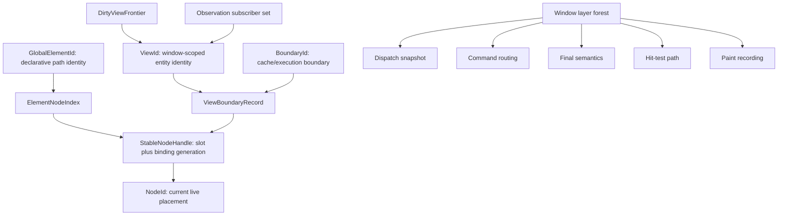
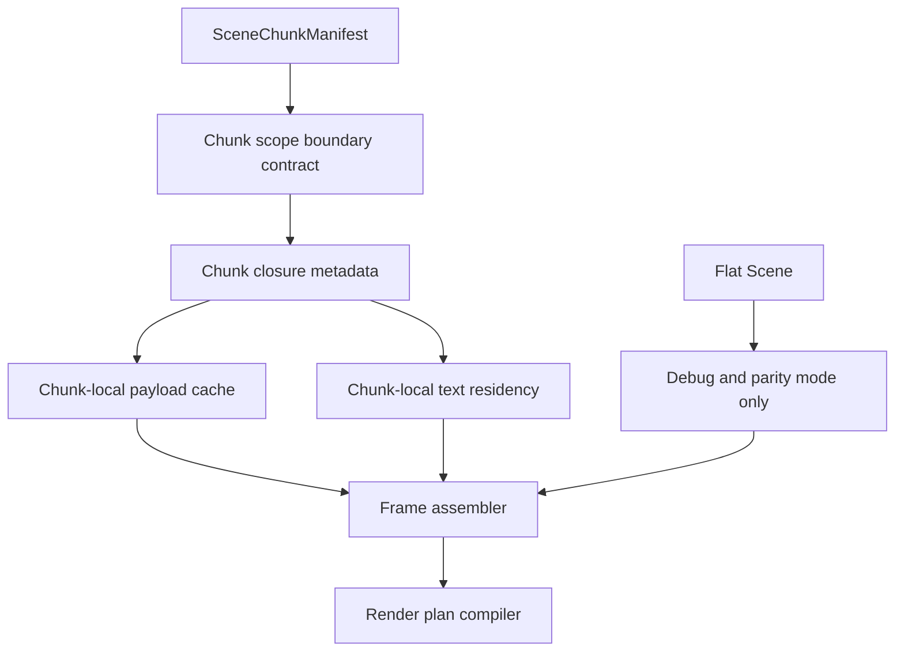
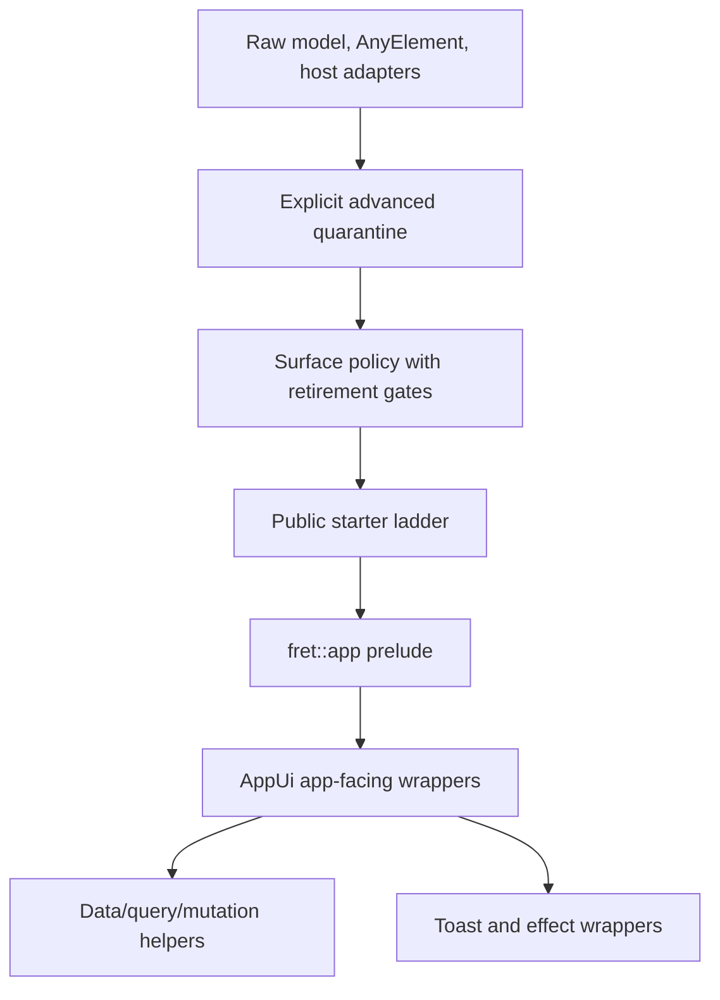

# UI Framework Phase 2 Fearless Refactor - Plan

## Goal Capsule

| Field | Value |
|---|---|
| Objective | Execute the next Fret UI framework convergence phase by deleting compatibility bridges that Phase 1 made observable, and by moving core identity, view-boundary, renderer, text, and public app surfaces to their intended future contracts. |
| Authority | User request, repository `AGENTS.md`, ADRs, the Phase 1 closeout audit, then local code evidence. |
| Execution profile | Deep, breaking, deletion-biased refactor. The repo is pre-launch, so compatibility shims may be removed once their gates prove a cleaner contract. |
| Stop conditions | Stop if a proposed deletion contradicts an ADR, loses a window/layer-forest invariant, or needs a product decision outside this plan. |
| Tail ownership | Implementation owns tests, perf gates, ADR alignment, source-policy cleanup, and deletion of dead-end migration code before closeout. |

---

## Product Contract

### Summary

Phase 1 closed the first convergence plan by making major compatibility paths visible instead of hidden. Phase 2 turns that evidence into clean contracts: stable identity instead of scan repair, entity-first `ViewId` ownership instead of `NodeId` bridges, chunk-native rendering instead of flat `Scene` replay, chunk-local text resource closure instead of full-blob helpers, and a public app authoring surface that no longer teaches advanced runtime seams by accident.

The plan uses Zed/GPUI as a reference for identity and view invalidation shape, especially `EntityId`-owned dirty views and `GlobalElementId` as element path identity. It does not adopt GPUI as a dependency or copy its platform layer.

The public adoption proof targets a Rust developer building a first serious Fret app on the default facade. Success is not full shadcn/Radix parity in this phase; success is that a generated native/web starter can teach realistic settings and mutation workflows without exposing raw runtime seams.

### Problem Frame

Fret currently has a few intentionally retained bridges that are useful only as migration scaffolding. `GlobalElementId`, `NodeId`, and `ViewId` still overlap in practice; live element resolution can fall back to full tree scans; view boundaries still expose v1 `NodeId` bridge APIs; renderer chunking is used for caching and upload planning but flat `Scene` is still the normal semantic input; text resource closure still has full-blob helper paths; and the public app ladder still depends on advanced examples for realistic mutation and feedback flows.

Leaving these bridges in place is the larger risk. They blur the framework's core contract, hide performance cliffs, and make future API design harder. Phase 2 should break and delete them behind explicit gates while the repo can still absorb large changes.

### Requirements

**Identity and View Boundaries**

- R1. Separate declarative element identity, stable node liveness, and view/entity identity so `GlobalElementId`, `StableNodeHandle`, `NodeId`, and `ViewId` no longer substitute for one another.
- R2. Replace scan-based live element lookup with an authoritative O(1) element-to-handle index maintained during mount, detach, rebind, and removal.
- R3. Make `ViewId` a window-scoped entity identity and make dirty view propagation, boundary frame products, and observations use `ViewId` or `BoundaryId` first.
- R4. Keep dispatch snapshots, command routing, final semantics snapshots, hit-test path routing, focus/capture state, layer forest state, and tree-wide paint recording window-owned unless a later ADR proves a narrower owner.

**Renderer and Text**

- R5. Promote `SceneChunkManifest` plus chunk closure metadata to the renderer-facing source of truth for normal rendering.
- R6. Make text resource closure chunk-local and visible-glyph based, then remove normal-path dependence on full-blob resource snapshots.
- R7. Expand partial uploads only for stream classes with proven closure and fallback reasons; unsafe streams must stay full upload until their side-table and resource dependencies are closed.

**Public Authoring and Surface Policy**

- R8. Extend the public app ladder beyond simulated `workbench-lite` by adding realistic settings and mutation behavior without importing raw runtime crates into generated starters.
- R9. Turn source-policy allowlists into owned quarantine records with retirement criteria, then shrink them as public wrappers land.
- R10. Split and narrow the `AppUi` facade internals so default authoring keeps ergonomic grouped helpers while raw model, element, and host-adapter seams move behind explicit advanced APIs.
- R11. Require every public API break to improve a named starter or cookbook path, remove an accidental advanced seam from default authoring, or carry migration notes in an explicit quarantine.
- R12. Preserve Fret's portable native plus web public contract while borrowing GPUI/Zed identity, view, and rendering ideas.

**Governance**

- R13. Every retained bridge must have an owner, a reason, a measurable deletion gate, and a follow-up path; unowned compatibility is out of scope for Phase 2.
- R14. Each breaking slice must update ADR alignment, focused tests, diagnostics, and perf/source-policy gates before being considered complete.

### Acceptance Examples

- AE1. After a 10k keyed reorder warmup, state, focus, selection, and scroll targets stay attached to the intended rows, and identity fallback scan counters remain zero.
- AE2. A model notification marks the owning `ViewId` dirty and rerenders through the view registry without converting the view identity through `NodeId`.
- AE3. Command dispatch, modal focus barriers, active layer input roots, and final semantics still reflect the full window/layer forest after boundary state moves to entity-first storage.
- AE4. A local text edit reencodes and uploads only the affected chunk's closed resources; missing glyph closure falls back or fails visibly instead of silently dropping glyphs.
- AE5. A generated mutation starter can run submit, success, error, retry, toast feedback, and query invalidation flows while forbidding `fret_ui`, `fret_core`, `fret_app`, `fret::advanced`, `UiTree`, `AnyElement`, and `UiActionHostAdapter` imports.
- AE6. Each advanced/manual surface policy exception has an owner, a reason, a retirement condition, and a negative public-surface test that prevents it from drifting into default authoring.
- AE7. A public user can generate the first-hour and mutation workbench starters, run their native and web diagnostics, and understand from the docs why full component parity is intentionally non-blocking for this phase.

### Scope Boundaries

In scope:

- Delete or quarantine Phase 1 compatibility paths once gates prove replacement contracts.
- Update ADRs and ADR implementation alignment when hard contracts change.
- Use local `repo-ref/zed` and GPUI references for architecture comparison.
- Break internal APIs when the cleaner future contract requires it, and break public APIs only when the change improves a named public authoring path or removes an accidental default-surface seam.

Deferred to follow-up work:

- Full shadcn/Radix parity expansion beyond the public starter surfaces touched by this plan.
- Full mobile backend work, unless a change is required to preserve portable contracts.
- A complete replacement of retained UI trees with per-frame declarative rebuilds; this plan removes the most harmful retained-tree compatibility bridges first.
- Broad material design or component-library growth not needed to prove the framework contracts.

Outside this product's identity:

- Adopting Zed/GPUI as a dependency.
- Moving interaction policy such as dismiss rules, focus trap policy, hover intent, or recipe defaults into `crates/fret-ui`.
- Turning Fret into a prebuilt component catalog before the core framework contracts are clean.

---

## Planning Contract

### Assumptions

- Internal breaking changes are acceptable because the project is pre-launch; public breaks still need a named adoption or default-surface cleanup benefit.
- The Phase 1 closeout audit is the primary origin document for retained/deferred work.
- Local `repo-ref/zed` and GPUI code are architecture references only.
- Source-policy and consumption-profile gates remain authoritative for public vs advanced surface classification.
- GPUI/Zed-inspired contracts must preserve the native plus web public authoring path.
- No launch-blocking product question remains; unknowns below are implementation-time discovery.

### Key Technical Decisions

| ID | Decision | Rationale |
|---|---|---|
| KTD1 | `StableNodeHandle` is not a thin `NodeId` wrapper. | A retained/detached node can still exist while no longer being the live binding for an element, so handle validity needs slot plus binding or attachment generation. |
| KTD2 | `GlobalElementId` remains declarative path identity, not a liveness oracle. | It is valid for state and diagnostics, but live node resolution must come from a window-local authoritative mount index with duplicate-id policy and no silent overwrite. |
| KTD3 | `ViewId` becomes entity-first and window-scoped. | GPUI's dirty view model is entity-owned; Fret should not continue representing long-lived views as retained node placements, and observations need subscriber fanout rather than a single owner. |
| KTD4 | Window/layer-forest products stay window-owned. | Dispatch, command availability, focus barriers, final semantics, hit testing, and paint ordering are decided by the active layer forest, not a single view boundary. |
| KTD5 | `SceneChunkManifest` graduates through multi-layer parity before flat `Scene` deletion. | Renderer mistakes are visual correctness bugs; chunk-native output must prove stream, render-state, resource-lifetime, command, and targeted pixel equivalence before the bridge is removed. |
| KTD6 | Text resource closure is shaping-aware and chunk-local. | Full-blob helpers over-invalidate, but visible-glyph closure is safe only when shaping runs, clusters, fallback fonts, bidi context, decorations, and atlas generations are closed. |
| KTD7 | Partial upload expansion is stream-by-stream. | Non-quad streams have side-table, clip, mask, material, and effect dependencies that need explicit fallback reasons before partial writes are safe. |
| KTD8 | Default app authoring gets wrappers before advanced seams are deleted. | The goal is a clean public ladder, not breaking examples without giving users an ergonomic replacement. |
| KTD9 | Public breaks must improve adoption or remove default-surface pollution. | Pre-launch freedom is useful for correctness, but public trust still depends on clear starters, cookbook continuity, and migration notes for visible API churn. |

### High-Level Technical Design

### System-Wide Impact

Identity changes affect layout invalidation, focus restore, view cache GC, model observation, scroll handles, animation frame notify, text selection, and diagnostics. Renderer changes affect `fret-core` scene contracts, `fret-render-wgpu` encoding and upload paths, perf metrics, and any demo that depends on chunk reuse. Public authoring changes affect starter generation, cookbook examples, `fret::app` autocomplete shape, and source-policy tooling.

### Risks and Mitigations

| Risk | Mitigation |
|---|---|
| Stable handles reuse a stale binding and corrupt focus or state. | Add keyed reorder, stale detached handle, deleted slot reuse, view-cache reuse, and multi-window tests before deleting fallback scans. |
| The element index aliases duplicate declarative ids or retained cache entries. | Define the index key, owner, duplicate policy, update order, and stale cleanup before replacing scans. |
| Shared model reads under-invalidate after observation ownership moves to views. | Model observations as subscriber sets with window scope and detach cleanup, then test multi-view, multi-window, overlay, and retained-boundary fanout. |
| Entity-first `ViewId` accidentally moves window-owned state into a boundary. | Add guard tests around dispatch, commands, final semantics, hit testing, focus barriers, and layer roots. |
| Chunk-native rendering misses render-state closure and draws incorrectly. | Require balanced or explicitly inherited scope closure, render-plan command parity, and targeted pixel tests before removing flat scene normal paths. |
| Text closure misses shaping dependencies and silently drops or changes glyphs. | Close on shaping runs or clusters, and add negative tests for ligatures, RTL, combining marks, fallback fonts, atlas reset, and decorations. |
| Source-policy cleanup breaks legitimate advanced demos. | Classify surfaces as public starter, cookbook lab, or advanced reference, and require retirement metadata before deletion. |
| Facade shrinkage harms app authoring ergonomics. | Land public wrappers and generated examples before moving raw seams behind advanced traits. |
| Public breakage optimizes architecture purity over adoption. | Require each public break to improve a named starter/cookbook path, remove an accidental default seam, or carry migration notes. |

### Alternative Approaches Considered

| Alternative | Decision |
|---|---|
| Keep fallback scans permanently and rely on diagnostics. | Rejected. Diagnostics were Phase 1 instrumentation, not the target architecture. |
| Make `StableNodeHandle` a `NodeId` newtype. | Rejected. It cannot invalidate a retained node whose live binding changed. |
| Move all boundary products into per-view storage. | Rejected. Window/layer-forest products are cross-view by definition. |
| Delete flat `Scene` immediately. | Rejected. Renderer correctness needs chunk parity before the normal path changes. |
| Promote existing advanced examples directly into public starters. | Rejected. They would freeze raw runtime crates into the user-facing ladder. |

### Phased Delivery

- Phase A: Identity and boundary deletion gates. Land U1 through U5 before renderer cleanup depends on boundary products.
- Phase B: Renderer and text migration. Land U6 through U9 with parity and perf gates.
- Phase C: Public authoring and source-policy cleanup. Land U10 settings diagnostics and U11 public wrappers first, then U12 generated mutation starter, U13 quarantine cleanup, and U14 facade splitting.
- Phase D: Closeout. Update ADR alignment, remove dead metrics or demote them to debug-only, and record remaining retained bridges with owner and deletion gate.

---

## Implementation Units

| Unit | Title | Primary files | Depends on |
|---|---|---|---|
| U1 | Freeze Phase 2 identity and deletion contract | `docs/adr/0165-dirty-views-and-notify-gpui-aligned.md`, `docs/adr/0327-frame-pipeline-v2-and-view-boundaries.md` | None |
| U2 | Add stable node handles and authoritative element index | `crates/fret-ui/src/tree/layout/state.rs`, `crates/fret-ui/src/declarative/frame.rs` | U1 |
| U3 | Replace scan-based live element resolution | `crates/fret-ui/src/declarative/mount.rs`, `crates/fret-ui/src/tree/ui_tree_invalidation_walk/propagate.rs` | U2 |
| U4 | Make `ViewId` and boundary storage entity-first | `crates/fret-core/src/ids.rs`, `crates/fret-ui/src/tree/view_boundary.rs` | U1, U2 |
| U5 | Delete v1 boundary bridges and guard window-owned products | `crates/fret-ui/src/tree/layout/entrypoints.rs`, `crates/fret-ui/src/tree/dispatch_snapshot.rs` | U4 |
| U6 | Add chunk closure metadata and parity harness | `crates/fret-core/src/scene/chunk.rs`, `crates/fret-render-wgpu/src/renderer/scene_chunk_encoding_cache.rs` | None |
| U7 | Make text resource closure chunk-local | `crates/fret-render-wgpu/src/text/diagnostics.rs`, `crates/fret-render-wgpu/src/renderer/render_scene/visible_text.rs` | U6 |
| U8 | Retire flat `Scene` from normal renderer input | `crates/fret-render-wgpu/src/renderer/render_scene/execute.rs`, `crates/fret-launch/src/runner/desktop/runner/window_redraw_render_scene.rs` | U6, U7 |
| U9 | Expand non-quad partial uploads behind closure gates | `crates/fret-render-wgpu/src/renderer/geometry_upload.rs` | U6, U7 |
| U10 | Add public workbench-lite settings diagnostics | `crates/fretboard/src/scaffold/templates.rs`, `tools/diag-scripts/` | None |
| U11 | Add app-facing mutation, toast, and query wrappers | `ecosystem/fret/src/view/data.rs`, `ecosystem/fret/src/view/effects.rs` | None |
| U12 | Generate mutation-workbench starter and behavior gates | `crates/fretboard/src/scaffold/templates.rs`, `apps/fret-cookbook/examples/mutation_toast_feedback_basics.rs` | U10, U11 |
| U13 | Turn advanced allowlists into retiring quarantine records | `tools/check_surface_policy.py`, `tools/test_check_surface_policy.py` | U11, U12 |
| U14 | Split and narrow the `AppUi` facade internals | `ecosystem/fret/src/view/data.rs`, `ecosystem/fret/src/view/local_state.rs` | U11, U13 |

### U1. Freeze Phase 2 Identity and Deletion Contract

- **Goal:** Update the hard-contract docs so implementation has one source of truth for identity roles, bridge deletion, and window-owned frame products.
- **Requirements:** R1, R3, R4, R13, R14.
- **Dependencies:** None.
- **Files:** `docs/adr/0165-dirty-views-and-notify-gpui-aligned.md`, `docs/adr/0327-frame-pipeline-v2-and-view-boundaries.md`, `docs/adr/IMPLEMENTATION_ALIGNMENT.md`, `docs/runtime-contract-matrix.md`, `docs/ui-closure-map.md`.
- **Approach:** Define `GlobalElementId`, `StableNodeHandle`, `NodeId`, `ViewId`, and `BoundaryId` as separate identities. Record that `ViewId(pub NodeId)`, `BoundaryId(NodeId)`, `iter_boundary_nodes_v1`, fallback scans, full-blob renderer helpers, and source-policy exceptions are migration bridges with deletion gates.
- **Patterns to follow:** Existing ADR style in `docs/adr/0165-dirty-views-and-notify-gpui-aligned.md`; closeout retained/deferred table in `docs/workstreams/fearless-architecture-convergence-v1/CLOSEOUT_AUDIT_2026-07-02.md`.
- **Test scenarios:** Test expectation: none for runtime behavior; this unit is contract documentation. The verification is that later units cite the ADR rows and no implementation gate lacks a contract owner.
- **Verification:** ADR alignment references the new contract language, and the implementation units below can name their deletion gates without inventing new policy.

### U2. Add Stable Node Handles and Authoritative Element Index

- **Goal:** Introduce internal stable node handles and an authoritative element-to-handle index without deleting fallback paths yet.
- **Requirements:** R1, R2, AE1.
- **Dependencies:** U1.
- **Files:** `crates/fret-ui/src/tree/layout/state.rs`, `crates/fret-ui/src/declarative/frame.rs`, `crates/fret-ui/src/declarative/mount.rs`, `crates/fret-ui/src/tree/debug/frame_stats.rs`, `crates/fret-ui/src/tree/ui_tree_debug/query.rs`, `crates/fret-diag/src/perf_keys.rs`, `docs/workstreams/diag-perf-profiling-infra-v1/perf-key-registry.frame-stats.json`, `crates/fret-ui/src/tree/tests/models.rs`, `crates/fret-ui/src/tree/tests/identity_stress.rs`.
- **Approach:** Add `StableNodeHandle` with slot identity plus binding or attachment generation. Maintain a window-local `ElementNodeIndex` keyed by the resolved declarative identity scope and live binding generation, with duplicate `GlobalElementId` entries in the same live window treated as errors or quarantine diagnostics rather than silent overwrites. Define update order for node create, attach, detach, rebind, remove, retained-cache membership, and stale-entry cleanup. Keep the existing resolver fallback temporarily, but record handle hit, stale handle, missing handle, and fallback counts separately.
- **Execution note:** Start with stale-handle and keyed-reorder characterization tests before replacing call sites.
- **Patterns to follow:** Existing U4 debug-frame stats wiring; GPUI `EntityId` and `GlobalElementId` separation in `repo-ref/zed/crates/gpui/src/view.rs` and `repo-ref/zed/crates/gpui/src/window.rs`.
- **Test scenarios:** A live element lookup returns the indexed handle without scanning. Duplicate declarative ids in one live window cannot silently overwrite the authoritative binding. Identical declarative ids in different windows remain isolated. A detached retained node with the same element id is rejected as stale. A deleted slot reused for a new node does not satisfy an old handle. A 10k keyed reorder preserves state/focus/selection/scroll target ownership while fallback metrics remain nonzero only where still expected.
- **Verification:** `fret-ui` identity tests prove handle validity semantics, and debug stats distinguish indexed success from fallback repair.

### U3. Replace Scan-Based Live Element Resolution

- **Goal:** Move hot call sites from scan repair to the authoritative index and delete scan helpers once warmup gates pass.
- **Requirements:** R2, R13, AE1.
- **Dependencies:** U2.
- **Files:** `crates/fret-ui/src/tree/layout/state.rs`, `crates/fret-ui/src/declarative/frame.rs`, `crates/fret-ui/src/declarative/mount.rs`, `crates/fret-ui/src/tree/ui_tree_invalidation_walk/propagate.rs`, `crates/fret-ui/src/tree/ui_tree_focus.rs`, `ecosystem/fret-ui-kit/src/primitives/focus_scope.rs`, `crates/fret-ui/src/tree/tests/models.rs`, `crates/fret-ui/src/tree/tests/identity_stress.rs`, `crates/fret-ui/src/declarative/tests/view_cache.rs`.
- **Approach:** Replace `self.nodes.iter()` fallback lookup, `WindowFrame.instances` scan lookup, and lazy `element_id_map_for_window` construction with indexed lookup. Split retained reuse from live resolution so detached reuse is a named retained-cache operation, not a hidden live fallback.
- **Execution note:** Delete code paths only after tests prove indexed lookup handles stale detached nodes, view-cache reuse, focus restore, scroll handles, and text selection.
- **Patterns to follow:** Resolver metrics from Phase 1; current focus-scope restore call sites that already accept mutable UI access for observable queries.
- **Test scenarios:** A stale detached node never wins over a live indexed node. A removed element returns no live node and does not scan. Duplicate ids fail or enter the duplicate-id quarantine path without overwriting an existing live handle. View-cache reuse keeps retained descendants reachable without parent-pointer repair. Focus restore and active text selection resolve through the index after keyed reorder.
- **Verification:** Static search for scan fallbacks returns no normal-path matches, and identity fallback counters are zero after warmup in focused tests.

### U4. Make `ViewId` and Boundary Storage Entity-First

- **Goal:** Break the `ViewId(pub NodeId)` and `BoundaryId(NodeId)` contract and store boundary records by stable view/boundary identity.
- **Requirements:** R1, R3, AE2.
- **Dependencies:** U1, U2.
- **Files:** `crates/fret-core/src/ids.rs`, `crates/fret-ui/src/tree/view_boundary.rs`, `crates/fret-ui/src/tree/mod.rs`, `crates/fret-ui/src/tree/ui_tree_view_cache.rs`, `crates/fret-ui/src/tree/layout/entrypoints.rs`, `crates/fret-ui/src/tree/ui_tree_subtree_layout_dirty.rs`, `crates/fret-ui/src/tree/tests/view_boundary.rs`, `crates/fret-ui/src/tree/tests/dirty_view_frontier.rs`.
- **Approach:** Make `ViewId` an independent window-scoped identity and make `BoundaryId` an independent cache/execution identity. Define the `ViewId` lifecycle: allocation owner, per-window uniqueness, mapping from declarative/root identity to `ViewId`, persistence across keyed reorder and view-cache reuse, detach behavior with `live_node: None`, removal invalidation, multi-window isolation, and diagnostic serialization. Introduce a `ViewBoundaryStore` keyed by view/boundary records with explicit `live_node` lookup. Model observations as subscriber sets keyed by model/resource plus window scope, with read owner metadata and detach cleanup. Keep temporary explicit bridge helpers only where the migration needs them and name them as v1 quarantine APIs.
- **Patterns to follow:** `DirtyViewFrontier` vocabulary from Phase 1; GPUI `dirty_views: FxHashSet<EntityId>` and `AnyView::entity_id()` shape in `repo-ref/zed/crates/gpui/src/window.rs` and `repo-ref/zed/crates/gpui/src/view.rs`.
- **Test scenarios:** A dirty view can be marked and cleared without a `NodeId` conversion. A detached view boundary remains in the registry with no live node and does not produce layout candidates. Boundary frame products attach to `BoundaryId` or `ViewId`, not raw node keys. One model read by two views, by two windows, by an overlay plus base view, and by a detached/reused boundary fans out invalidation to the correct subscribers without NodeId bridge lookup.
- **Verification:** `ViewId` no longer implements implicit conversion to or from `NodeId`, and boundary storage is not keyed by `SecondaryMap<NodeId, ViewBoundaryState>`.

### U5. Delete v1 Boundary Bridges and Guard Window-Owned Products

- **Goal:** Remove `iter_boundary_nodes_v1`-style bridge APIs and add guard tests proving cross-view frame products remain window-owned.
- **Requirements:** R3, R4, R13, AE2, AE3.
- **Dependencies:** U4.
- **Files:** `crates/fret-ui/src/tree/view_boundary.rs`, `crates/fret-ui/src/tree/layout/entrypoints.rs`, `crates/fret-ui/src/tree/ui_tree_subtree_layout_dirty.rs`, `crates/fret-ui/src/tree/dispatch_snapshot.rs`, `crates/fret-ui/src/tree/commands.rs`, `crates/fret-ui/src/tree/ui_tree_semantics.rs`, `crates/fret-ui/src/tree/hit_test.rs`, `crates/fret-ui/src/tree/tests/dispatch_snapshot_cache.rs`, `crates/fret-ui/src/tree/tests/command_availability.rs`, `crates/fret-ui/src/tree/tests/semantics.rs`.
- **Approach:** Change layout dirty frontier iteration from boundary nodes to view/boundary records resolved through the registry. Delete v1 bridge methods, v1 test names, and compatibility metrics that only measured the bridge. Add tests that assert dispatch snapshots, command availability, focus barriers, hit-test paths, and final semantics still use active layer roots and barrier roots.
- **Execution note:** Treat any attempt to store final dispatch, command, or semantics products under a single view as a regression unless an ADR changes ownership.
- **Patterns to follow:** Existing dispatch snapshot cache tests; command routing and layer-root tests from Phase 1.
- **Test scenarios:** A dirty child boundary in an inactive layer does not become a layout root. A modal barrier still limits command and hit-test routing after entity-first boundary migration. Final semantics excludes hidden layers while including visible boundary subtree caches. Paint recording order stays window order.
- **Verification:** Static search for `iter_boundary_nodes_v1`, `mark_boundary_node_v1`, `clear_boundary_node_v1`, and `BoundaryId(NodeId)` returns no normal-path matches.

### U6. Add Chunk Closure Metadata and Parity Harness

- **Goal:** Extend scene chunks with renderer-facing closure metadata and prove chunk payload parity against flat scene segments.
- **Requirements:** R5, R7, AE4.
- **Dependencies:** None.
- **Files:** `crates/fret-core/src/scene/chunk.rs`, `crates/fret-core/src/scene/manifest.rs`, `crates/fret-render-wgpu/src/renderer/scene_chunk_encoding_cache.rs`, `crates/fret-render-wgpu/src/renderer/render_scene/encode/mod.rs`, `crates/fret-render-wgpu/src/renderer/render_scene/encode/draw/mod.rs`, `crates/fret-render-wgpu/src/renderer/render_scene/encode/ops.rs`, `crates/fret-render-wgpu/src/renderer/tests/scene_chunk_parity.rs`.
- **Approach:** Add a chunk-boundary contract before normal renderer use: chunks are either balanced render scopes or carry inherited/open scope state for clip, mask, material, layer, composite, and effect stacks. Add closure fields for op ranges, draw stream ranges, side-table ranges, text residency keys, inherited/open scope state, and resource generation keys. Build parity at multiple layers: encoded stream fingerprints, relocated side-table and resource-key equivalence, render-plan command equivalence, and targeted pixel/golden tests for clips, masks, effects, blending, text, and resource generation invalidation.
- **Patterns to follow:** Current `SceneChunkManifest` and `SceneChunk` fingerprint vocabulary; render scene encode modules under `crates/fret-render-wgpu/src/renderer/render_scene/encode/`.
- **Test scenarios:** A quad-only chunk parity test passes without flat replay. A text chunk parity test includes glyph and text instance stream ranges. Balanced clip, mask, material, effect, layer, and composite scopes prove stream, side-table, command, and targeted pixel parity. Unbalanced or inherited scope cases either carry open-scope closure metadata or report an explicit unsupported closure reason. Changing an image, svg, material, mask, or effect generation invalidates only chunks whose closure names that resource.
- **Verification:** Chunk payload parity is visible in tests before any normal renderer path consumes chunk-native output.

### U7. Make Text Resource Closure Chunk-Local

- **Goal:** Replace normal-path full-blob text resource snapshots with chunk-local visible glyph residency closure.
- **Requirements:** R6, AE4.
- **Dependencies:** U6.
- **Files:** `crates/fret-render-wgpu/src/text/diagnostics.rs`, `crates/fret-render-wgpu/src/text/blobs.rs`, `crates/fret-render-wgpu/src/text/tests.rs`, `crates/fret-render-wgpu/src/renderer/scene_chunk_encoding_cache.rs`, `crates/fret-render-wgpu/src/renderer/render_scene/visible_text.rs`, `tools/perf/diag_u8_text_budget_gate.py`.
- **Approach:** Add a shaping-aware residency snapshot for chunk encoding and migrate renderer chunk keys to it. Define text chunk closure around shaping runs or cluster-safe boundaries, including fallback fonts, glyph atlas generation, palette, outline, shadow, decoration keys, bidi/ligature context, selection, and caret dependencies. Keep `text_resource_snapshot_for_blobs` only for tests or explicit debug diagnostics until all normal render and cache paths stop calling it, then delete or hide it.
- **Execution note:** Add negative tests before removing the helper from normal paths because missing glyph resources can render as missing text.
- **Patterns to follow:** Existing visible text residency metrics and `diag_u8_text_budget_gate.py`.
- **Test scenarios:** A chunk with one visible shaping-safe glyph cluster records only that cluster's atlas/resource closure. An offscreen blob does not invalidate the visible chunk. Ligatures across chunk boundaries, RTL text, combining marks, fallback font changes, atlas reset, glyph UV miss, palette change, outline change, shadow change, selection, and caret changes trigger explicit invalidation or fallback. Normal renderer chunk keys no longer call the full-blob helper.
- **Verification:** Static search for `text_resource_snapshot_for_blobs` shows no normal renderer path dependence, and text perf gates still pass.

### U8. Retire Flat `Scene` from Normal Renderer Input

- **Goal:** Make chunk-native payloads and the frame assembler drive normal render planning, with flat `Scene` retained only for debug and parity modes until deletion.
- **Requirements:** R5, R6, R7, AE4.
- **Dependencies:** U6, U7.
- **Files:** `crates/fret-render-wgpu/src/renderer/render_scene/execute.rs`, `crates/fret-render-wgpu/src/renderer/render_scene/frame_prepare.rs`, `crates/fret-render-wgpu/src/renderer/render_scene/plan_compile.rs`, `crates/fret-render-wgpu/src/renderer/render_scene/render.rs`, `crates/fret-render-wgpu/src/renderer/scene_chunk_encoding_cache.rs`, `crates/fret-render-wgpu/src/renderer/tests/scene_chunk_parity.rs`, `crates/fret-launch/src/runner/desktop/runner/window_redraw_render_scene.rs`, `crates/fret-launch/src/runner/web/render_loop.rs`.
- **Approach:** Add a frame assembler that concatenates chunk payloads in order, applies inherited/open scope metadata, relocates side tables, and feeds render-plan compilation. Move `encode_scene_chunk_entry_payload` away from replaying chunks into temporary flat scenes. Demote `RenderSceneParams.scene` from required normal input to optional debug/parity input only after stream, resource, command, and targeted pixel parity gates pass, then delete it from the normal call chain.
- **Execution note:** Keep the flat-scene parity mode until all stream classes have parity tests; delete only the normal-path dependency first.
- **Patterns to follow:** Current render scene executor lifecycle; chunk encoding cache alignment checks.
- **Test scenarios:** Normal render planning succeeds from chunk payloads without reading `RenderSceneParams.scene`. Debug/parity mode can still compare against flat scene output. Side-table relocation preserves clip, mask, effect, material, layer, and composite state. Render-plan command equivalence and targeted pixel tests pass for the supported closure classes. A chunk order change changes output order but not individual chunk payload fingerprints.
- **Verification:** Static search confirms normal renderer execution no longer requires `RenderSceneParams.scene`, and parity tests cover every supported stream.

### U9. Expand Non-Quad Partial Uploads Behind Closure Gates

- **Goal:** Enable partial uploads for the first safe non-quad stream classes while preserving explicit full-upload fallback for unsafe streams.
- **Requirements:** R7, AE4.
- **Dependencies:** U6, U7.
- **Files:** `crates/fret-render-wgpu/src/renderer/geometry_upload.rs`, `crates/fret-render-wgpu/src/renderer/render_scene/uploads.rs`, `crates/fret-render-wgpu/src/renderer/render_scene/plan_reporting.rs`, `crates/fret-render-wgpu/src/renderer/tests/partial_uploads.rs`, `docs/workstreams/ui-perf-zed-smoothness-v1/ui-perf-contract-matrix.md`.
- **Approach:** Start with side-table-free streams such as viewport vertices, and enable pure text vertex/glyph instance streams only after U7's text closure gates pass. Add a per-stream prerequisite table that names closure owner, required parity, fallback reason, write counts, bytes, and coverage gaps. Keep path, clip, mask, material, and effect streams on full upload until their closure metadata and parity are complete.
- **Patterns to follow:** Existing quad partial upload coverage and coverage-gap safeguards in `geometry_upload.rs`.
- **Test scenarios:** A stable chunk edit produces no full upload for the newly supported stream after warmup. A coverage gap falls back to full upload with a recorded reason. Clip/mask/material/effect changes keep full upload until their closure gates exist. Perf reporting separates quad and non-quad write counts.
- **Verification:** Strict perf matrix still passes, and partial upload metrics prove no silent partial writes occur for unsupported streams.

### U10. Add Public Workbench-Lite Settings Diagnostics

- **Goal:** Make the existing public `workbench-lite` starter behavior-complete for settings dialog interactions before adding new starter rungs.
- **Requirements:** R8, R11, R12, AE7.
- **Dependencies:** None.
- **Files:** `crates/fretboard/src/scaffold/templates.rs`, `crates/fretboard/src/scaffold/mod.rs`, `docs/first-hour.md`, `docs/examples/README.md`, `docs/crate-usage-guide.md`, `tools/diag-scripts/public-app/workbench-lite-settings-dialog.json`.
- **Approach:** Add generated-app diagnostics for settings dialog open, initial focus, edit, save, cancel, Escape, Tab and Shift+Tab containment, keyboard activation for save/cancel, and restore focus to the invoking settings control.
- **Patterns to follow:** Existing `workbench-lite` scaffold tests and public app surface docs.
- **Test scenarios:** Generated `workbench-lite` opens settings with deterministic initial focus. Tab and Shift+Tab stay inside the dialog. Enter or Space activates save/cancel controls where applicable. Escape closes with the expected semantics. Save and cancel preserve or discard edits as documented. Focus returns to the settings trigger. Native and web diagnostics use stable `test_id`s.
- **Verification:** Scaffold tests and settings diagnostics prove realistic public behavior without raw runtime imports.

### U11. Add App-Facing Mutation, Toast, and Query Wrappers

- **Goal:** Provide the public facade APIs needed by a realistic mutation starter before the starter is generated.
- **Requirements:** R8, R10, R11, AE5, AE7.
- **Dependencies:** None.
- **Files:** `ecosystem/fret/src/view.rs`, `ecosystem/fret/src/view/data.rs`, `ecosystem/fret/src/view/effects.rs`, `ecosystem/fret/src/view/shell.rs`, `ecosystem/fret/tests/app_ui_facade_surface.rs`, `apps/fret-cookbook/examples/mutation_toast_feedback_basics.rs`, `apps/fret-examples/src/api_workbench_lite_demo.rs`.
- **Approach:** Add app-facing submit, retry, toast/Sonner feedback, and query invalidation wrappers that replace `UiActionHostAdapter` and raw runtime imports in public mutation flows. Specify generated Cargo feature flags for mutation/query support and keep raw model/action hooks behind explicit advanced traits.
- **Execution note:** Keep the wrapper surface narrow: it must serve the mutation starter and cookbook path, not recreate the whole raw runtime API on `AppUi`.
- **Patterns to follow:** Existing `fret::app::prelude` surface tests, `AppUiEffects`, `AppUiData`, and cookbook mutation examples.
- **Test scenarios:** A public app can express submit, running, success, error, retry, toast feedback, and query invalidation without importing `fret_ui`, `fret_core`, `fret_app`, `fret::advanced`, `UiTree`, `AnyElement`, or `UiActionHostAdapter`. Public signatures, reexports, trait bounds, and docs examples do not expose raw model, element, host-adapter, or advanced trait types. Existing cookbook behavior still works through the new wrappers.
- **Verification:** `fret` facade tests and public API surface snapshots prove the wrapper surface is narrow and raw seams remain advanced-only.

### U12. Generate Mutation-Workbench Starter and Behavior Gates

- **Goal:** Add the next public starter rung after wrapper APIs exist, covering realistic async/mutation behavior without raw runtime seams.
- **Requirements:** R8, R9, R11, R12, AE5, AE7.
- **Dependencies:** U10, U11.
- **Files:** `crates/fretboard/src/scaffold/templates.rs`, `crates/fretboard/src/scaffold/mod.rs`, `apps/fret-examples/src/api_workbench_lite_demo.rs`, `apps/fret-cookbook/examples/mutation_toast_feedback_basics.rs`, `docs/first-hour.md`, `docs/examples/README.md`, `docs/crate-usage-guide.md`, `tools/diag-scripts/public-app/mutation-workbench-flow.json`.
- **Approach:** Extract a public `mutation-workbench` starter from the cookbook and API examples only after app-facing wrappers hide raw action-host and runtime seams. Treat `api_workbench_lite_demo.rs` as source evidence until the generated starter passes forbidden-import, native, and web diagnostics.
- **Patterns to follow:** Existing `workbench-lite` generator tests; U11 wrapper APIs; public app source-policy fixtures.
- **Test scenarios:** Generated `mutation-workbench` covers submit, running, success, error, retry, toast feedback, and query invalidation. Success followed by invalidation covers pending/refetching, refreshed success, refreshed empty state, and invalidation/refetch error. Error preserves editable input, exposes the error region to keyboard and screen-reader users, keeps or restores focus to the primary retry/submit control, and supports keyboard retry. Generated sources contain only public facade imports.
- **Verification:** Scaffold tests and mutation diagnostics prove realistic public behavior on native and web without raw runtime imports.

### U13. Turn Advanced Allowlists into Retiring Quarantine Records

- **Goal:** Make source-policy exceptions owned and temporary, then shrink them when public wrappers replace advanced demos.
- **Requirements:** R9, R11, R13, AE6.
- **Dependencies:** U11, U12.
- **Files:** `tools/check_surface_policy.py`, `tools/test_check_surface_policy.py`, `tools/check_consumption_profiles.py`, `apps/fret-cookbook/examples/mutation_toast_feedback_basics.rs`, `apps/fret-cookbook/examples/canvas_pan_zoom_basics.rs`, `apps/fret-examples/src/api_workbench_lite_demo.rs`, `apps/fret-examples/src/node_graph_demo.rs`, `apps/fret-examples/src/workspace_shell_demo.rs`.
- **Approach:** Replace bare `ADVANCED_MANUAL_SURFACES` entries with records that include owner, category, allowed raw seams, reason, and retirement condition. Add negative fixtures for public starter sources. Reclassify or remove entries as `mutation-workbench`, `canvas-lite`, `workspace-lite`, and future node graph wrappers land.
- **Patterns to follow:** Existing surface-policy scanner and consumption-profile separation.
- **Test scenarios:** A public starter containing `fret_ui::`, `fret_core::`, `fret_app::`, `fret::advanced`, `FnDriver`, `UiTree`, `ElementContext`, `AnyElement`, or `UiActionHostAdapter` fails. An advanced reference with owner and retirement metadata passes. An allowlist entry missing a retirement condition fails. Reclassifying `api_workbench_lite_demo.rs` changes its reason and retirement gate without hiding it from audits.
- **Verification:** Source-policy tests pass and report exception ownership; consumption-profile checks still distinguish dependency profiles from source cleanliness.

### U14. Split and Narrow the `AppUi` Facade Internals

- **Goal:** Keep default app authoring ergonomic while moving raw model, element, and host-adapter seams behind explicit advanced APIs and smaller modules.
- **Requirements:** R10, R11, R13, AE5, AE6.
- **Dependencies:** U11, U13.
- **Files:** `ecosystem/fret/src/view.rs`, `ecosystem/fret/src/view/data.rs`, `ecosystem/fret/src/view/local_state.rs`, `ecosystem/fret/src/view/shell.rs`, `ecosystem/fret/tests/raw_state_advanced_surface_docs.rs`, `ecosystem/fret/tests/advanced_prelude_surface.rs`, `ecosystem/fret/tests/app_ui_facade_surface.rs`, `apps/fret-cookbook/src/lib.rs`.
- **Approach:** Split `view/data.rs` into selector, query, mutation, and render-data modules while preserving grouped helper names. Move `LocalState::from_model`, `model`, `clone_model`, `*_in`, and `watch_in` style raw bridges to explicit advanced or component-adapter extension traits after call sites migrate. Reduce `AppUi::elements()` dependence by adding app-facing wrappers where public examples still need raw element construction.
- **Execution note:** Keep `LocalState` as the blessed first-contact state story, but move raw model wrapping out of default autocomplete once replacement wrappers exist.
- **Patterns to follow:** Existing `fret::app::prelude` surface tests; prior public authoring state-lane audits under `docs/workstreams/public-authoring-state-lanes-and-identity-fearless-refactor-v1/`.
- **Test scenarios:** Default prelude does not export raw model or raw element seams. Advanced traits remain explicit and documented. Public cookbook examples compile without `AppUi::elements()` where wrappers exist. Public signatures, reexports, trait bounds, and docs examples hide raw model, element, host-adapter, `UiTree`, `AnyElement`, and advanced trait types. File-size drift checks fail if `view/data.rs` or `view/local_state.rs` regrows into monolithic aggregators.
- **Verification:** `fret` facade tests, public API snapshots, and compile-fail surface tests prove the public prelude is narrow, advanced imports are explicit, and generated starters continue to compile through public APIs.

---

## Verification Contract

| Gate | Applies to | Done Signal |
|---|---|---|
| `cargo fmt --all --check` | All units | Formatting stays clean. |
| `python3 tools/check_layering.py` | All units | Core and ecosystem layering remains valid. |
| `python3 tools/check_surface_policy.py` | U10, U11, U12, U13, U14 | Public surfaces do not import raw seams; advanced exceptions carry metadata. |
| `python3 tools/check_consumption_profiles.py` | U10, U11, U12, U13, U14 | Consumption profiles still match intended dependency tiers. |
| `python3 tools/check_execution_surface.py` | U10, U11, U12, U13, U14 | Public execution examples stay within the approved surface. |
| `python3 tools/check_adr_numbers.py` | U1 and closeout | ADR numbering stays unique. |
| `cargo nextest run -p fret-ui --no-fail-fast` | U2, U3, U4, U5 | Identity, dirty view, boundary, dispatch, command, hit-test, semantics, and focus tests pass. |
| `cargo nextest run -p fret-render-wgpu --no-fail-fast` | U6, U7, U8, U9 | Chunk parity, text closure, geometry upload, and renderer tests pass. |
| `cargo nextest run -p fretboard scaffold --no-fail-fast` | U10, U12 | Generated starter tests pass. |
| `cargo nextest run -p fret --lib --no-fail-fast` | U11, U12, U13, U14 | Public app facade tests pass. |
| `cargo nextest run -p fret-bootstrap --lib --no-fail-fast` | U2, U3, U4, U5 | Frame stats and diagnostics serde remain compatible while identity metrics migrate. |
| Static identity bridge search | U3, U4, U5 | No normal-path matches for `ViewId(pub NodeId)`, `impl From<ViewId> for NodeId`, `BoundaryId(NodeId)`, `iter_boundary_nodes_v1`, `mark_boundary_node_v1`, `clear_boundary_node_v1`, or scan fallback helpers. |
| Static renderer bridge search | U7, U8 | No normal renderer path calls `text_resource_snapshot_for_blobs`, `encode_scene_chunk_entry_payload` does not replay chunks into temporary flat scenes, and flat `Scene` is debug/parity only. |
| Identity pressure gate | U2, U3, U4, U5 | 10k keyed reorder warmup records zero fallback scans, zero fallback scanned nodes, zero stale live hits, and zero parent repairs after migration. |
| Observation fanout gate | U4, U5 | Shared model reads invalidate two views, two windows, overlay plus base view, and detached/reused boundary subscribers without NodeId bridge lookup. |
| Chunk render correctness gate | U6, U8 | Encoded streams, relocated side tables, resource keys, render-plan commands, and targeted pixels match flat-scene parity for supported chunk classes. |
| Text shaping closure gate | U7, U9 | Ligatures, RTL, combining marks, fallback fonts, atlas reset, decorations, selection, and caret changes trigger correct invalidation or fallback. |
| Renderer perf gate | U6, U7, U8, U9 | Text budget and strict UI perf baselines stay within approved thresholds, with per-stream upload metrics showing expected partial/full behavior. |
| Public app diagnostics | U10, U12 | Settings and mutation flows pass native and web scripted diagnostics with stable `test_id`s. |
| Public API surface gate | U11, U14 | Rustdoc/public-api snapshots or compile-fail tests prove default prelude and public wrappers do not expose raw model, element, host-adapter, `UiTree`, `AnyElement`, or advanced trait types. |
| `git diff --check` | All units | No whitespace errors remain. |

---

## Definition of Done

- U1 through U14 are implemented or explicitly split into smaller follow-on plans with owner, reason, and deletion gate.
- No compatibility bridge named in U1's migration-bridge list and governed by R13 remains in a normal path without an explicit quarantine owner and retirement condition.
- ADR implementation alignment and runtime contract docs match the shipped code.
- Identity fallback scans and parent repair are removed or debug-only after pressure gates prove zero normal-path use.
- `ViewId` and `BoundaryId` are no longer raw `NodeId` wrappers in the runtime contract.
- Normal rendering no longer treats flat `Scene` as the semantic source after chunk parity gates pass.
- Full-blob text helper dependence is deleted from normal renderer paths.
- Source-policy allowlists are retiring quarantine records, and default starters pass forbidden-import checks.
- Public API breaks improve a named starter/cookbook path, remove default-surface pollution, or include migration notes in a quarantine.
- Abandoned migration code, stale tests, and obsolete perf keys are removed before closeout.
- The final closeout note records shipped units, retained bridges, perf evidence, and next work only if it is outside this plan.

---

## Appendix

### Sources and Research

- Phase 1 closeout: `docs/workstreams/fearless-architecture-convergence-v1/CLOSEOUT_AUDIT_2026-07-02.md`.
- Fret identity and boundary contracts: `docs/adr/0165-dirty-views-and-notify-gpui-aligned.md`, `docs/adr/0327-frame-pipeline-v2-and-view-boundaries.md`, `crates/fret-core/src/ids.rs`, `crates/fret-ui/src/tree/view_boundary.rs`.
- Fret identity fallback evidence: `crates/fret-ui/src/tree/layout/state.rs`, `crates/fret-ui/src/declarative/frame.rs`, `crates/fret-ui/src/declarative/mount.rs`, `crates/fret-ui/src/tree/debug/frame_stats.rs`.
- Fret renderer evidence: `crates/fret-core/src/scene/chunk.rs`, `crates/fret-core/src/scene/manifest.rs`, `crates/fret-render-wgpu/src/renderer/render_scene/execute.rs`, `crates/fret-render-wgpu/src/renderer/scene_chunk_encoding_cache.rs`, `crates/fret-render-wgpu/src/renderer/geometry_upload.rs`, `crates/fret-render-wgpu/src/text/diagnostics.rs`.
- Fret public authoring evidence: `crates/fretboard/src/scaffold/templates.rs`, `ecosystem/fret/src/view/data.rs`, `ecosystem/fret/src/view/local_state.rs`, `ecosystem/fret/src/view/shell.rs`, `tools/check_surface_policy.py`.
- GPUI/Zed reference points: `repo-ref/zed/crates/gpui/src/view.rs`, `repo-ref/zed/crates/gpui/src/window.rs`, `repo-ref/zed/crates/gpui/src/app.rs`, `repo-ref/zed/crates/gpui/src/element.rs`, `repo-ref/zed/crates/gpui/src/platform.rs`.
