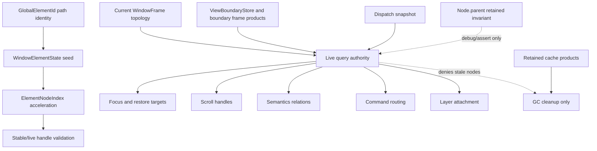
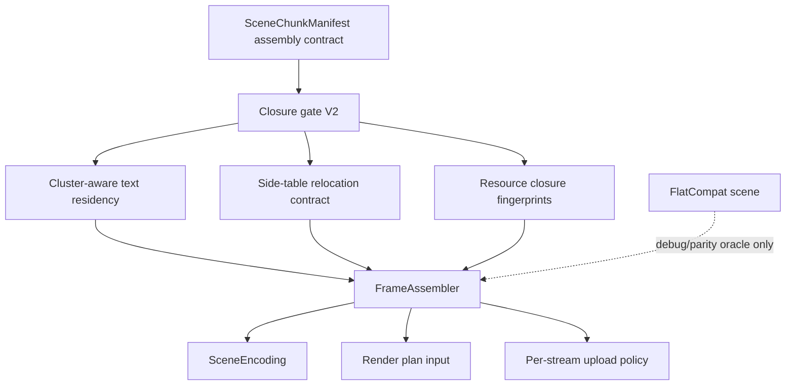
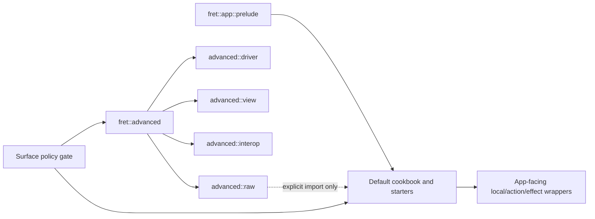

# UI Framework Phase 3 Retained Bridge Deletion - Plan

## Goal Capsule

| Field | Value |
|---|---|
| Objective | Delete or demote the retained bridges left by Phase 2 by moving Fret's normal UI runtime to frame/boundary liveness, shaping-aware text closure, chunk-native renderer input, stream-scoped upload gates, and a cleaner public app facade. |
| Authority | User request, repository `AGENTS.md`, ADRs and runtime contract docs, Phase 2 closeout retained-bridge table, local code evidence, then local `repo-ref/zed`/GPUI and shadcn/Radix/Base UI references. |
| Execution profile | Deep, breaking, deletion-biased refactor. Internal compatibility can be removed once replacement contracts and gates prove correctness; public-facing breaks need an adoption or default-surface cleanup benefit. |
| Stop conditions | Stop if a deletion contradicts an ADR, removes the only oracle for an unproven rendering/text path, loses a window/layer-forest invariant, or turns a policy-layer behavior into `crates/fret-ui`. |
| Tail ownership | Implementation owns focused tests, diagnostics/perf keys, source-policy gates, ADR alignment, workstream/current-state memory, and a closeout that records every remaining bridge with an owner and deletion gate. |

---

## Product Contract

### Summary

Phase 2 made the most important retained bridges explicit, but several of them still sit in normal paths. Phase 3 is the deletion phase for those bridges: `Node.parent` repair stops being a runtime correctness dependency, GC reachability stops acting as live identity, flat `Scene` stops being the default launch source, text closure becomes shaping-run/cluster aware before full-blob helpers are retired, non-quad partial upload expands only behind stream-specific closure proof, and public app examples stop teaching raw runtime seams.

The plan deliberately uses Zed/GPUI as the architectural baseline for identity and frame state: current frame products are authoritative, cached state is keyed by stable element or view identity, and retained products are accelerators rather than liveness or correctness oracles. Fret remains its own GPU-first, native/web framework; it does not adopt GPUI or Zed as dependencies.

### Problem Frame

The current risk is not that Phase 2 failed to delete everything. The risk is that retained bridges can become permanent architecture if the next work starts from local fixes instead of replacement contracts.

`repair_parent_pointers_from_layer_roots` is still called from declarative mount and dirty-layout underflow recovery. Its own comment says parent pointers are required for cache-root discovery and `node_layer` checks, so `Node.parent` is still more than retained storage metadata. `WindowElementState::NodeEntry` still mixes identity seed, liveness bookkeeping, and GC state. View-cache hits still touch or scan retained subtrees to recover membership. GC reachability still participates in retained-tree liveness instead of only cleaning cache products.

Renderer state has the same shape of problem. Native and web launch still pass `RenderSceneSource::flat_with_diagnostic_chunks`, where flat `Scene` decides actual rendering and the chunk manifest is diagnostic/payload-cache evidence. `ResourceFreeQuadChunks` proves a narrow chunk-native path, but side tables, text, path, image, masks, material state, effects, and inherited scopes still need contract and parity gates. Text is better than before because normal retained chunk keys are visible-glyph based, but the closure is still glyph-only: shaping cluster/run identity is lost before WGPU residency, so ligatures, RTL, combining marks, fallback fonts, selection/caret, decorations, and atlas resets are not fully closed.

The public facade is cleaner than before, but the default learning path still leaks advanced concepts. `fret::app::prelude` is reasonably narrow, yet cookbook examples and public-looking paths still use `LocalState::new_in`, `advanced::prelude` raw traits, `fret_runtime::ModelStore`, `fret_ui::CommandAvailability`, and `AppUiRawActionNotifyExt`. That means the crate boundary is correct in theory but not yet clean in what users copy.

### Requirements

**Identity, Liveness, and Retained Tree**

- R1. Treat declarative element identity, current-frame liveness, retained storage, and view/entity identity as separate contracts.
- R2. Keep `NodeId` as current retained storage placement, not as a durable identity and not as a valid liveness proof by itself.
- R3. Make current-frame topology authoritative for focus, scroll, command routing, semantics, layer attachment, cache-root lookup, and dirty propagation.
- R4. Demote `Node.parent` to retained storage invariant and debug/assert evidence after frame/boundary topology covers normal queries.
- R5. Demote `WindowElementState::NodeEntry` to a previous-frame acceleration seed; it must not prove live attachment, focus target validity, scroll target validity, or semantics relation validity.
- R6. Move view-cache hit membership from retained subtree scans to boundary-owned frame products and recorded identity membership.
- R7. Shrink GC reachability to retained-cache cleanup after stale retained nodes can no longer satisfy live identity, focus, scroll, semantics, or layer queries.
- R8. Add pressure gates that require zero parent repairs and zero stale liveness offenders after warmup for keyed reorder, retained cache, overlay root, and virtual-list scenarios.

**Renderer and Text**

- R9. Split renderer source contracts so normal launch can use authoritative chunk manifests without mixing flat-scene semantics and diagnostic chunks in one enum variant.
- R10. Upgrade `SceneChunkManifest` from diagnostic entry list to assembly contract: stable order, closure metadata, stream ownership, resource closure fingerprint, side-table requirements, and unsupported reasons.
- R11. Add a renderer `FrameAssembler` owner for chunk payload cache, side-table relocation, resource residency, assembly diagnostics, and partial-upload candidate reporting.
- R12. Make text resource closure shaping-aware: cluster/run metadata, fallback font identity, visual bounds, paint span summary, and atlas reset generation must feed chunk-local residency signatures.
- R13. Retire full-blob text helpers only after cluster-aware gates replace their current oracle value.
- R14. Expand partial upload stream by stream only when closure owner, relocation coverage, resource dependency coverage, fallback reason, write-count metrics, and negative coverage-gap tests exist.
- R15. Keep flat scene output available only as explicit debug/parity oracle until targeted chunk-native pixel and structure gates cover the affected stream class.

**Public Facade and Governance**

- R16. Keep `fret::app::prelude` as the default app surface and stop public cookbook/starter paths from using raw runtime, raw model, `UiTree`, `FnDriver`, or unclassified advanced seams.
- R17. Add app-facing constructors and action/effect wrappers before removing public-looking raw bridges such as `LocalState::new_in` and raw action-host cookbook usage.
- R18. Split `fret::advanced` into explicit driver, view, interop, and raw lanes; `advanced::prelude` must stop wildcard-exporting raw bridge traits.
- R19. Convert advanced/manual source-policy exceptions into owned, classified, retirement-tracked records, then remove records as wrappers or generated starters land.
- R20. Retire historical observation-collapse perf keys only through a diagnostics compatibility cutover that preserves old bundle readability or provides an alias/migration layer.

### Acceptance Examples

- AE1. A 10k keyed reorder plus retained view-cache warmup records zero parent repair passes after warmup while state, focus, selection, scroll targets, command availability, and semantics relations stay attached to the intended rows.
- AE2. A stale `WindowElementState::NodeEntry` that points at a detached retained node cannot satisfy live element lookup, focus restore, scroll lookup, semantics relation lookup, or layer attachment checks.
- AE3. A view-cache hit reuses boundary-owned frame products and recorded identity membership without scanning the retained subtree to touch liveness.
- AE4. Retained-tree GC removes stale cache products without changing the answer to any current-frame focus, scroll, semantics, hit-test, or command-routing query.
- AE5. Native and web launch can render a named support matrix of demos/frame classes through an authoritative `ChunkManifest` source with zero normal-path `FlatCompat` usage for those fixtures, while unsupported mixed frames report structured unsupported reasons and are not bridge-deletion evidence.
- AE6. A chunk with side tables relocates draw refs, uniforms, clips, masks, effect markers, and cache-key-dependent references or fails with a structured unsupported reason.
- AE7. Text chunks keep ligatures, combining marks, emoji sequences, RTL visual bounds, fallback font runs, selection/caret geometry, decorations, and atlas reset generation coherent in the chunk-local closure key.
- AE8. Partial upload for a newly supported non-quad stream reports bytes, write count, stream coverage, fallback reason, and negative coverage-gap behavior; unsupported streams remain full upload with an explicit reason.
- AE9. Default cookbook examples for form, table, router, toast, undo, and text input compile without `fret::advanced`, `fret_runtime::ModelStore`, raw `Model<T>`, `fret_ui`, `UiTree`, or raw action-host imports.
- AE10. Historical perf-key fixtures still read, while current registry/report output no longer exposes retired observation-collapse keys after U14's alias or fixture-backed compatibility cutover passes old-bundle tests.

### Scope Boundaries

In scope:

- Breaking internal APIs and deleting normal-path retained bridges once replacement contracts and gates exist.
- Focused public facade breaking changes that remove accidental default-surface raw seams and come with app-facing replacements.
- Renderer source, text closure, chunk manifest, and partial-upload contracts needed to remove flat/chunk duality.
- Diagnostics/perf/source-policy gates that prevent deleted bridges from reappearing.
- ADR alignment updates when a hard contract changes.

Deferred:

- A full replacement of `UiTree` with a GPUI-style every-frame declarative element tree. Phase 3 removes the most dangerous retained-tree correctness dependencies first.
- Full shadcn/Radix/Base UI parity expansion beyond source-policy and cookbook cleanup needed by this plan.
- Full Material 3 component work.
- Full mobile platform backend work unless a contract change would otherwise break native/web portability.
- All renderer stream classes at once; stream support expands only when each stream has closure and relocation proof.

Outside this product identity:

- Adopting Zed/GPUI as a dependency.
- Moving policy-layer behavior such as dismiss strategy, focus trap policy, hover intent, default row heights, component padding, or recipe defaults into `crates/fret-ui`.
- Keeping compatibility shims because they are convenient after replacement gates prove the cleaner contract.

---

## Planning Contract

### Assumptions

- The repository is pre-launch enough to accept breaking internal changes and deliberate public facade cleanup.
- Phase 2 closeout is the authoritative origin for retained bridge inventory.
- Local `repo-ref/zed` is sufficient reference material for this plan; no new upstream clone is required before implementation.
- Current native and web demos can tolerate feature flags or diagnostics during migration, but the final normal path should be typed so debug/oracle paths are not accidentally used.
- Existing diagnostic bundle compatibility matters, but compatibility should live in explicit alias/migration code rather than keeping obsolete current metrics forever.
- The first implementation run should start with U1-U4; renderer/text/facade units are planned now but should not be implemented ahead of the identity/liveness contract if doing so would hide retained-tree correctness bugs.

### Key Technical Decisions

| ID | Decision | Rationale |
|---|---|---|
| KTD1 | Start Phase 3 with frame/boundary topology, not immediate deletion of parent repair. | `repair_parent_pointers_from_layer_roots` still protects cache-root discovery and layer attachment checks; deleting it before replacement topology would turn known debt into nondeterministic correctness bugs. |
| KTD2 | `Node.parent` becomes a retained storage invariant, not a normal query authority. | Current-frame liveness should be answered by frame topology, dispatch snapshots, and boundary records, matching GPUI's current-frame product model. |
| KTD3 | `WindowElementState::NodeEntry` becomes an acceleration seed only. | A previous-frame retained node can be stale or detached; using it as liveness proof conflates identity cache with live attachment. |
| KTD4 | View-cache membership belongs to boundary-owned frame products. | Cache hits should reuse recorded frame products, state, and identity membership, not scan retained subtrees to reconstruct what was live. |
| KTD5 | GC reachability must not participate in live query correctness. | GC should clean retained cache products after current-frame liveness is independently determined. |
| KTD6 | Renderer source split precedes flat launch deletion. | The type system should prevent `Flat + diagnostic chunks` from being mistaken for chunk-native rendering. |
| KTD7 | `FrameAssembler` owns chunk assembly and relocation. | Payload cache, side-table rebase, resource residency, and partial-upload eligibility are one contract; scattering them makes unsupported fallback hard to reason about. |
| KTD8 | Text closure is cluster/run aware before full-blob oracle deletion. | Glyph-only residency can split ligature/combining clusters or lose fallback/run context even when it avoids full-blob churn. |
| KTD9 | Partial upload is a stream policy table, not a boolean optimization. | Different streams have different side tables, resource dependencies, write-count costs, and fallback reasons. |
| KTD10 | Default public examples are part of the API contract. | Users copy cookbook code; a clean prelude is not enough if public examples still teach raw runtime seams. |
| KTD11 | Historical perf keys are removed through diagnostics migration, not opportunistic cleanup. | Old bundles and report readers need either aliases or explicit compatibility behavior before registry/report fields disappear. |
| KTD12 | Frame/boundary topology needs an explicit epoch lifecycle. | A topology snapshot without build/freeze/invalidate/consume rules would just replace stale retained parents with stale topology. |
| KTD13 | Text cluster/run metadata is owned by WGPU `TextShape` residency metadata, derived from `fret-render-text`. | `fret-render-text` owns shaping, but the renderer must keep the cluster/run facts adjacent to the glyph instances it uploads and keys. |
| KTD14 | U10 uses all-or-nothing authoritative frame support until segmented assembly is explicitly proven. | This keeps chunk-native launch claims falsifiable: a named supported frame fixture has zero normal-path `FlatCompat` usage; an unsupported frame reports a structured unsupported reason and is not bridge-deletion evidence. |
| KTD15 | Native and web launch share one renderer source-selection contract. | Source selection must not fork between launch backends; support predicate, debug/parity opt-in, and unsupported reason reporting belong to one shared helper or equivalent shared API. |

### High-Level Technical Design

### System-Wide Impact

- `crates/fret-ui`: shifts normal correctness from retained parent repair and reachability repair to frame/boundary topology; tests become pressure-oriented rather than repair-oriented.
- `crates/fret-core`: chunk manifest entries gain enough metadata to be a renderer assembly contract, not just diagnostics.
- `crates/fret-render-wgpu`: gains a `FrameAssembler` owner and text cluster/run residency; flat scene becomes a compatibility/debug source.
- `crates/fret-launch` and web/native runners: normal launch routes to chunk manifest once supported classes are closed.
- `ecosystem/fret`: app facade exposes replacements before raw bridge deletion; advanced raw seams are classified and explicit.
- `tools/` and `crates/fret-diag`: gates become the enforcement mechanism for deleted bridges and historical perf-key migration.
- `docs/adr/IMPLEMENTATION_ALIGNMENT.md`, `docs/runtime-contract-matrix.md`, `docs/ui-closure-map.md`, and workstream memory must stay aligned with every hard-contract change.

### Risks and Countermeasures

| Risk | Countermeasure |
|---|---|
| Parent repair deletion breaks focus/layout/cache routing. | Implement frame/boundary topology and pressure gates first; move repair to debug/assert only after zero-repair warmup evidence. |
| GC cleanup deletes retained cache products still needed by view-cache hits. | First prove stale retained nodes cannot satisfy live queries; use boundary-owned cache membership for keep-alive decisions. |
| Chunk-native renderer produces visually correct pixels but wrong clip/effect/interaction structure. | Add structure parity for side-table relocation and render-plan inputs, not only pixel tests. |
| Text cluster overfetch hurts perf or underfetch drops glyphs. | Add perf counters for cluster overfetch and negative tests for ligature/RTL/combining/fallback boundaries. |
| Partial upload increases many small `queue.write_buffer` calls and regresses frame time. | Require write-count and byte-budget diagnostics per stream; fallback when coalescing would lose. |
| Public facade cleanup breaks examples before replacements exist. | Add app-facing constructors/wrappers before deleting raw public-looking paths; classify advanced examples explicitly. |
| Perf key retirement breaks old bundle readers. | Add alias/migration tests before removing current registry/report output. |

---

## Implementation Units

### Unit Index

| Unit | Dependency | Primary Outcome |
|---|---|---|
| U1 | none | Freeze Phase 3 contracts, gates, and bridge ledger. |
| U2 | U1 | Add retained identity/liveness pressure gates. |
| U3 | U2 | Build frame/boundary topology as normal query authority. |
| U4 | U3 | Move view-cache membership and GC liveness off retained subtree scans. |
| U5 | U4 | Delete or debug-demote normal parent repair. |
| U5.5 | U5 | Remove remaining normal retained-parent query bridges. |
| U6 | U1 | Add text cluster/run metadata and residency gates. |
| U7 | U6 | Retire full-blob text helper usage that no longer provides oracle value. |
| U8 | U1, U6 | Split renderer source contract and add `FrameAssembler` scaffolding. |
| U9 | U8 | Promote manifest closure V2 and side-table relocation. |
| U10 | U9 | Move normal launch toward authoritative chunk manifest and demote flat compat. |
| U11 | U9 | Expand partial upload stream policy with diagnostics and negative gates. |
| U12 | U1 | Clean public facade constructors, raw bridge visibility, and cookbook source policy. |
| U13 | U12 | Split advanced facade lanes and shrink quarantine records. |
| U14 | U5.5, U7, U10, U11, U13 | Retire historical perf keys and close out bridge deletion evidence. |

### U1 - Freeze Phase 3 Bridge Deletion Contract

**Goal:** Establish the authoritative Phase 3 contract before code changes so implementation cannot silently redefine what "deleted" means.

**Files:**

- `docs/adr/IMPLEMENTATION_ALIGNMENT.md`
- `docs/runtime-contract-matrix.md`
- `docs/ui-closure-map.md`
- `docs/workstreams/` or `docs/knowledge/engineering/` follow-on state files
- `docs/plans/2026-07-03-001-refactor-ui-framework-phase3-retained-bridge-deletion-plan.md`

**Approach:**

- Add or update contract rows that distinguish normal path, debug/parity oracle, and compatibility alias.
- Record the retained bridges from Phase 2 as Phase 3 deletion targets with owner, reason, and gate.
- Define "deleted" as no normal-path call or public/default-surface teaching path, not merely hidden behind a helper.
- Explicitly state that policy-layer interaction behavior remains in `ecosystem/*`, not `crates/fret-ui`.

**Test scenarios and verification:**

- `python3 tools/check_adr_numbers.py`
- `python3 tools/check_workstream_catalog.py`
- `python3 ~/.codex/skills/engineering-wiki-memory/scripts/wiki_memory.py validate --root docs/knowledge/engineering`
- `git diff --check`

**Deletion gate:** No code deletion in U1. The output is the contract that later units must satisfy.

### U2 - Add Retained Identity and Liveness Pressure Gates

**Goal:** Make parent repair, stale seed use, retained subtree scans, and GC liveness pressure visible enough that later deletion has a safety net.

**Files:**

- `crates/fret-ui/src/tree/debug/frame_stats.rs`
- `crates/fret-ui/src/tree/tests/`
- `crates/fret-ui/src/declarative/tests/`
- `crates/fret-diag/src/perf_keys.rs`
- `crates/fret-diag/src/stats/gc_gates.rs`
- `crates/fret-diag/src/stats/view_cache_gates.rs`
- `docs/workstreams/diag-perf-profiling-infra-v1/perf-key-registry.frame-stats.json`

**Approach:**

- Add opt-in pressure gates for keyed reorder, cache-hit reuse, stale detached seed, overlay root, retained virtual list, focus restore, scroll lookup, and semantics relation lookup.
- Record per-frame counters for parent repair passes/counts, retained subtree membership scans, stale seed attempts, stale seed denials, GC reachability offenders, and live-query stale hits.
- Add a non-mutating `parent_repair_would_repair` shadow oracle before U5. It should compute the same reachable-parent inconsistencies that repair would have fixed without mutating `Node.parent`.
- Make the gate require zero parent repair calls and zero `parent_repair_would_repair` nodes after warmup, plus zero stale liveness offenders in designated scenarios.
- Keep historical bundle compatibility: new strict gates should be opt-in or versioned until enough bundles carry the new fields.

**Test scenarios and verification:**

- Focused `cargo nextest run -p fret-ui` tests for identity reorder, focus restore, scroll binding, semantics relation, overlay root, and retained virtual list scenarios.
- Focused `cargo nextest run -p fret-diag` tests for registry uniqueness, field coverage, and gate evaluation.
- Regenerate `docs/workstreams/diag-perf-profiling-infra-v1/perf-key-registry.frame-stats.json` through `cargo run -p fretboard -- diag stats --perf-keys-json`.

**Deletion gate:** U2 does not delete repair; it proves when deletion becomes observable.

### U3 - Make Frame/Boundary Topology the Normal Query Authority

**Goal:** Move normal liveness and parent/topology queries away from retained `Node.parent`.

**Files:**

- `crates/fret-ui/src/declarative/frame.rs`
- `crates/fret-ui/src/declarative/mount.rs`
- `crates/fret-ui/src/tree/view_boundary.rs`
- `crates/fret-ui/src/tree/ui_tree_view_cache.rs`
- `crates/fret-ui/src/tree/dispatch/`
- `crates/fret-ui/src/tree/layout/entrypoints.rs`
- `crates/fret-ui/src/tree/identity.rs`

**Approach:**

- Introduce a small frame-topology or boundary-topology snapshot that can answer live parent, root, layer, and boundary ownership without retained parent repair.
- Define the topology lifecycle before migrating consumers: build phase, freeze point, epoch/revision key, mutation invalidation rules, allowed consumers per pipeline phase, same-frame reentrancy behavior, and stale-epoch debug assertions.
- Default lifecycle: build from the completed declarative mount/window-frame child graph, freeze before pending invalidation propagation consumes topology, allow dispatch/prepaint/paint/GC to read only the frozen current-frame epoch, and force same-frame mutations either to rebuild the snapshot or fail a stale-epoch assertion.
- Route `node_is_attached_to_layer_tree`, cache-root discovery, dirty-boundary propagation, focus barrier resolution, command availability, scroll target validation, and semantics relation validation through the new topology where possible.
- Keep `Node.parent` updated as retained storage metadata, but stop using it as the first authority for current-frame live attachment.
- Add stale-parent fixtures that intentionally corrupt retained `parent` while current-frame topology remains valid.

**Test scenarios and verification:**

- Tests should prove focus, command availability, viewport/layer root owner, cache-root invalidation, and semantics relation queries survive stale retained parent pointers.
- Add event-time, layout-time, prepaint/paint-time, and GC-time topology epoch tests so each consumer rejects stale topology instead of silently using it.
- Existing dispatch snapshot cache tests must still pass.
- `cargo nextest run -p fret-ui --no-fail-fast` after focused tests pass.

**Deletion gate:** Normal live topology queries no longer need `repair_parent_pointers_from_layer_roots` to run before invalidation.

### U4 - Move View-Cache Membership and GC Liveness Off Retained Scans

**Goal:** Ensure cache hits and GC cleanup use boundary-owned frame products and explicit identity membership instead of scanning retained subtrees to reconstruct liveness.

**Files:**

- `crates/fret-ui/src/declarative/mount.rs`
- `crates/fret-ui/src/elements/runtime.rs`
- `crates/fret-ui/src/tree/view_boundary.rs`
- `crates/fret-ui/src/tree/frame_arena.rs`
- `crates/fret-ui/src/tree/ui_tree_mutation/remove.rs`
- `crates/fret-ui/src/declarative/tests/view_cache.rs`

**Approach:**

- Add boundary-owned membership records for cache-hit subtrees: element ids, view ids, action hooks, semantics ownership, scroll handles, and observed dependencies needed by normal queries.
- Replace cache-hit retained subtree touch/scan helpers with replay of recorded membership and frame products.
- Make `WindowElementState::NodeEntry` a seed with validation, not a liveness source.
- Shrink GC decisions so reachability protects retained cache cleanup and resource lifetime, not current-frame query correctness.

**Test scenarios and verification:**

- Cache-hit tests for nested view cache, action hooks, environment queries, semantics output, retained virtual list, and stale `NodeEntry`.
- Negative tests where stale retained nodes remain in storage but cannot satisfy live focus, scroll, semantics, or layer queries.
- `cargo nextest run -p fret-ui view_cache gc_liveness retained_virtual_list --no-fail-fast` or equivalent focused filters.

**Deletion gate:** Static search shows retained subtree membership touch/scan helpers are gone from normal mount/cache-hit paths or moved to debug/test-only names.

### U5 - Delete or Debug-Demote Normal Parent Repair

**Goal:** Remove parent-pointer repair from normal mount and dirty-layout recovery once U3-U4 gates prove it is not needed for correctness.

**Files:**

- `crates/fret-ui/src/declarative/mount.rs`
- `crates/fret-ui/src/tree/ui_tree_mutation/focus.rs`
- `crates/fret-ui/src/tree/ui_tree_subtree_layout_dirty.rs`
- `crates/fret-ui/src/tree/ui_tree_mutation/core.rs`
- `crates/fret-ui/src/tree/ui_tree_mutation/barrier.rs`
- `crates/fret-ui/src/tree/tests/children.rs`

**Approach:**

- Remove normal calls to `repair_parent_pointers_from_layer_roots` after mount and before invalidation only after the `parent_repair_would_repair` shadow oracle has reported zero would-repair nodes after warmup for the U2 pressure suite.
- Change dirty-layout underflow behavior from "repair parents and continue" to a debug/assert diagnostic plus topology-based dirty count rebuild where possible.
- Move the repair helper to debug/test support or delete it if no test/debug oracle needs it.
- Rewrite tests that currently assert repair as behavior into tests that assert stale retained parent cannot affect frame topology.

**Test scenarios and verification:**

- `rg -n "repair_parent_pointers_from_layer_roots" crates ecosystem apps -g '*.rs'` shows no normal-path call sites.
- Pressure gate from U2 records zero parent repair calls and zero `parent_repair_would_repair` nodes after warmup.
- `cargo nextest run -p fret-ui --no-fail-fast`.

**Deletion gate:** If any normal query still needs retained parent repair, U5 must stop and reopen U3/U4 instead of preserving repair as a hidden shim.

### U5.5 - Remove Remaining Retained Parent Query Bridges

**Goal:** Close the residual normal-path retained-parent reads left after U5.

**Files:**

- `crates/fret-ui/src/tree/ui_tree_mutation/mount.rs`
- `crates/fret-ui/src/tree/ui_tree_mutation/focus.rs`
- `crates/fret-ui/src/tree/identity.rs`
- `crates/fret-ui/src/declarative/host_widget/layout/scrolling.rs`
- `ecosystem/fret-ui-shadcn/src/{command,drawer,sheet}.rs`
- `apps/fret-ui-gallery/src/driver/render_flow.rs`
- `crates/fret-ui/src/tree/tests/children.rs`

**Approach:**

- Make initial mount skip decisions depend on child-edge/layer-root topology, not `Node.parent`.
- Route runtime parent-chain/debug ancestry queries through `node_parent_in_layer_tree`.
- Demote retained `node_parent` reads to test-only storage assertions.
- Refresh stale comments that still describe `node_layer` or liveness as parent-pointer based.

**Test scenarios and verification:**

- A stale retained `None` parent on a live child-edge subtree must not trigger the initial layer-root mount fast path.
- Static search shows no non-test runtime call to `node_parent()`.
- `cargo nextest run -p fret-ui set_children_in_mount --no-fail-fast`.

**Deletion gate:** Retained `Node.parent` may remain as direct edge storage and debug/test oracle only; it must not be a normal topology query authority.

### U6 - Add Shape Cluster/Run Metadata and Text Residency Gates

**Goal:** Upgrade text closure from glyph-only residency to shaping-aware cluster/run residency.

**Files:**

- `crates/fret-render-wgpu/src/text/types.rs`
- `crates/fret-render-wgpu/src/text/prepare/shape_build.rs`
- `crates/fret-render-wgpu/src/text/prepare/glyph_materialize.rs`
- `crates/fret-render-wgpu/src/text/blobs.rs`
- `crates/fret-render-wgpu/src/text/pin_state.rs`
- `crates/fret-render-wgpu/src/renderer/render_scene/visible_text.rs`
- `crates/fret-render-text/src/` if renderer-side metadata cannot preserve the needed Parley cluster/run facts

**Approach:**

- Add `TextGlyphCluster` or equivalent metadata to WGPU `TextShape`, derived during shape build from `fret-render-text` cluster/run data. The metadata must include line index, text range, glyph range, visual bounds, RTL flag, font/run identity, and paint span summary.
- Add `cluster_index` to each WGPU `GlyphInstance`; avoid a disconnected parallel index unless the upload layout forces it, and then add a structure test that proves the parallel index matches uploaded glyph ranges.
- Make `TextFrameResidency` record cluster-aware entries and a residency signature that includes `TextBlobId`, cluster keys, glyph keys, fallback/run identity, and atlas reset generation.
- Keep atlas pinning glyph-based internally, but require closure decisions to be cluster-aware.
- Require `visible_text` and `scene_chunk_encoding_cache` to consume this authoritative `TextShape` cluster metadata before U7 can retire full-blob oracles.

**Test scenarios and verification:**

- Ligature visibility includes the whole cluster.
- Combining mark and emoji/ZWJ sequences are not split.
- RTL uses visual bounds and preserves caret/selection parity evidence.
- Mixed-script fallback font runs do not pollute visible chunk keys when offscreen.
- Atlas reset generation changes residency signatures and retries missing resources.
- Cluster metadata ranges match the actual glyph instances uploaded for ligature, RTL, fallback, decoration, selection, and atlas-reset cases.
- `cargo nextest run -p fret-render-wgpu text --no-fail-fast`.

**Deletion gate:** U6 must not delete full-blob helpers yet; it creates the successor oracle.

### U7 - Retire Full-Blob Text Helper Scaffolding

**Goal:** Delete or test-hide full-blob text helper usage that no longer provides unique parity value after U6.

**Files:**

- `crates/fret-render-wgpu/src/text/diagnostics.rs`
- `crates/fret-render-wgpu/src/text/atlas_flow.rs`
- `crates/fret-render-wgpu/src/text/tests.rs`
- `crates/fret-render-wgpu/src/renderer/render_scene/visible_text.rs`
- `crates/fret-render-wgpu/src/renderer/scene_chunk_encoding_cache.rs`

**Approach:**

- Rename remaining full-blob helpers as explicit test/parity oracle helpers or remove them if cluster-aware tests supersede them.
- Replace `prepare_for_scene_with_perf` and `prepare_for_text_blobs_with_perf` usages that are only scaffolding with explicit `TextFrameResidency` or visible-chunk harness setup.
- Preserve `text_resource_snapshot_for_residency` if it remains part of normal retained key generation.
- Keep a small negative test proving full-blob churn does not enter normal chunk keys.

**Test scenarios and verification:**

- Static search separates normal path from `#[cfg(test)]`/debug helper usage for `text_resource_snapshot_for_blobs`, `text_residency_for_blobs`, and `prepare_for_text_blobs_with_perf`.
- Cluster-aware successor tests from U6 cover old helper value.
- `cargo nextest run -p fret-render-wgpu text scene_chunk_encoding_cache --no-fail-fast`.

**Deletion gate:** No normal retained chunk key or launch path uses full-blob text snapshots.

### U8 - Split Renderer Source Contract and Add FrameAssembler

**Goal:** Prevent type-level mixing of flat-scene semantics and chunk diagnostics, then introduce the owner that will assemble chunk-native frames.

**Files:**

- `crates/fret-render-wgpu/src/renderer/mod.rs`
- `crates/fret-render-wgpu/src/renderer/render_scene/execute.rs`
- `crates/fret-render-wgpu/src/renderer/render_scene/frame_assembler.rs`
- `crates/fret-render-wgpu/src/renderer/scene_chunk_encoding_cache.rs`
- `crates/fret-launch/src/runner/desktop/runner/window_redraw_render_scene.rs`
- `crates/fret-launch/src/runner/web/render_loop.rs`

**Approach:**

- Replace `RenderSceneSource::Flat { diagnostic_chunks }` style mixing with explicit `RenderSceneSource::ChunkManifest` and `RenderSceneSource::FlatCompat`.
- Keep any dual-run comparison behind explicit debug/parity execution while chunk support is incomplete, and make the type tell the truth: flat compat is not chunk-native rendering.
- Add `FrameAssembler` as the renderer-internal owner for manifest validation, chunk payload assembly, side-table relocation hooks, text/resource residency inputs, assembly diagnostics, and upload eligibility reporting.
- Migrate resource-free quad assembly into `FrameAssembler` without widening stream support prematurely.
- Add the first `ChunkLaunchSupportMatrix` shape even if only resource-free quad and vertex-color fixtures are supported. The matrix names stream classes, demo/frame fixtures, unsupported reasons, and fallback counters consumed by U10.
- Add a shared source-selection contract, for example `select_render_scene_source(manifest, debug_flat_oracle_policy) -> RenderSceneSourceSelection`. The selection output should include the chosen source, support predicate result, structured unsupported reason, and whether an explicit debug/parity oracle run requested `FlatCompat`.

**Test scenarios and verification:**

- Existing resource-free quad authoritative tests still pass under the new source name.
- A test proves `FlatCompat` does not consume diagnostic chunks as authoritative render input.
- Native and web call sites compile against the same source-selection helper or an equivalent shared API, not duplicated source-selection branches.
- Launch code compiles with explicit source selection and no ambiguous `flat_with_diagnostic_chunks` constructor in new code.
- `cargo nextest run -p fret-render-wgpu render_scene scene_chunk --no-fail-fast`.

**Deletion gate:** `RenderSceneSource` no longer has a variant that combines flat semantics and diagnostic chunks.

### U9 - Promote Manifest Closure V2 and Side-Table Relocation

**Goal:** Make `SceneChunkManifest` a real assembly contract for supported stream classes.

**Files:**

- `crates/fret-core/src/scene/chunk.rs`
- `crates/fret-core/src/scene/manifest.rs`
- `crates/fret-ui/src/tree/view_boundary.rs`
- `crates/fret-ui/src/tree/ui_tree_invalidation.rs`
- `crates/fret-render-wgpu/src/renderer/render_scene/frame_assembler.rs`
- `crates/fret-render-wgpu/src/renderer/scene_chunk_encoding_cache.rs`
- `crates/fret-render-wgpu/src/renderer/render_plan.rs`

**Approach:**

- Extend manifest entries with stable entry/order identity, closure metadata, stream summaries, resource closure fingerprints, side-table requirements, and unsupported reasons.
- Replace unsupported-empty-payload behavior with structured errors or diagnostics in authoritative mode.
- Implement side-table relocation for supported streams: draw refs, uniforms, clips, masks, `uniform_mask_images`, clip path masks, effect markers, and cache-key-sensitive references.
- Start with resource-free quad plus vertex-color full-frame assembly, then add additional streams only when relocation is proven.

**Test scenarios and verification:**

- Core tests cover open/inherited scope, resource closure, stream summary, and unsupported reasons.
- Renderer tests compare chunk assembly structure against flat oracle for supported streams.
- Negative tests fail authoritative assembly on missing side-table relocation or missing resource closure.
- Pixel smoke tests cover at least one clipped/masked/effect case per newly supported stream.

**Deletion gate:** Supported chunk classes assemble without flat scene fallback; unsupported classes fail with structured unsupported reasons unless an explicitly requested debug/parity run uses `FlatCompat`.

### U10 - Move Normal Launch to Authoritative Chunk Manifest

**Goal:** Remove flat `Scene` as the normal native/web launch input for supported classes.

**Files:**

- `crates/fret-launch/src/runner/desktop/runner/window_redraw.rs`
- `crates/fret-launch/src/runner/desktop/runner/window_redraw_render_scene.rs`
- `crates/fret-launch/src/runner/web/render_loop.rs`
- `crates/fret-launch/src/runner/common/`
- `ecosystem/fret-bootstrap/src/`
- `crates/fret-render-wgpu/src/renderer/tests.rs`

**Approach:**

- Route normal launch through `RenderSceneSource::ChunkManifest` when closure gates say the frame is supported.
- Use all-or-nothing frame source selection for U10: a frame fixture listed as supported in the `ChunkLaunchSupportMatrix` must have zero normal-path `FlatCompat` usage; any unsupported mixed frame reports a structured unsupported reason and does not count as bridge deletion evidence.
- Keep `FlatCompat` as explicit debug/parity oracle with diagnostics, never as hidden normal launch fallback and never hidden in the normal source constructor.
- Update driver/launch facade wording so `scene_chunk_manifest` is an authoritative render source API or clearly debug-only, not both.
- Add a static gate that prevents `flat_with_diagnostic_chunks` from reappearing in launch normal paths.
- Add fallback counters for unsupported stream, missing resource closure, missing side-table relocation, material/effect state, and mixed-frame compatibility selection.
- Make native and web launch use the U8 source-selection contract so both paths report the same unsupported reason shape and debug/parity policy.

**Test scenarios and verification:**

- `rg -n "flat_with_diagnostic_chunks" crates/fret-launch crates/fret-render-wgpu/src/renderer -g '*.rs'` only finds debug/parity tests or nothing, depending on final helper retention.
- Native and web render-loop unit tests compile and source selection is explicit.
- Targeted UI gallery or demo diagnostics exercise chunk-native launch for every frame fixture named in the support matrix and assert zero normal-path `FlatCompat` usage for those fixtures.
- `cargo nextest run -p fret-launch --no-fail-fast` if tests exist; otherwise `cargo check -p fret-launch --all-targets`.
- `cargo nextest run -p fret-render-wgpu --no-fail-fast`.

**Deletion gate:** Normal launch paths no longer pass flat scene plus diagnostic chunk manifest as one source.

### U11 - Expand Partial Upload Stream Policy

**Goal:** Replace the current quad plus vertex-color partial upload special case with an explicit per-stream eligibility policy.

**Files:**

- `crates/fret-render-wgpu/src/renderer/geometry_upload.rs`
- `crates/fret-render-wgpu/src/renderer/types.rs`
- `crates/fret-render-wgpu/src/renderer/render_scene/uploads.rs`
- `crates/fret-render-wgpu/src/renderer/render_scene/frame_assembler.rs`
- `crates/fret-diag/src/perf_keys.rs`

**Approach:**

- Add a stream policy table naming support status, closure owner, relocation dependencies, resource dependencies, fallback reason, and write-budget constraints.
- Include deterministic budget fields in the stream policy: `max_partial_write_count` and `max_partial_write_bytes`, expressed per frame for the stream being considered.
- For the first non-quad stream U11 enables, set conservative initial values in code and tests instead of leaving them to implementer judgment. The first stream's over-budget negative test must assert those exact values and full-upload fallback reason.
- Expand partial upload only for the next stream class whose closure and relocation are complete.
- Record write count, bytes, stream coverage, full-upload fallback reason, and coalescing/budget decisions.
- Keep unsupported streams on full upload with explicit metrics.

**Test scenarios and verification:**

- Negative coverage-gap tests force full upload for missing closure, missing side-table relocation, missing resource residency, or over-budget write count.
- Over-budget tests assert `max_partial_write_count` and `max_partial_write_bytes` for the first enabled non-quad stream.
- Positive tests prove actual partial writes for the newly supported stream.
- Perf-key registry tests cover new upload metrics.
- `cargo nextest run -p fret-render-wgpu geometry_upload uploads --no-fail-fast`.

**Deletion gate:** No stream enters partial upload without a named fallback reason and negative coverage-gap test.

### U12 - Clean Public App Facade Constructors and Cookbook Raw Seams

**Goal:** Give public examples ergonomic replacements before removing public-looking raw model/action seams.

**Files:**

- `ecosystem/fret/src/view/local_state.rs`
- `ecosystem/fret/src/view/local_state/bridges.rs`
- `ecosystem/fret/src/view/actions.rs`
- `ecosystem/fret/src/view/effects.rs`
- `ecosystem/fret/src/lib.rs`
- `apps/fret-cookbook/examples/`
- `tools/check_surface_policy.py`
- `docs/crate-usage-guide.md`

**Approach:**

- Add app-facing local-state construction such as `app.local_state(value)` or another repo-consistent constructor, then migrate cookbook/default examples away from `LocalState::new_in`.
- Add app-facing action/effect helpers for remaining router, toast, undo, text input, and table flows that currently need `AppUiRawActionNotifyExt` or raw `ModelStore`.
- Migrate default cookbook examples away from `fret::advanced`, `fret_runtime::ModelStore`, raw `Model<T>`, `fret_ui`, `UiTree`, and `FnDriver`.
- Extend `tools/check_surface_policy.py` with default cookbook rules and negative fixtures.

**Test scenarios and verification:**

- `cargo check -p fret-cookbook --all-targets`
- `cargo nextest run -p fret --lib --no-fail-fast`
- `python3 tools/check_surface_policy.py`
- Static search over default cookbook examples for raw seams.

**Deletion gate:** Default cookbook/starter paths no longer teach raw runtime seams once replacements exist.

### U13 - Split Advanced Facade Lanes and Shrink Quarantine Records

**Goal:** Make advanced usage explicit, classified, and temporary where it represents migration state.

**Files:**

- `ecosystem/fret/src/lib.rs`
- `ecosystem/fret/src/view/raw.rs`
- `ecosystem/fret/src/view/runtime.rs`
- `tools/check_surface_policy.py`
- `tools/test_check_surface_policy.py`
- `docs/crate-usage-guide.md`
- `apps/fret-examples/src/`
- `apps/fret-cookbook/examples/`

**Approach:**

- Split `fret::advanced` into `advanced::driver`, `advanced::view`, `advanced::interop`, and `advanced::raw`.
- Stop `advanced::prelude` from wildcard-exporting raw bridge traits; require explicit `advanced::raw` imports for raw seams.
- Reclassify advanced examples into default, advanced cookbook, internal harness, or migration reference categories.
- Remove or tighten quarantine records that now have public wrappers or generated starters.

**Test scenarios and verification:**

- `python3 tools/check_surface_policy.py`
- `python3 tools/check_consumption_profiles.py`
- `python3 tools/check_execution_surface.py`
- `cargo check -p fret-examples-imui --all-targets`
- `cargo check -p fret-cookbook --all-targets`
- Facade source tests prove app/default prelude remains clean and advanced raw imports are explicit.

**Deletion gate:** No unclassified public-looking example imports raw or advanced seams.

### U14 - Retire Historical Perf Keys and Close the Bridge Ledger

**Goal:** Remove historical observation-collapse perf keys and close Phase 3 with evidence for each retained bridge.

**Files:**

- `crates/fret-diag/src/perf_keys.rs`
- `crates/fret-diag/src/stats/bundle_stats_compute.inc.rs`
- `crates/fret-diag/src/stats/bundle_stats_report.inc.rs`
- `crates/fret-diag/src/diag_perf/`
- `docs/workstreams/diag-perf-profiling-infra-v1/perf-key-registry.frame-stats.json`
- `docs/adr/IMPLEMENTATION_ALIGNMENT.md`
- `docs/knowledge/engineering/`
- Phase 3 closeout document under `docs/plans/` or `docs/workstreams/`

**Approach:**

- Add compatibility aliases or fixture-backed migration for old `layout_collapse_layout_observations_time_us` and `paint_collapse_observations_time_us` bundle fields.
- Remove the retired keys from current registry/report output after old-bundle tests pass.
- Run static searches for every Phase 2 retained bridge and classify any remaining match as normal path, debug/oracle, compatibility alias, test, or removed.
- Write closeout with unit evidence, gates run, and any remaining bridge owner/deletion gate.

**Test scenarios and verification:**

- `cargo nextest run -p fret-diag --no-fail-fast`
- `cargo run -p fretboard -- diag stats --perf-keys-json > docs/workstreams/diag-perf-profiling-infra-v1/perf-key-registry.frame-stats.json`
- Static search for retired perf keys returns only compatibility fixtures or no matches, depending on migration design.
- Full Phase 3 final gate set from the Verification Contract.

**Deletion gate:** Current diagnostics registry/report output does not expose retired observation-collapse keys, and old bundle fixtures remain readable or explicitly migrated.

---

## Verification Contract

Run focused gates per unit, then the final gate set before closeout.

**Always:**

- `cargo fmt --all --check`
- `git diff --check`
- `python3 tools/check_layering.py`
- `python3 tools/check_surface_policy.py`
- `python3 tools/check_consumption_profiles.py`
- `python3 tools/check_execution_surface.py`
- `python3 tools/check_adr_numbers.py`
- `python3 tools/check_workstream_catalog.py`
- `python3 ~/.codex/skills/engineering-wiki-memory/scripts/wiki_memory.py validate --root docs/knowledge/engineering`

**Identity and retained tree:**

- `cargo nextest run -p fret-ui --no-fail-fast`
- Focused `fret-ui` filters for identity, focus restore, scroll binding, semantics relation, view cache, retained virtual list, dispatch snapshot, GC liveness, and parent repair pressure.
- Static search: `repair_parent_pointers_from_layer_roots` has no normal-path callers after U5.
- Static search: retained subtree membership scan/touch helpers are absent from normal cache-hit paths after U4.

**Renderer and text:**

- `cargo nextest run -p fret-render-wgpu --no-fail-fast`
- Focused renderer filters for render scene source, scene chunk assembly, visible text, text residency, scene chunk encoding cache, geometry upload, and uploads.
- Static search: `flat_with_diagnostic_chunks` is absent from normal launch after U10.
- Static search: `text_resource_snapshot_for_blobs` and related full-blob helpers are test/debug-only or removed after U7.
- Pixel or structure gates for each newly supported stream class before partial upload or flat compat deletion.

**Public facade and diagnostics:**

- `cargo nextest run -p fret --lib --no-fail-fast`
- `cargo check -p fret-cookbook --all-targets`
- `cargo check -p fret-examples-imui --all-targets`
- `cargo nextest run -p fret-diag --no-fail-fast`
- Static search over default cookbook/starter paths for `fret::advanced`, `fret_runtime::ModelStore`, raw `Model<`, `fret_ui`, `UiTree`, `FnDriver`, `LocalState::new_in`, and `AppUiRawActionNotifyExt`.

**Final closeout searches:**

- `rg -n "repair_parent_pointers_from_layer_roots|flat_with_diagnostic_chunks|text_resource_snapshot_for_blobs|layout_collapse_layout_observations_time_us|paint_collapse_observations_time_us|LocalState::new_in|AppUiRawActionNotifyExt" crates ecosystem apps tools docs -g '*.rs' -g '*.py' -g '*.md'`
- Classify each remaining match in the closeout as removed, debug/test-only, compatibility alias, advanced explicit seam, or still retained with owner and deletion gate.

---

## Definition of Done

- U1-U14 are either completed or explicitly split into a narrower follow-on with owner, reason, and deletion gate.
- `Node.parent` repair is removed from normal runtime paths or documented as an intentional retained bridge with a failing deletion gate and a new follow-on owner.
- Stale retained nodes cannot satisfy live identity, focus, scroll, semantics, layer, command, or cache-root queries.
- View-cache hits use boundary-owned membership/frame products instead of retained subtree scans for normal liveness bookkeeping.
- Normal native/web launch no longer mixes flat scene semantics with diagnostic chunks; `FlatCompat` is explicit debug/parity or removed.
- Text chunk closure is cluster/run aware for the listed shaping cases before full-blob helpers are retired.
- Partial upload is governed by a stream policy table with metrics and negative coverage-gap tests.
- Default public cookbook/starter paths do not teach raw runtime seams.
- Historical perf keys are migrated or removed from current output with old-bundle compatibility tested.
- ADR alignment, runtime contract docs, UI closure map, source-policy records, perf-key registry, and engineering memory are updated.
- Final gates in the Verification Contract pass, or the closeout names the exact failing gate and why it became a follow-on rather than hidden debt.

---

## Open Questions

- OQ1. Should the frame/boundary topology snapshot be a new public-ish internal type, or remain private to `fret-ui` mount/dispatch/layout modules? Default recommendation: keep it private until two independent normal query families need a stable API.
- OQ2. Should `FlatCompat` remain as a long-lived debug oracle in `fret-render-wgpu`, or be moved behind a test-only feature after chunk-native launch closes enough demos? Default recommendation: keep explicit debug oracle until renderer stream parity covers text/path/image/mask/material/effect classes.
- OQ3. Which app-facing local-state constructor name best matches the existing `fret` facade vocabulary? Default recommendation: prefer a method on app/facade state over another public inherent `LocalState::new_*` if it keeps autocomplete cleaner.

---

## Source Evidence

- Phase 2 closeout: `docs/plans/2026-07-02-001-refactor-ui-framework-phase2-closeout.md`
- Current engineering state: `docs/knowledge/engineering/current-state.md`
- Parent repair evidence: `crates/fret-ui/src/tree/ui_tree_mutation/focus.rs`, `crates/fret-ui/src/declarative/mount.rs`, `crates/fret-ui/src/tree/ui_tree_subtree_layout_dirty.rs`
- Renderer source evidence: `crates/fret-render-wgpu/src/renderer/mod.rs`, `crates/fret-render-wgpu/src/renderer/render_scene/execute.rs`, `crates/fret-launch/src/runner/desktop/runner/window_redraw_render_scene.rs`, `crates/fret-launch/src/runner/web/render_loop.rs`
- Text closure evidence: `crates/fret-render-wgpu/src/text/types.rs`, `crates/fret-render-wgpu/src/text/pin_state.rs`, `crates/fret-render-wgpu/src/renderer/render_scene/visible_text.rs`, `crates/fret-render-wgpu/src/renderer/scene_chunk_encoding_cache.rs`
- Public facade evidence: `ecosystem/fret/src/lib.rs`, `ecosystem/fret/src/view/local_state.rs`, `ecosystem/fret/src/view/local_state/bridges.rs`, `ecosystem/fret/src/view/raw.rs`, `tools/check_surface_policy.py`
- Reference architecture: `repo-ref/zed/crates/gpui/src`, `repo-ref/zed/crates/gpui_macos/src/text_system.rs`, `repo-ref/ui/apps/v4/registry/new-york-v4/ui`, `repo-ref/primitives`, `repo-ref/base-ui`
