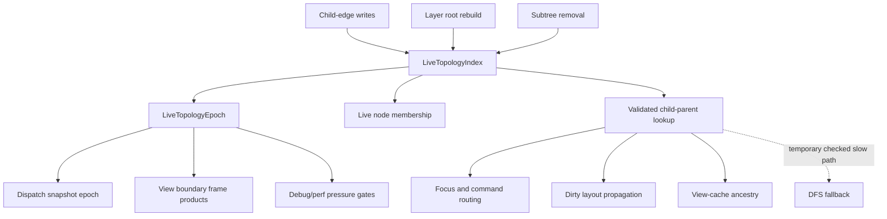
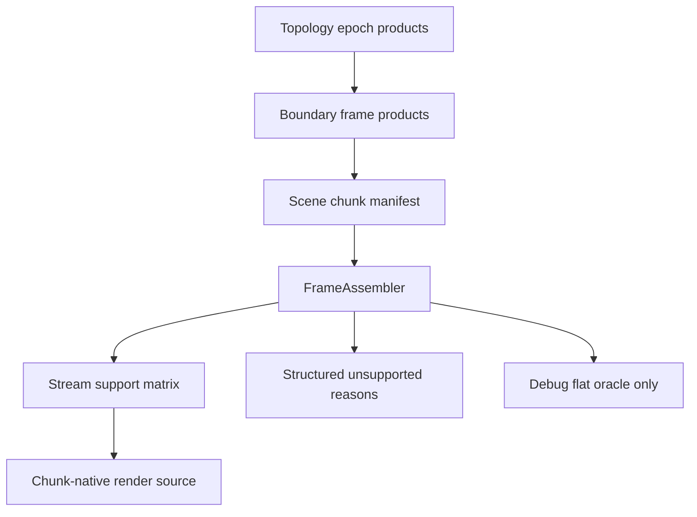

# UI Framework Phase 4 Topology Epoch and Frame Products - Plan

## Goal Capsule

| Field | Value |
|---|---|
| Objective | Turn the post-Phase-3 child-edge topology indexes into a typed frame product with an epoch lifecycle, then use that contract to harden dispatch/view-boundary consumers before reopening renderer and raw-surface follow-ons. |
| Authority | User request, repository `AGENTS.md`, Phase 3 retained bridge deletion plan and closeout memory, Fret runtime ADRs, current source evidence, then local `repo-ref/zed` and GPUI references. |
| Execution profile | Deep, breaking, deletion-biased refactor. The first executable slice is `crates/fret-ui` topology; renderer and public raw-seam work remain ordered follow-ons unless topology gates are already green. |
| Stop conditions | Stop if a change makes `Node.parent` a live topology oracle again, weakens source-policy gates, hides renderer fallback as supported chunk-native output, or moves component policy into `crates/fret-ui`. |
| Tail ownership | Implementation owns focused tests, perf/debug stats, diagnostics registry updates when stats become public, engineering memory, and conventional commits for each completed slice. |

---

## Product Contract

### Summary

Phase 3 removed the dangerous retained parent bridge and replaced repeated topology scans with derived child-edge indexes.
That was the right direction, but the indexes are still naked `HashMap`/`HashSet` fields without a lifecycle.
Phase 4 makes topology a typed frame product: child edges remain the source of truth, `Node.parent` stays storage/debug metadata, and consumers can ask whether a dispatch snapshot, view boundary product, or cache decision was built against the same topology epoch.

The renderer and public raw-surface follow-ons stay in this plan because they are the next architectural frontiers, but they should not preempt topology epoch work.
Renderer `FrameAssembler` work depends on reliable boundary frame products; raw seam shrink depends on the app-facing surface already having replacements.

### Problem Frame

Fret is converging toward the same core posture GPUI/Zed uses: views are stable state holders, elements are rebuilt per frame, and frame products are authoritative for hit testing, dispatch, layout, and paint.
Local GPUI references show `AnyView` keyed by entity identity, cached prepaint/paint ranges keyed by current frame conditions, and `DispatchNodeId` documented as not stable between frames.
That validates Fret's direction: stable identity can seed reuse, but live topology must be a current-frame product.

The current Fret risk is that `live_layer_nodes` and `child_parent_index` can drift silently.
They are updated from child-edge writes, but no typed epoch proves when they were built, when they changed, or whether a consumer is reusing a stale frame product.
The remaining DFS fallback in `parent_in_layer_forest_via_children` is useful as a temporary assertion path, but it should not become a permanent hidden repair bridge.

### Requirements

**Topology and Identity**

- R1. Child edges remain the topology authority for live membership and parent queries.
- R2. `Node.parent` remains retained storage/debug metadata and cannot become the first normal live-parent lookup path again.
- R3. The derived live topology index has one owner that stores live nodes, child-parent edges, and a typed epoch.
- R4. Every topology mutation that changes live membership or live child-parent edges advances the topology epoch; stable no-op child writes do not advance it.
- R5. Consumers can read the current topology epoch without inspecting raw index fields.
- R6. Stale topology consumers are observable through tests or debug stats before fallback deletion.
- R7. The DFS parent fallback is demoted to assertion/diagnostic coverage and then removed from normal hot paths once epoch consumers are covered.
- R8. Existing view-cache, dispatch, focus, command routing, semantics, scroll, and dirty propagation behavior remains correct under stale retained parent storage.

**Renderer and Text Follow-Ons**

- R9. Renderer chunk-native expansion starts only after topology epoch products can identify stable boundary frame products.
- R10. `FrameAssembler` owns support decisions for stream-specific assembly, unsupported reasons, payload cache shape, and debug flat-oracle use.
- R11. Text closure work preserves shaping cluster/run information before deleting any remaining oracle value from full-shape helpers.

**Public Surface Follow-Ons**

- R12. Default app/cookbook/starter surfaces stay free of `UiTree`, raw `ModelStore`, raw action-host traits, and wildcard advanced preludes.
- R13. Advanced/raw seams that remain must be named, classified, and kept out of default app prelude paths.

### Acceptance Examples

- AE1. Reparenting a child while its retained `Node.parent` is stale changes the topology epoch and still detaches it from the old parent through validated child-edge topology.
- AE2. Removing a deep live subtree changes the topology epoch without falling back to repeated root scans for each descendant.
- AE3. Rebuilding layer roots creates a fresh topology epoch and reindexes live nodes and child-parent edges from the layer forest.
- AE4. Same-children writes that only resync retained parent storage do not pretend to be a new topology when the child-edge set is unchanged.
- AE5. A dispatch snapshot or view-boundary test can assert the topology epoch it consumed and reject a stale snapshot after a child-edge mutation.
- AE6. A renderer chunk-native expansion unit cannot claim support for a stream class unless unsupported reasons and debug flat-oracle behavior are covered.
- AE7. Default public examples compile without importing `fret::advanced::prelude::*` except examples that are explicitly classified as advanced/manual.

### Scope Boundaries

In scope:

- Breaking internal `crates/fret-ui` topology APIs to introduce a typed owner and epoch.
- Focused debug/perf stats for topology epoch pressure when they are useful for gates.
- Planning renderer/text/raw follow-ons in dependency order without implementing them before topology consumers are ready.
- Deleting hidden repair/fallback code once tests prove current-frame topology is authoritative.

Deferred to follow-up work:

- Full GPUI-style deletion of retained `UiTree`.
- Full renderer stream support for every draw class in one pass.
- Full text shaping redesign beyond the cluster/run closure needed by renderer chunking.
- Broad public advanced/raw API redesign before app-facing replacements exist.

Outside this product identity:

- Treating GPUI or Zed as dependencies.
- Moving component policy such as focus traps, dismiss behavior, hover intent, sizing recipes, or shadcn defaults into `crates/fret-ui`.
- Keeping old repair bridges because they are convenient after a typed replacement is proven.

---

## Planning Contract

### Key Technical Decisions

| ID | Decision | Rationale |
|---|---|---|
| KTD1 | Introduce `LiveTopologyIndex` as the only owner of live nodes, child-parent edges, and topology epoch. | A pair of raw fields cannot express lifecycle, stale-consumer checks, or mutation boundaries. |
| KTD2 | Use a typed `LiveTopologyEpoch` newtype rather than a bare `u64`. | Epochs become part of frame-product contracts; a typed value prevents accidental mixing with frame IDs, binding generations, or cache generations. |
| KTD3 | Bump epochs from index owner operations, not from scattered callers. | The owner knows whether a mutation changes live membership or child-parent edges; callers should express intent, not counter bookkeeping. Coalescing multiple internal changes into one public mutation can be added later without changing the epoch contract. |
| KTD4 | Keep DFS fallback temporarily as a checked slow path, then delete it once epoch-bound consumers are covered. | Phase 3 proved the fallback was a safety net; Phase 4 should make stale indexes visible before removing the net. |
| KTD5 | Topology epoch gates precede renderer chunk-native expansion. | Boundary frame products are upstream of renderer scene chunk authority; chunk-native support without stable boundary topology risks proving the wrong product. |
| KTD6 | Public raw seam shrink is dependency-ordered after default app replacements. | Deletion should clean the user path, not remove advanced/manual capabilities that still have no app-facing replacement. |

### High-Level Technical Design

### Assumptions

- Phase 3 closeout already removed normal parent repair, flat diagnostic chunks, full-blob text resource normal usage, retired observation-collapse current perf keys, and default-surface raw local-state/action examples.
- Existing `fret-ui` tests are strong enough to support a narrow topology owner extraction without first adding integration diagnostics.
- Renderer `FrameAssembler` already exists, so the next renderer plan should expand ownership rather than invent a parallel assembler.
- Current default app/cookbook gates already encode many raw-surface exclusions; remaining public cleanup should build on those gates.
- The immediate raw-surface work is documentation and source-policy hygiene, not broad deletion: `fret::advanced::raw` remains intentional, while stale docs that imply raw traits live in `advanced::prelude` should be corrected.

### Sources and Research

- `docs/plans/2026-07-03-001-refactor-ui-framework-phase3-retained-bridge-deletion-plan.md`
- `docs/knowledge/engineering/progress/2026-07-04-phase3-closeout-child-edge-topology-index.md`
- `crates/fret-ui/src/tree/identity.rs`
- `crates/fret-ui/src/tree/view_boundary.rs`
- `crates/fret-ui/src/tree/ui_tree_mutation/remove.rs`
- `crates/fret-render-wgpu/src/renderer/mod.rs`
- `crates/fret-render-wgpu/src/renderer/render_scene/frame_assembler.rs`
- `repo-ref/zed/crates/gpui/src/view.rs`
- `repo-ref/zed/crates/gpui/src/element.rs`
- `repo-ref/zed/crates/gpui/src/key_dispatch.rs`
- `repo-ref/gpui-component/skills/gpui/references/element-id.md`

---

## Implementation Units

### U1. Own Live Topology Index and Epoch

- **Goal:** Replace raw `UiTree` topology index fields with a typed owner that stores the current `LiveTopologyEpoch`.
- **Requirements:** R1, R2, R3, R4, R5, AE1, AE2, AE3, AE4.
- **Dependencies:** None.
- **Files:** `crates/fret-ui/src/tree/identity.rs`, `crates/fret-ui/src/tree/mod.rs`, `crates/fret-ui/src/tree/ui_tree_default.rs`, `crates/fret-ui/src/tree/ui_tree_mutation/core.rs`, `crates/fret-ui/src/tree/ui_tree_mutation/mount.rs`, `crates/fret-ui/src/tree/ui_tree_mutation/barrier.rs`, `crates/fret-ui/src/tree/ui_tree_mutation/remove.rs`, `crates/fret-ui/src/tree/tests/identity_stress.rs`, `crates/fret-ui/src/tree/tests/children.rs`.
- **Approach:** Add `LiveTopologyEpoch` and `LiveTopologyIndex`; move live-node and child-parent storage into that owner; route reindex, child-edge replacement, live membership, parent lookup, and removal cleanup through owner methods; keep external `UiTree` helpers stable where possible.
- **Execution note:** Characterize epoch behavior before broad rewrites: unchanged child-edge writes should not bump topology, while live reparent, subtree removal, and root rebuild should.
- **Patterns to follow:** `ElementNodeIndex` and `StableNodeHandle` in `crates/fret-ui/src/tree/identity.rs`; stale retained-parent tests in `crates/fret-ui/src/tree/tests/children.rs`.
- **Test scenarios:** A live reparent with stale retained parent increments epoch and keeps child-edge parent lookup correct; same-children write does not increment epoch when child edges are unchanged; removing a deep subtree increments epoch and clears live membership; rebuilding layer roots increments epoch and preserves live element lookup.
- **Verification:** `fret-ui` focused tests for topology epoch and stale retained-parent reparent pass; `cargo check -p fret-ui` passes.

### U2. Bind Dispatch and View Boundaries to Topology Epoch

- **Goal:** Make dispatch snapshots and view-boundary frame products record the topology epoch they consumed.
- **Requirements:** R5, R6, R8, AE5.
- **Dependencies:** U1.
- **Files:** `crates/fret-ui/src/tree/dispatch_snapshot.rs`, `crates/fret-ui/src/tree/view_boundary.rs`, `crates/fret-ui/src/tree/ui_tree_view_cache.rs`, `crates/fret-ui/src/tree/tests/dispatch_snapshot_cache.rs`, `crates/fret-ui/src/tree/tests/view_cache.rs`.
- **Approach:** Store the current `LiveTopologyEpoch` on cached dispatch snapshots and relevant boundary products; invalidate or rebuild when topology epoch changes; add tests that mutate child edges after snapshot build and assert stale products are not reused.
- **Execution note:** Prefer proof-first tests because this unit changes cache reuse semantics.
- **Patterns to follow:** Existing dispatch snapshot cache hit/miss tests and boundary-owned frame-product tests.
- **Test scenarios:** Snapshot cache reuses within the same epoch; snapshot cache rebuilds after child-edge mutation; view-cache ancestry does not reuse a boundary product stamped with an older topology epoch.
- **Verification:** Focused dispatch/view-cache nextest cases pass; `cargo nextest run -p fret-ui --no-fail-fast` passes before follow-on deletion.

### U3. Demote and Delete Parent DFS Fallback From Normal Hot Paths

- **Goal:** Turn `parent_in_layer_forest_via_children` fallback scanning from hidden repair into explicit diagnostic/assertion coverage, then remove it from normal hot queries.
- **Requirements:** R6, R7, R8, AE2, AE5.
- **Dependencies:** U1, U2.
- **Files:** `crates/fret-ui/src/tree/identity.rs`, `crates/fret-ui/src/tree/ui_tree_subtree_layout_dirty.rs`, `crates/fret-ui/src/tree/ui_tree_view_cache.rs`, `crates/fret-ui/src/tree/layout/entrypoints.rs`, `crates/fret-ui/src/tree/tests/propagation_depth_topology.rs`, `crates/fret-ui/src/tree/tests/view_cache.rs`.
- **Approach:** Add temporary debug stats for topology fallback use if needed; update consumers to rely on validated index lookups; keep only test/debug slow checks that prove index correctness; delete the fallback from release hot paths once tests cover stale-index cases.
- **Execution note:** Do not delete fallback until U2 proves epoch-bound consumers reject stale topology.
- **Patterns to follow:** Phase 3 parent repair shadow-oracle retirement and retained pressure gates.
- **Test scenarios:** Dirty propagation follows indexed child-edge parent under stale retained parents; view-cache root ancestry follows indexed topology; stale index test fails in debug/assertion path rather than silently scanning roots.
- **Verification:** Focused topology tests and retained pressure gates pass.

### U4. Expand Renderer FrameAssembler Support by Stream Class

- **Goal:** Move the next renderer stream class from flat compatibility to explicit `FrameAssembler` support with structured unsupported reasons.
- **Requirements:** R9, R10, AE6.
- **Dependencies:** U1, U2.
- **Files:** `crates/fret-render-wgpu/src/renderer/mod.rs`, `crates/fret-render-wgpu/src/renderer/render_scene/frame_assembler.rs`, `crates/fret-render-wgpu/src/renderer/render_scene/execute.rs`, `crates/fret-render-wgpu/src/renderer/scene_chunk_encoding_cache.rs`, `crates/fret-render-wgpu/src/renderer/tests.rs`.
- **Approach:** Extend the existing support matrix and assembler rather than adding a parallel launch path; support one named stream class per slice; require unsupported reasons for mixed or side-table-dependent frames.
- **Execution note:** Start from structure tests before pixel/parity tests so unsupported support claims fail early.
- **Patterns to follow:** Existing `ResourceFreeQuad` and `ResourceFreeVertexColor` chunk launch support tests.
- **Test scenarios:** Supported stream assembles without `FlatCompat`; mixed streams report unsupported reason; debug flat oracle remains optional and does not define support.
- **Verification:** Renderer focused tests and `cargo nextest run -p fret-render-wgpu --no-fail-fast` pass for the touched stream class.

### U5. Harden Text Cluster and Run Closure

- **Goal:** Ensure renderer text residency signatures include the shaping cluster/run facts needed before broader chunk-native text support.
- **Requirements:** R10, R11.
- **Dependencies:** U4.
- **Files:** `crates/fret-render-wgpu/src/renderer/render_scene/visible_text.rs`, `crates/fret-render-wgpu/src/text/*`, `crates/fret-render-text/src/*`, `crates/fret-render-wgpu/src/text/tests.rs`.
- **Approach:** Preserve cluster boundaries, fallback font identity, visual bounds, and atlas reset generation in residency signatures; delete no oracle helper until replacement tests prove the same edge cases.
- **Execution note:** Use characterization tests around ligature, combining mark, emoji, RTL, and fallback-font cases before deletion.
- **Patterns to follow:** Existing `visible_text_residency_pins_complete_combining_cluster_under_narrow_scissor` coverage.
- **Test scenarios:** Narrow residency keeps a full combining cluster; ligature and RTL cases do not split required glyphs; fallback font changes alter residency signature.
- **Verification:** Focused text tests and renderer text suite pass.

### U6. Shrink Public Advanced Raw Surface After Replacements

- **Goal:** Continue public raw seam cleanup only where default app-facing replacements already exist.
- **Requirements:** R12, R13, AE7.
- **Dependencies:** None, but should not interrupt U1-U3.
- **Files:** `ecosystem/fret/src/view.rs`, `ecosystem/fret/src/view/raw.rs`, `ecosystem/fret/src/view/local_state.rs`, `ecosystem/fret/src/view/local_state/bridges.rs`, `ecosystem/fret-bootstrap/src/lib.rs`, `apps/fret-cookbook/src/lib.rs`, `apps/fret-cookbook/examples/query_basics.rs`, `docs/workstreams/into-element-surface-fearless-refactor-v1/TARGET_INTERFACE_STATE.md`, `docs/workstreams/authoring-surface-and-ecosystem-fearless-refactor-v1/REMAINING_SURFACE_SHRINK_AUDIT_2026-03-17.md`, `tools/check_surface_policy.py`.
- **Approach:** Keep intentional advanced/manual examples explicit; correct docs and tests so raw traits are imported from `fret::advanced::raw`, not `fret::advanced::prelude`; demote `fret-bootstrap` direct-driver helpers in docs to lower-level bootstrap paths; optionally add an app-context-friendly `query_status_badge` helper before removing `cx.elements()` from `query_basics`.
- **Execution note:** Treat this as a follow-on unless a narrow public-surface violation blocks topology or renderer work.
- **Patterns to follow:** Existing cookbook assertions that ban raw local-state/action usage in default examples.
- **Test scenarios:** Raw model/action/local-state traits are absent from app and advanced preludes; default cookbook examples do not import raw prelude; explicitly advanced examples remain classified; stale `UiCx` and `AppUiRawStateExt` documentation is superseded or corrected.
- **Verification:** `cargo nextest run -p fret --lib`, `cargo nextest run -p fret-bootstrap --lib`, `cargo nextest run -p fret-cookbook --lib`, `python3 tools/check_surface_policy.py`, and `python3 tools/check_consumption_profiles.py` pass for touched surfaces.

---

## Verification Contract

| Gate | Applies To | Done Signal |
|---|---|---|
| `cargo check -p fret-ui` | U1-U3 | Topology API compiles without renderer or app facade fallout. |
| `cargo nextest run -p fret-ui --no-fail-fast` | U1-U3 | Existing identity, view-cache, dispatch, layout, and stale-parent contracts remain green. |
| `cargo nextest run -p fret-render-wgpu --no-fail-fast` | U4-U5 | Renderer stream/text changes preserve existing conformance. |
| `cargo check -p fret-cookbook --all-targets` | U6 | Default examples compile after raw seam changes. |
| `python3 tools/check_layering.py` | All units | Crate boundaries stay intact. |
| `python3 tools/check_surface_policy.py` | U6 and public docs | Default public surface does not regress to raw/advanced imports. |
| `python3 tools/check_consumption_profiles.py` | Public examples and app facade | Consumption profiles remain classified and intentional. |
| `cargo fmt --all --check` | All units | Formatting is stable. |
| `git diff --check` | All units | No whitespace damage. |

---

## Definition of Done

- U1-U3 are complete before renderer stream support is treated as the active normal-path work.
- `LiveTopologyEpoch` is the typed contract for current topology products; raw live topology fields are not exposed from `UiTree`.
- `Node.parent` remains storage/debug metadata and no normal query path starts from it.
- Dispatch/view-boundary consumers either carry topology epoch or are explicitly documented as not caching topology-dependent products.
- Any temporary DFS fallback retained after U1 has an owner, a gate, and a deletion condition.
- Renderer follow-ons use `FrameAssembler` and structured unsupported reasons, not a new parallel source path.
- Public raw seams are either removed from default paths or classified as explicit advanced/manual examples.
- Tests and repo gates listed in the Verification Contract pass for completed units.
- Obsolete code discovered during implementation is deleted once replacement tests prove the new contract.
- Engineering memory records the executed slice, verification, and any remaining follow-on owner.
