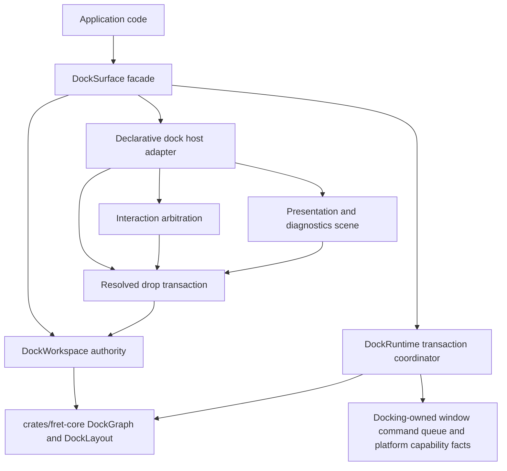
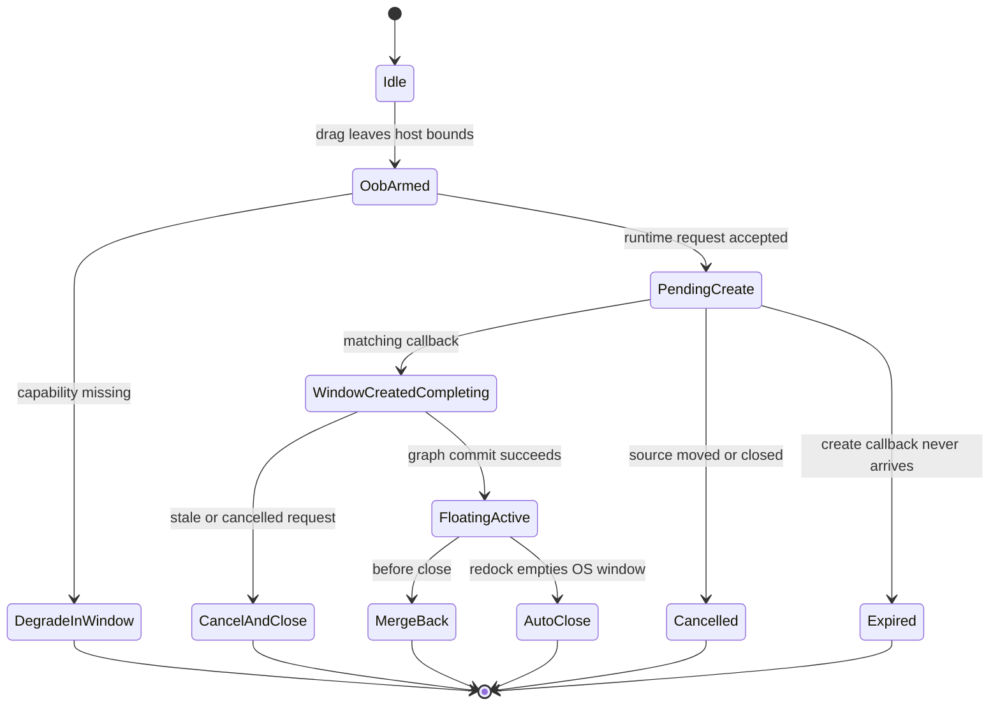
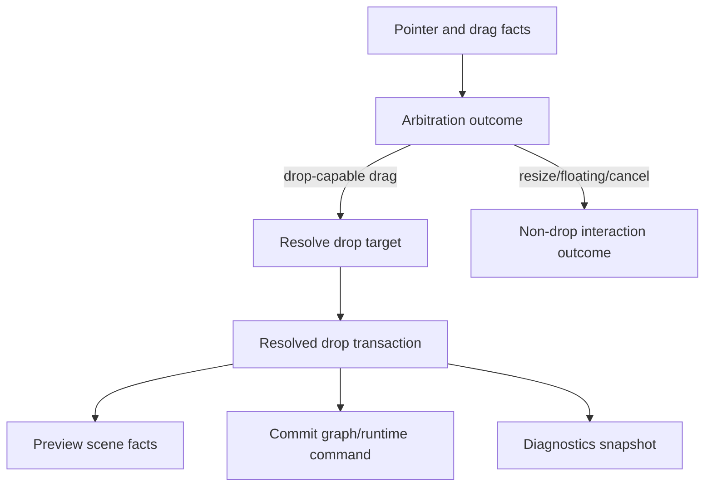

# Docking Surface Architecture Refactor - Plan

## Goal Capsule

| Field | Value |
|---|---|
| Objective | Rebuild Fret docking around a deep app-facing surface, a docking-owned runtime transaction module, workspace/model authority, resolved drop transactions, and explicit interaction arbitration while preserving Fret's core/runtime layering. |
| Authority | User request, repository `AGENTS.md`, ADR 0013/0072/0075/0077/0083/0155/0158/0159, current Fret source, `repo-ref/open-gpui` docking `71b42a39`, `repo-ref/imgui` docking branch `4be08b1ec`, and local planning research. |
| Execution profile | Deep, breaking, deletion-biased refactor. Direct code transplantation from the reference repos is allowed only behind Fret-owned internal module interfaces. Characterization and fixture coverage come before behavior-moving edits. |
| Stop conditions | Stop if platform/window/view handles enter `crates/fret-core`, preview and commit use different drop resolution, legacy public APIs are preserved by adding shallow compatibility layers, close/fallback paths can lose panels, or ADR evidence cannot be updated honestly. |
| Tail ownership | Goal execution owns implementation, focused tests, diagnostics evidence, doc alignment, code review, cleanup of abandoned attempts, and conventional commits at completed unit boundaries. |

---

## Reference Snapshot

| Source | Pinned state | Refactor impact |
|---|---|---|
| `repo-ref/open-gpui` | `71b42a39dd7c259175da3ba02e451fec97375491` (`71b42a39 refactor(docking): split viewport preview cleanup tests`) | Facade-first app surface, route-authority separation, release revalidation, typed viewport/session boundaries, and focused preview cleanup tests. |
| `repo-ref/imgui` | docking branch `4be08b1ecf7709f15e4274fb2ddac37e121d7d9a` (`4be08b1ec Docking: minor packing of AuthorityForXXX fields.`) | Dockspace liveness, runtime-owned request processing, settings/lifecycle separation, platform viewport callback responsibilities, and preview/commit consistency. |

---

## Product Contract

### Summary

This plan turns docking from a collection of useful but shallow handlers and public services into a set of deep modules: a `DockSurface` facade for applications, an internal runtime transaction owner, a workspace/model authority, a resolved drop transaction seam, and explicit interaction arbitration.
The refactor may break and delete existing `fret-docking` public APIs, including first-party example call sites, when the replacement interface is deeper and better tested.
The target shape is a headless-ish docking kernel plus Fret-bound host adapters, not a fully standalone headless crate.

### Problem Frame

Fret docking has already absorbed many correct ideas from ImGui docking and the earlier `imgui` reference lane: durable graph operations in `fret-core`, docking UI/policy in `ecosystem/fret-docking`, multi-window degradation, N-ary split support, declarative docking hosts, runtime owner splits, and substantial regression coverage.
The remaining issue is interface depth.
`DockingRuntime` is a thin facade over ordered handlers, application examples still assemble many low-level globals directly, `DockManager` mixes durable model state with transient interaction state, and drop/interaction correctness is partly encoded in event-handler order rather than in explicit transaction outcomes.

The reference repos point to a stronger shape.
Open GPUI exposes `DockSurface` as the common app seam, keeps graph/workspace/model access as an advanced tier, and makes resolved drop transactions internal test surfaces.
ImGui centralizes docking request processing, preview, commit, settings rebuild, and splitter updates in `DockContext`, but its immediate-mode global context and C++ pointer lifecycle are not portable to Fret.
Fret should copy mature algorithms and lifecycle discipline, not the donor interface or UI runtime assumptions.

### Premise Evidence

The current developer friction is visible in first-party docking code rather than only in architecture prose.
Normal examples and proof demos currently assemble or import low-level manager/service/runtime concepts such as `DockManager`, `DockPanelContentService`, `DockingPolicyService`, `DockViewportOverlayHooksService`, `dock_space_element_from_registry`, `Effect::Dock`, and free runtime handlers.
The before/after product test is simple: a normal docking app should register panel descriptors, seed or restore a layout, install policy/overlay hooks, mount hosts, and wire tear-off callbacks through `DockSurface` without learning manager globals or runtime handler ordering.
Low-level access may remain for framework tests and advanced integrations, but it must no longer be the taught path.

### Requirements

**Application Surface**

- R1. `DockSurface` becomes the recommended app-facing docking module for panel registration, initial layout, policy installation, host mounting, runtime callbacks, and first-party example integration.
- R2. Common users no longer need to import `DockManager`, low-level service globals, or free runtime handler functions to build a normal docking app.
- R3. Low-level model/runtime access remains available only through an explicit advanced/internal surface when tests or framework integration need it.
- R4. First-party docking examples and surface tests teach the new app-facing interface instead of the legacy manager/service assembly pattern.
- R21. An external-style consumer or generated starter test builds a normal docking app through the public `fret-docking` root and `DockSurface`, without first-party-only shortcuts.

**Runtime Lifecycle**

- R5. Docking runtime owns tear-off request, pending correlation, duplicate suppression, cancellation, window-created completion, before-close merge, auto-close, fallback, and invalidation as one transaction lifecycle.
- R6. Runtime outcomes are explicit for proceed, no-op, degraded in-window float, expired pending request, cancel-and-close, merge-back, missing-manager fail-closed, and graph-commit failure paths.
- R7. Disabled multi-window, disabled tear-off, missing hovered-window facts, missing `DockManager`, stale `window_created`, and canceled pending requests cannot create duplicate windows or lose panels.
- R8. OS-window tear-off requests stop living in the pure core graph operation vocabulary once a docking-owned runtime command path exists.

**Model and Persistence**

- R9. `crates/fret-core` remains the durable graph/layout/op/persistence layer and does not acquire UI, platform, viewport, drag session, or runtime window facts.
- R10. `ecosystem/fret-docking` owns a workspace/model authority that separates durable graph/panel catalog/layout state from transient hover, viewport layout, drag, and presentation state.
- R11. `fret-core` remains the owner of durable `DockLayout` graph/window/node/floating/active-tab schema and versioning; `fret-docking` owns panel descriptor/catalog metadata keyed by `PanelKey`.
- R12. Restore validates the core layout schema first, then reconciles the docking-owned descriptor catalog; unknown panels, duplicate keys, invalid split fractions, stale node IDs, and unmapped windows resolve through validation errors, descriptor-only restore, or documented single-window fallback.

**Drop, Interaction, and Presentation**

- R13. Drop preview and drop commit consume the same resolved drop transaction result.
- R14. Drop resolution handles panel and tab-stack drags, empty dock spaces, root and leaf edge targets, tab insertion, overflow headers, variable-width tabs, dragged-tab exclusion, policy denial, and out-of-window floating.
- R15. Declarative event handlers delegate interaction priority to an explicit arbitration module instead of relying on scattered early-return order.
- R16. Presentation affordances and diagnostics read one scene/state authority for drop hints, drag ghosts, floating chrome, tab detail, and published docking diagnostics.

**Verification and Documentation**

- R17. Characterization, fixture, public-surface, and diagnostics gates protect existing behavior before old paths are removed.
- R18. ADR implementation evidence is updated for every hard contract touched by the refactor.
- R19. Stale crate audit or workstream notes that contradict current retained-bridge status are refreshed or clearly superseded.
- R20. Abandoned compatibility code, old adapters, and superseded tests are deleted once the new interface and gates are green.

### Acceptance Examples

- AE1. A first-party docking demo registers panels, declares layout, installs policy, and opens a dock host through `DockSurface` without directly assembling manager and service globals.
- AE2. Repeating a panel or tab-stack tear-off request before `window_created` produces one create request and one pending transaction.
- AE3. A stale or canceled `window_created` callback closes the created window or no-ops without moving the panel into the wrong graph location.
- AE4. With multi-window or hover detection disabled, a tear-off request degrades into an in-window floating container and does not emit an OS-window create request.
- AE5. Closing a registered floating dock window merges its panels into a valid target or reports a non-lossy fallback outcome; missing target tabs are not silently treated as a successful merge.
- AE6. A drop preview for a tab-bar edge and the subsequent drop commit resolve to the same target, zone, insert index, and policy decision.
- AE7. A policy-denied drop target displays no commit-capable preview and emits no graph mutation on drop.
- AE8. Layout restore with an unmapped saved window degrades into the main window's in-window floating layout while preserving panel descriptors.
- AE9. Pointer interaction arbitration gives divider drag, floating drag, pending panel drag, pending tab-stack drag, hover preview, and cancel/drop cleanup deterministic outcomes.
- AE10. Public-surface gates fail if the common crate root re-exports low-level manager/runtime services after the facade replacement is available.
- AE11. A small external-style consumer or starter-app compile test depends on `fret-docking` through its public root, constructs a `DockSurface`, mounts a normal dock host, and verifies advanced/internal imports are not required for the ordinary path.

### Scope Boundaries

In scope:

- Breaking and deleting `ecosystem/fret-docking` public APIs that keep the interface shallow.
- Migrating first-party examples, tests, and cookbook-like surfaces to the new facade.
- Adding an external-style public-root consumer gate for the facade before deleting legacy exports.
- Directly transplanting mature implementation ideas from `repo-ref/open-gpui` and `repo-ref/imgui` into internal Fret modules.
- Moving OS-window tear-off request semantics out of pure core graph operations after a docking-owned runtime route is available.
- Updating ADR evidence and stale docking audit documents.

Deferred to follow-up work:

- Creating a separately published headless docking crate.
- Full platform-specific Wayland/macOS/Windows manual acceptance beyond the scripted native docking lifecycle diagnostic, existing diagnostics, and local automated gates.
- Reworking non-docking application window lifecycle APIs unless docking cannot safely integrate without a narrow upstream hook.
- Full visual redesign of docking chrome beyond preserving existing affordance behavior through a stronger presentation authority.

Outside this product identity:

- Treating `repo-ref/open-gpui` or `repo-ref/imgui` as dependencies.
- Copying GPUI entity/window/view ownership or ImGui immediate-mode global frame state into Fret.
- Moving component policy into `crates/fret-ui`.
- Preserving old shallow public APIs only to avoid first-party migration work.

---

## Planning Contract

### Key Technical Decisions

| ID | Decision | Rationale |
|---|---|---|
| KTD1 | Use transplant-first implementation behind Fret-owned interfaces with an explicit provenance gate. | The donor code is mature in lifecycle and geometry behavior, but its app/runtime assumptions are not Fret contracts. Copying algorithms behind internal modules gives leverage only when source SHA, file/function, license/NOTICE obligations, and Fret-native behavior fixtures are recorded before behavior-moving edits. |
| KTD2 | Make `DockSurface` the ordinary app seam and demote low-level docking access. | Current examples teach callers to wire globals, registries, runtime handlers, and host elements. Open GPUI shows the better depth: common apps configure a surface, advanced callers use lower tiers explicitly. |
| KTD3 | Prove the `DockSurface` vertical slice and runtime command handoff before deleting graph vocabulary. | Request/callback ordering is the highest-risk behavior, and facade value is the product proof. A thin facade plus a chosen handoff gives tests one vertical seam before `DockOp::RequestFloat*ToNewWindow` is removed from core. |
| KTD4 | Keep `fret-core` pure even when deleting core request ops. | Core can model durable graph mutations, but OS-window creation is a runtime/platform concern. The final shape must not move platform facts into core to compensate for deleting request ops. |
| KTD5 | Split workspace/model authority from transient interaction state. | `DockManager` currently stores durable graph/panels and transient hover/viewport facts. This weakens locality and makes future logical dockspace work more expensive. |
| KTD6 | Promote resolved drop transaction to the test surface. | Preview/commit divergence is one of the easiest docking regressions to introduce. A resolved transaction lets tests exercise the same target and intent that rendering and commit consume. |
| KTD7 | Express interaction priority as arbitration outcomes. | ADR 0072 is a matrix contract. Code that encodes priority through handler order is hard to review and easy to break during fearless refactors. |
| KTD8 | Keep diagnostics and presentation state downstream of behavior decisions. | Drop hints, drag ghosts, and diagnostics should render or report resolved facts; they should not assemble graph commands or decide commit behavior. |
| KTD9 | Delete legacy surface after first-party migration, not before. | Public surface gates need a working replacement to test against. Once examples and tests use the new facade, compatibility code becomes removable rather than protective. |
| KTD10 | Treat ADR/workstream evidence as part of the implementation. | Docking touches hard contracts. Updating `IMPLEMENTATION_ALIGNMENT.md` and stale audit notes keeps future agents from planning against obsolete retained-bridge or runtime-owner assumptions. |
| KTD11 | Use a `fret-docking` owned runtime command queue for OS-window docking requests. | `crates/fret-runtime` and `crates/fret-core` must not depend on `ecosystem/fret-docking`. `Effect::Dock` remains the durable graph-op channel; `DockSurface`/host adapters expose docking-owned window commands and callbacks for tear-off create, completion, close, cancel, and degrade paths. |
| KTD12 | Keep persisted graph schema in core and descriptor/catalog schema in docking. | `DockLayout` already models durable graph/window/node facts. `DockWorkspace` should reconcile panel descriptors and content factories around that schema instead of pushing UI descriptors or live handles into core. |

### High-Level Technical Design

### Assumptions

- The user has authorized breaking changes, deleting old code, direct internal code transplantation, subagents, incremental commits, and goal-mode execution.
- `docs/solutions/` and `CONCEPTS.md` do not exist in this repo; ADRs, workstream notes, crate audits, and diagnostics docs are the durable planning memory.
- `docs/workstreams/crate-audits/fret-docking.l0.md` is partially stale because retained bridge use has been removed from current docking paths.
- First-party examples, focused tests, and one external-style public-root consumer gate are the compatibility source of truth for this refactor; broad external consumer compatibility is intentionally lower priority than a correct framework contract.
- Exact type names and module filenames may change during execution, but the final interfaces must preserve the depth and layering decisions in this plan.

### Deferred to Implementation

- The exact advanced-surface name is execution-owned. It must be explicit enough that common app imports do not accidentally teach low-level manager/runtime APIs.
- Some diagnostics or real-host gates may be platform-limited locally. A skipped real-host gate must record the host limitation and keep deterministic unit/fixture evidence.

### Cross-Cutting Execution Gates

- **Transplant provenance gate:** Before copying or closely porting donor code, record source repository, pinned commit SHA, source file/function, license or NOTICE obligations, the Fret-owned destination module, and the behavior fixture that proves the port. If attribution cannot be satisfied, or if the code depends on GPUI entity/window/view ownership or ImGui global frame state, reimplement from observed behavior instead of copying.
- **Runtime command handoff gate:** OS-window docking requests use a `fret-docking` owned command queue exposed by `DockSurface`/host adapters. The queue carries tear-off create requests, cancellation, completion correlation, close handling, and degrade outcomes. `Effect::Dock(fret_core::DockOp)` remains the portable durable graph-op channel and must carry no OS-window creation request by the end of U5.
- **Vertical lifecycle gate:** Before U5 deletes core request variants, a focused vertical test must start a tear-off through `DockSurface`, observe exactly one docking-owned create command, complete a matching `window_created`, commit the durable graph move, and prove `Effect::Dock` contains only durable graph operations.
- **Persistence ownership gate:** Core layout schema changes must be versioned through `DOCK_LAYOUT_VERSION` and core persistence tests. Docking descriptor/catalog changes live in `ecosystem/fret-docking` workspace tests and must prove known-panel restore, unknown descriptor-only restore, duplicate-key rejection, and unmapped-window fallback without storing live handles.
- **Drop outcome contract gate:** U6 must define a resolved drop outcome table before deleting event-side assembly. Each row states preview state, commit action, cleanup/invalidation behavior, and diagnostics emission for valid commit, policy denied, no target, cancel, in-window float, OS-window tear-off, and degraded tear-off.
- **Diagnostics payload gate:** U6-U8 diagnostics must publish and assert resolved payload kind, source/current window, target id, zone, insert index, policy decision and denial reason, commit-capable flag, resolved command or no-op outcome, arbitration owner/outcome, cleanup or invalidation reason, and the scripted diagnostic name that captured the fields.

### Sources and Research

- `ecosystem/fret-docking/src/lib.rs`
- `ecosystem/fret-docking/src/facade.rs`
- `ecosystem/fret-docking/src/runtime.rs`
- `ecosystem/fret-docking/src/runtime/tests.rs`
- `ecosystem/fret-docking/src/dock/manager.rs`
- `ecosystem/fret-docking/src/dock/drop_resolve.rs`
- `ecosystem/fret-docking/src/dock/declarative/drag_resolve.rs`
- `ecosystem/fret-docking/tests/public_surface_policy.rs`
- `crates/fret-core/src/dock/op.rs`
- `crates/fret-core/src/dock/apply.rs`
- `crates/fret-core/src/dock/layout.rs`
- `crates/fret-core/src/dock/persistence.rs`
- `crates/fret-runtime/src/effect.rs`
- `apps/fret-examples/src/docking_demo.rs`
- `apps/fret-examples/src/docking_arbitration_demo.rs`
- `apps/fret-examples/src/container_queries_docking_demo.rs`
- `repo-ref/open-gpui/crates/gpui_docking/src/lib.rs`
- `repo-ref/open-gpui/crates/gpui_docking/src/surface.rs`
- `repo-ref/open-gpui/crates/gpui_docking/src/model.rs`
- `repo-ref/open-gpui/crates/gpui_docking/src/workspace_drop_transaction.rs`
- `repo-ref/imgui/imgui.cpp`
- `repo-ref/imgui/imgui_internal.h`
- `docs/adr/0013-docking-ops-and-persistence.md`
- `docs/adr/0072-docking-interaction-arbitration-matrix.md`
- `docs/adr/0075-docking-layering-b-route-and-retained-bridge.md`
- `docs/adr/0077-resizable-panel-groups-and-docking-split-sizing.md`
- `docs/adr/0083-multi-window-degradation-policy.md`
- `docs/adr/0155-docking-tab-dnd-contract.md`
- `docs/adr/0158-docking-tab-bar-variable-width-tabs.md`
- `docs/adr/0159-ui-diagnostics-snapshot-and-scripted-interaction-tests.md`
- `docs/workstreams/docking-multiwindow-imgui-parity/M23_DOCKING_RUNTIME_TEAR_OFF_OWNER_SPLIT_2026-05-31.md`
- `docs/workstreams/docking-multiwindow-imgui-parity/M28_DOCKING_RUNTIME_BEFORE_CLOSE_OWNER_SPLIT_2026-06-02.md`
- `docs/workstreams/docking-multiwindow-imgui-parity/M32_DOCKING_RUNTIME_TEST_OWNER_SPLIT_2026-06-02.md`
- `docs/workstreams/retained-bridge-exit-v1/HANDOFF.md`
- `docs/workstreams/crate-audits/fret-docking.l0.md`

---

## Implementation Units

### U1. Add Characterization and Surface Gates

- **Goal:** Lock current behavior and desired public-surface direction before moving implementation.
- **Requirements:** R5, R6, R7, R13, R14, R17, AE2, AE3, AE4, AE6, AE7. U1 may seed non-enforcing coverage targets for R1-R4, R21, AE1, AE10, and AE11, but those targets become passing gates only in U2, U3, and U8.
- **Dependencies:** None.
- **Files:** `ecosystem/fret-docking/tests/public_surface_policy.rs`, `ecosystem/fret-docking/src/runtime/tests.rs`, `ecosystem/fret-docking/src/dock/tests/dock_space.rs`, `ecosystem/fret-docking/src/dock/tests/split.rs`, `crates/fret-core/src/dock/tests.rs`, `crates/fret-core/src/dock/fixtures/dock_op_sequences_v1.json`, `apps/fret-examples/tests/docking_demo_surface.rs`, `apps/fret-examples/tests/docking_arbitration_surface.rs`, `apps/fret-examples/tests/container_queries_docking_surface.rs`.
- **Approach:** Strengthen tests around current lifecycle behavior, desired facade-facing examples, and accidental public exports. Add fixture-style assertions where existing tests are too coupled to event handlers.
- **Execution note:** Characterization-first. Future-facing facade assertions added before the facade exists must be ignored, expectation-marked, or otherwise kept out of the passing U1 gate. Completed U1 must leave focused tests green; it must not land intentionally red tests.
- **Patterns to follow:** Existing runtime tests in `ecosystem/fret-docking/src/runtime/tests.rs`; source-policy style in `ecosystem/fret-docking/tests/public_surface_policy.rs`; core dock fixture style in `crates/fret-core/src/dock/fixtures/dock_op_sequences_v1.json`.
- **Test scenarios:** Duplicate tear-off requests are idempotent; stale `window_created` does not move the wrong panel; canceled pending requests close new windows; disabled multi-window degrades in-window; public root does not expose retained or legacy low-level entry points once replacements exist; examples use the facade after U3.
- **Verification:** Focused runtime, core dock fixture, and current public-surface tests pass before behavior-moving edits begin; future facade gates are present only as non-enforcing coverage notes until U2/U3 make them executable.

### U2. Land DockSurface Vertical Slice and Runtime Transaction Coordinator

- **Goal:** Prove the app-facing facade and docking-owned runtime command handoff first, then replace ordered free-handler knowledge with one runtime transaction module.
- **Requirements:** R1, R2, R5, R6, R7, R8, R17, R21, AE1, AE2, AE3, AE4, AE5, AE11.
- **Dependencies:** U1.
- **Files:** `ecosystem/fret-docking/src/lib.rs`, `ecosystem/fret-docking/src/facade.rs`, `ecosystem/fret-docking/src/runtime.rs`, `ecosystem/fret-docking/src/runtime/request.rs`, `ecosystem/fret-docking/src/runtime/tear_off.rs`, `ecosystem/fret-docking/src/runtime/window_created.rs`, `ecosystem/fret-docking/src/runtime/before_close.rs`, `ecosystem/fret-docking/src/runtime/auto_close.rs`, `ecosystem/fret-docking/src/runtime/apply.rs`, `ecosystem/fret-docking/src/runtime/layout_invalidation.rs`, `ecosystem/fret-docking/src/runtime/tests.rs`, `ecosystem/fret-docking/src/dock/declarative/tear_off.rs`, `ecosystem/fret-docking/src/dock/drop_resolve/intent.rs`, `ecosystem/fret-docking/tests/public_surface_policy.rs`.
- **Approach:** First land a thin `DockSurface` vertical slice over existing runtime behavior: panel registration, layout seed, host mount, and a `fret-docking` owned runtime command queue for OS-window tear-off requests. Then introduce one internal lifecycle owner for request registration, pending lookup, cancellation, completion, before-close merge, auto-close, fallback, expired pending requests, and invalidation. Keep old public handlers only as temporary adapters until the facade migration removes them from common use.
- **Execution note:** Preserve behavior first, then simplify. The `DockSurface` vertical test must pass before broad runtime rewrites. Do not remove existing owner-split tests until equivalent transaction tests cover the same paths.
- **Patterns to follow:** Current `DockTearOffMachine` in `runtime/tear_off.rs`; runtime owner split notes under `docs/workstreams/docking-multiwindow-imgui-parity/`; open-gpui viewport runtime outcome/status modules.
- **Test scenarios:** A thin external-style consumer constructs `DockSurface` through the public root; a tear-off through `DockSurface` emits one docking-owned create command and no core OS-window request op; duplicate panel and tab-stack request paths create one pending transaction; stale and canceled callbacks close or no-op safely; expired pending requests clean up visibly; missing manager fails closed; graph commit failure returns a visible outcome; before-close with missing target tabs does not report a false successful merge; auto-close removes registered empty OS windows after redock.
- **Verification:** Runtime tests exercise the coordinator through `DockSurface` and a direct internal seam where needed; no caller must know the request -> create -> callback ordering to use the runtime facade correctly.

### U3. Complete DockSurface and Migrate First-Party App Entry Points

- **Goal:** Add a deep app-facing `DockSurface` facade and migrate first-party examples to it.
- **Requirements:** R1, R2, R3, R4, R17, R21, AE1, AE10, AE11.
- **Dependencies:** U1, U2.
- **Files:** `ecosystem/fret-docking/src/lib.rs`, `ecosystem/fret-docking/src/facade.rs`, `ecosystem/fret-docking/src/dock/mod.rs`, `ecosystem/fret-docking/src/dock/declarative.rs`, `ecosystem/fret-docking/src/dock/declarative/registry.rs`, `ecosystem/fret-docking/src/dock/services.rs`, `apps/fret-examples/src/docking_demo.rs`, `apps/fret-examples/src/docking_arbitration_demo.rs`, `apps/fret-examples/src/container_queries_docking_demo.rs`, `apps/fret-examples/src/imui_editor_proof_demo/workbench_shell.rs`, `ecosystem/fret-docking/tests/public_surface_policy.rs`, `apps/fret-examples/tests/docking_demo_surface.rs`, `apps/fret-examples/tests/docking_arbitration_surface.rs`, `apps/fret-examples/tests/container_queries_docking_surface.rs`.
- **Approach:** Build a facade that owns normal panel registration, initial graph/layout seed, policy and overlay installation, host element creation, runtime callback hooks, and common panel commands. Every migrated demo should demonstrate this developer flow: construct `DockSurface`, register panel roots/descriptors, seed or restore layout, install policy and overlays, mount a dock host for each participating window/frame, wire runtime callbacks through the facade, and use common panel commands without importing manager or service globals. Keep lower-level manager/workspace/runtime access out of the common root unless it is routed through an explicit advanced tier.
- **Execution note:** Break first-party examples instead of preserving legacy assembly code. The facade must be proven by migrated examples, not only by unit tests.
- **Patterns to follow:** `repo-ref/open-gpui/crates/gpui_docking/src/surface.rs`; current declarative registry setup in first-party examples; Fret app facade patterns in `ecosystem/fret` and `ecosystem/fret-bootstrap`.
- **Test scenarios:** Duplicate panel registration fails fast; missing panel content can restore descriptor-only where supported; policy hooks are installed through the facade; first-party examples no longer import manager/service globals for normal setup; the external-style public-root consumer compiles without first-party shortcuts; advanced imports remain quarantined where an example is explicitly low-level.
- **Verification:** Public-surface and example-surface tests pass with the new facade as the taught path.

### U4. Split Workspace and Panel Catalog Authority From Transient Interaction State

- **Goal:** Turn `DockManager` into a coordinator over deeper internal modules instead of a mixed state bag.
- **Requirements:** R9, R10, R11, R12, R17, AE8.
- **Dependencies:** U2, U3.
- **Files:** `ecosystem/fret-docking/src/dock/manager.rs`, `ecosystem/fret-docking/src/dock/services.rs`, `ecosystem/fret-docking/src/dock/declarative/registry.rs`, `ecosystem/fret-docking/src/dock/declarative/geometry.rs`, `ecosystem/fret-docking/src/dock/declarative/frame_state.rs`, `ecosystem/fret-docking/src/dock/host_frame.rs`, `ecosystem/fret-docking/src/dock/layout.rs`, `ecosystem/fret-docking/src/dock/tests/dock_space.rs`, `ecosystem/fret-docking/src/dock/tests/split.rs`.
- **Approach:** Create an internal workspace/model authority for graph, panel descriptors, panel catalog, dock-space roots, persistence-facing layout state, and graph mutation helpers. `fret-core::DockLayout` remains the durable graph/window/node schema; `DockWorkspace` owns descriptor/catalog reconciliation around `PanelKey`, content factories, placeholder/descriptor-only restore, and duplicate-key rejection. Move hover, drag preview, viewport layout, and presentation facts into separate transient owners.
- **Execution note:** Replace rather than layer. Once call sites use the workspace authority, delete duplicated direct `DockManager` mutation helpers that no longer earn their interface.
- **Patterns to follow:** open-gpui `DockWorkspace` and `DockController`; existing Fret `DockGraph` and `DockLayout` contracts; ADR 0075 layering.
- **Test scenarios:** Panel activation still prefers requested windows; viewport layout sync remains idempotent; panel catalog survives close/reopen flows; known-panel restore mounts content; unknown panel restore keeps descriptor data without live handles; duplicate descriptor keys fail fast; invalid core layouts fail validation; unmapped saved windows degrade without dropping panels.
- **Verification:** Dock-space and split tests pass through the new workspace owner; `DockManager` fields are private or internal enough that common app code cannot depend on the old mixed state shape.

### U5. Remove Runtime Window Requests From Core DockOp

- **Goal:** Make core docking operations purely durable graph transactions by moving OS-window tear-off requests into `ecosystem/fret-docking`.
- **Requirements:** R8, R9, R17, AE2, AE3, AE4.
- **Dependencies:** U2, U3.
- **Files:** `crates/fret-core/src/dock/op.rs`, `crates/fret-core/src/dock/apply.rs`, `crates/fret-core/src/dock/tests.rs`, `crates/fret-core/src/dock/fixtures/dock_op_sequences_v1.json`, `crates/fret-runtime/src/effect.rs`, `crates/fret-launch/src/runner/desktop/runner/effect_queue.rs`, `crates/fret-launch/src/runner/web/effects.rs`, `ecosystem/fret-docking/src/runtime.rs`, `ecosystem/fret-docking/src/runtime/tests.rs`, `ecosystem/fret-docking/src/dock/drop_resolve/intent.rs`, `ecosystem/fret-docking/src/dock/declarative/tear_off.rs`, `ecosystem/fret-docking/src/dock/declarative/drag_resolve.rs`.
- **Approach:** After the runtime coordinator, `DockSurface` vertical slice, and docking-owned command queue can own tear-off commands, stop emitting OS-window requests as `fret_core::DockOp` variants. Keep durable moves, floats, merges, split updates, and active-tab changes in core. U5 is intentionally narrow: it deletes the request variants and rewires docking-owned handoff paths; it must not absorb workspace splitting or non-docking window lifecycle redesign.
- **Execution note:** This is the intentionally breaking unit. Do not keep `RequestFloat*ToNewWindow` as unsupported core variants unless a narrower transitional gate proves they are unreachable and scheduled for deletion in the same execution run.
- **Patterns to follow:** Current `DockGraph::apply_op_checked` rejection of request ops; ADR 0013 transaction vocabulary; open-gpui separation between graph mutations and viewport runtime effects.
- **Test scenarios:** Core op fixtures contain no OS-window create request operations; graph apply has no unsupported request-op branch; `Effect::Dock` contains only durable graph operations; drag/drop tear-off still creates or degrades through the docking runtime coordinator and command queue; desktop and web consumers do not depend on core request variants.
- **Verification:** `fret-core`, `fret-runtime`, `fret-launch`, and `fret-docking` compile and focused docking tests prove equivalent tear-off behavior without core request ops.

### U6. Promote Resolved Drop Transaction to the Preview and Commit Seam

- **Goal:** Make drop target resolution, preview facts, commit intent, diagnostics, and invalidation derive from one resolved transaction.
- **Requirements:** R13, R14, R16, R17, AE6, AE7.
- **Dependencies:** U4, U5.
- **Files:** `ecosystem/fret-docking/src/dock/drop_resolve.rs`, `ecosystem/fret-docking/src/dock/drop_resolve/target.rs`, `ecosystem/fret-docking/src/dock/drop_resolve/intent.rs`, `ecosystem/fret-docking/src/dock/drop_resolve/diagnostics.rs`, `ecosystem/fret-docking/src/dock/declarative/drag_resolve.rs`, `ecosystem/fret-docking/src/dock/declarative/drag_resolve/target.rs`, `ecosystem/fret-docking/src/dock/declarative/drag_resolve/drop_intent.rs`, `ecosystem/fret-docking/src/dock/declarative/drag_resolve/diagnostics.rs`, `ecosystem/fret-docking/src/dock/types.rs`, `ecosystem/fret-docking/src/dock/declarative/events/internal_drag.rs`, `ecosystem/fret-docking/src/dock/tests/dock_space.rs`.
- **Approach:** Keep pure resolution reusable and make declarative event code an adapter that projects pointer/frame facts into the resolver, then applies the resolved transaction outcome. Preview scene facts, presentation scene facts, diagnostics payloads, invalidation, and commit commands consume the same resolved value. Add a presentation authority for drop hints, drag ghosts, floating chrome, tab metrics, and diagnostic readers so presentation does not recompute behavior decisions.
- **Execution note:** Build direct matrix tests before deleting old event-side assembly. Use both panel and tab-stack payloads.
- **Patterns to follow:** Current `drop_resolve` target and intent modules; open-gpui `workspace_drop_transaction`; ImGui preview setup/render/queue discipline.
- **Test scenarios:** Center, left, right, top, bottom, inner, outer, empty dockspace, root edge, leaf edge, tab insertion, overflow header, dragged-tab exclusion, no target, cancel, in-window float, OS-window tear-off, degraded tear-off, and policy-denied cases all return stable resolved outcomes. Preview, cleanup, diagnostics, and commit/no-op behavior agree for every outcome class.
- **Verification:** Drop transaction tests can exercise the resolver without a full event dispatch chain; event tests prove the adapter applies those outcomes; diagnostics assertions cover the payload fields named in the cross-cutting diagnostics gate.

### U7. Make Declarative Interaction Arbitration Explicit

- **Goal:** Replace event-handler priority encoded by early returns with an arbitration module that returns typed outcomes.
- **Requirements:** R15, R16, R17, AE9.
- **Dependencies:** U6.
- **Files:** `ecosystem/fret-docking/src/dock/declarative/interaction.rs`, `ecosystem/fret-docking/src/dock/declarative/interaction/types.rs`, `ecosystem/fret-docking/src/dock/declarative/interaction/drag_sessions.rs`, `ecosystem/fret-docking/src/dock/declarative/events/pointer_down.rs`, `ecosystem/fret-docking/src/dock/declarative/events/pointer_move.rs`, `ecosystem/fret-docking/src/dock/declarative/events/pointer_move/divider_drag.rs`, `ecosystem/fret-docking/src/dock/declarative/events/pointer_move/floating_drag.rs`, `ecosystem/fret-docking/src/dock/declarative/events/pointer_move/pending_panel_drag.rs`, `ecosystem/fret-docking/src/dock/declarative/events/pointer_move/pending_tabs_group_drag.rs`, `ecosystem/fret-docking/src/dock/declarative/events/pointer_up.rs`, `ecosystem/fret-docking/src/dock/declarative/events/pointer_cancel.rs`, `ecosystem/fret-docking/src/dock/tests/dock_space.rs`, `ecosystem/fret-docking/src/dock/tests/split.rs`.
- **Approach:** Model the priority matrix from ADR 0072 as a behavior module: event facts plus current interaction state produce consume/capture/redraw/invalidate/drop/resize/floating/cancel outcomes. Event files translate outcomes into host effects and state updates.
- **Execution note:** Preserve one outcome at a time. Divider drag, floating drag, pending panel drag, pending tab-stack drag, hover preview, drop, and cancel cleanup should each have direct tests before handler rewrites spread.
- **Patterns to follow:** Existing `DeclarativeDockInteractionService`; pointer-move owner splits; `docs/docking-arbitration-checklist.md`.
- **Test scenarios:** Divider drag suppresses hover; floating drag suppresses pending panel drag; panel drag and tab-stack drag thresholds do not cross-trigger; modal barriers block docking input; starting a dock drag closes or suspends non-modal overlays; viewport capture and dock drag cannot own the same pointer session; Escape cancels an active dock drag without committing; a second pointer cannot start a competing dock drag while the window-exclusive docking lock is active; cancel clears hover and capture; pointer-up drop clears drag preview and emits only the resolved transaction effects.
- **Verification:** Arbitration tests map back to ADR 0072 decisions, and event handler tests prove outcomes are applied once.

### U8. Delete Legacy Surface, Align Docs, and Run Diagnostics

- **Goal:** Remove superseded public APIs and stale documentation after the new surface and behavior seams are in use.
- **Requirements:** R2, R3, R4, R16, R18, R19, R20, R21, AE1, AE10, AE11.
- **Dependencies:** U3, U4, U5, U6, U7.
- **Files:** `ecosystem/fret-docking/src/lib.rs`, `ecosystem/fret-docking/src/dock/mod.rs`, `ecosystem/fret-docking/src/dock/services.rs`, `ecosystem/fret-docking/src/facade.rs`, `ecosystem/fret-docking/tests/public_surface_policy.rs`, `apps/fret-examples/src/docking_demo.rs`, `apps/fret-examples/src/docking_arbitration_demo.rs`, `apps/fret-examples/src/container_queries_docking_demo.rs`, `apps/fret-examples/src/imui_editor_proof_demo/workbench_shell.rs`, `docs/adr/IMPLEMENTATION_ALIGNMENT.md`, `docs/workstreams/crate-audits/fret-docking.l0.md`, `docs/docking-imgui-parity-matrix.md`, `docs/docking-arbitration-checklist.md`, `docs/ui-diagnostics-and-scripted-tests.md`.
- **Approach:** Remove or demote legacy exports, delete adapters whose only purpose was compatibility with the old surface, update first-party docs and ADR evidence, run the external-style public-root consumer gate, and record any real-host diagnostics gaps honestly.
- **Execution note:** Do not leave deprecated code behind unless a still-active first-party caller requires it and the caller is documented as advanced/internal.
- **Patterns to follow:** Existing public surface policy tests; ADR implementation alignment evidence format; retained bridge exit handoff.
- **Test scenarios:** Common root exports only facade-facing symbols; advanced-only low-level symbols are isolated; external-style consumer and first-party examples compile against the facade; stale retained-bridge audit text no longer contradicts current source; docking diagnostics docs point to current seams and gates.
- **Verification:** Public-surface, external-style consumer, example-surface, docking runtime/drop/arbitration tests, scripted native docking lifecycle diagnostic, ADR evidence, and diagnostics notes all describe the same final interface. If the native diagnostic cannot run locally, the skip must name the host limitation and cite deterministic tests for tear-off create, matching `window_created`, before-close merge, and auto-close.

---

## Verification Contract

| Gate | Applies To | Done Signal |
|---|---|---|
| Formatting | All units | `cargo fmt` produces no diff. |
| Transplant provenance | U1-U8 | Any copied or closely ported donor algorithm has a source SHA/file/function/license note and a Fret behavior fixture before the behavior-moving edit lands. |
| Core docking tests | U1, U4, U5 | `cargo nextest run -p fret-core` passes for dock graph/op/persistence coverage. |
| Docking crate tests | U1-U8 | `cargo nextest run -p fret-docking --no-fail-fast` passes. |
| Example surface tests | U3, U8 | `cargo nextest run -p fret-examples --no-fail-fast` passes for docking example surface tests when the package is available in the local workspace. |
| External-style consumer gate | U2, U3, U8 | A small public-root consumer or generated starter test builds normal docking through `DockSurface` and proves advanced/internal imports are unnecessary for the ordinary path. |
| Layering check | U5, U8 | `python3 tools/check_layering.py` passes and confirms no UI/platform dependency leaked into `fret-core`. |
| Focused clippy | U2-U8 | `cargo clippy -p fret-docking --all-targets -- -D warnings` passes or any pre-existing workspace-wide blocker is documented with a focused clean substitute. |
| Diagnostics evidence | U6-U8 | Existing docking arbitration or scripted diagnostics named in `docs/ui-diagnostics-and-scripted-tests.md` pass, or platform-specific skips are documented with the deterministic tests that cover the same contract. |
| Native docking lifecycle diagnostic | U8 | A scripted native diagnostic covers tear-off create, matching `window_created`, before-close merge, and auto-close before legacy deletion; any skip names the missing host capability and cites deterministic tests for each lifecycle state. |
| ADR alignment | U8 | `docs/adr/IMPLEMENTATION_ALIGNMENT.md` cites current file/test evidence for touched docking ADRs. |

---

## System-Wide Impact

- **Framework users:** Common docking setup becomes smaller and more opinionated. Existing low-level imports may break, but first-party examples and the external-style consumer gate will show the replacement path.
- **Core/runtime layering:** `fret-core` becomes cleaner by losing runtime window request vocabulary. OS-window docking requests move to a `fret-docking` owned `DockSurface`/host command queue while `Effect::Dock` remains durable graph-only.
- **Diagnostics and tests:** More behavior becomes testable through transaction and arbitration seams rather than through large event harnesses only.
- **Reference alignment:** The final shape should make future open-gpui/imgui parity work easier because comparable concepts exist in Fret with Fret-owned names and contracts.
- **Agent maintainability:** Future agents can reason about app surface, runtime lifecycle, workspace model, drop transaction, and interaction arbitration as distinct modules rather than scanning event handlers and examples.

---

## Risks & Dependencies

| Risk | Mitigation |
|---|---|
| Moving OS-window requests out of `DockOp` touches runtime and runner handoff behavior. | Choose the `fret-docking` owned command queue in U2, prove the vertical lifecycle gate before U5, and keep U5 focused on deleting request ops without changing durable graph semantics. |
| First-party examples may hide low-level API dependencies that public-surface tests do not catch. | Migrate examples in U3, add the external-style consumer gate, and enforce source-policy gates in U8. |
| Drop resolver refactor can regress subtle tab insertion or overflow behavior. | Add direct resolved-transaction matrix tests before deleting event-side assembly. |
| Before-close merge may currently no-op in states where data preservation should win. | U2 must give missing-target and graph-failure paths explicit outcomes before U8 claims lifecycle alignment. |
| Stale workstream/audit docs can mislead execution. | U8 refreshes or supersedes `fret-docking.l0.md` and updates ADR implementation evidence. |
| Copied donor code can import hidden donor assumptions. | The transplant provenance gate records source, license/NOTICE obligations, and behavior fixture; behavior-only reimplementation is required when donor runtime assumptions do not fit Fret. |
| Subagents may produce overlapping edits in shared docking modules. | Execute high-contention units serially unless harness-native isolation provides safe worker integration; orchestrator owns commits and final tests. |

---

## Documentation and Operational Notes

- Update `docs/adr/IMPLEMENTATION_ALIGNMENT.md` for ADR 0013, 0072, 0075, 0077, 0083, 0155, 0158, and 0159 when implementation changes their evidence anchors.
- Refresh or supersede `docs/workstreams/crate-audits/fret-docking.l0.md` because it currently records retained-bridge risks that no longer match current source.
- Keep `docs/docking-imgui-parity-matrix.md`, `docs/docking-arbitration-checklist.md`, and `docs/ui-diagnostics-and-scripted-tests.md` aligned with the final transaction/arbitration seams.
- Capture durable lessons after the refactor if the execution reveals a reusable pattern for Fret docking or public-surface breakage.

---

## Definition of Done

- U1 through U8 are implemented or an explicit plan-scope blocker is surfaced before guessing.
- `DockSurface` is the recommended first-party app-facing docking entry point.
- `DockingRuntime` or its replacement owns runtime lifecycle as a transaction module, not as ordered free handlers.
- `fret_core::DockOp` no longer contains OS-window creation request variants.
- `Effect::Dock` carries only durable core graph operations; OS-window docking requests flow through the `fret-docking` owned `DockSurface`/host command queue.
- `DockManager` no longer exposes mixed durable and transient state as the common app surface.
- Drop preview and commit use the same resolved transaction seam.
- Interaction arbitration is represented as explicit behavior outcomes tied to ADR 0072.
- Legacy public exports are removed or quarantined under an explicit advanced/internal surface when they remain legitimate low-level access; compatibility adapters that no longer earn their interface are deleted.
- Focused tests, formatting, layering checks, relevant diagnostics, and ADR evidence are complete.
- Experimental or abandoned refactor attempts are removed from the diff before the work is marked done.
