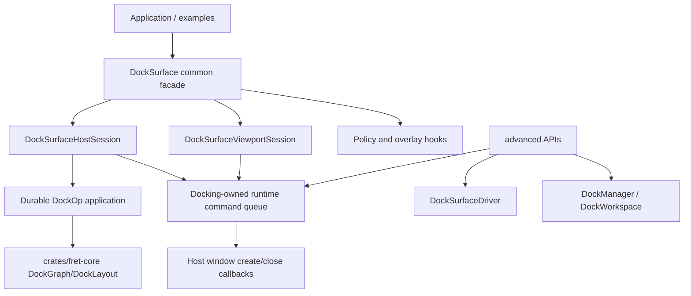
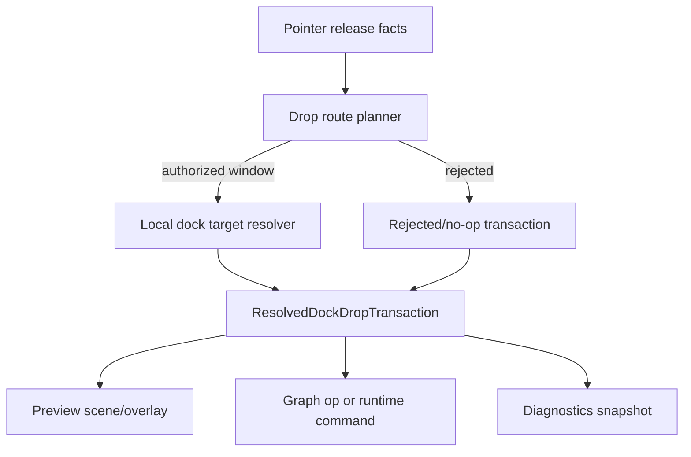
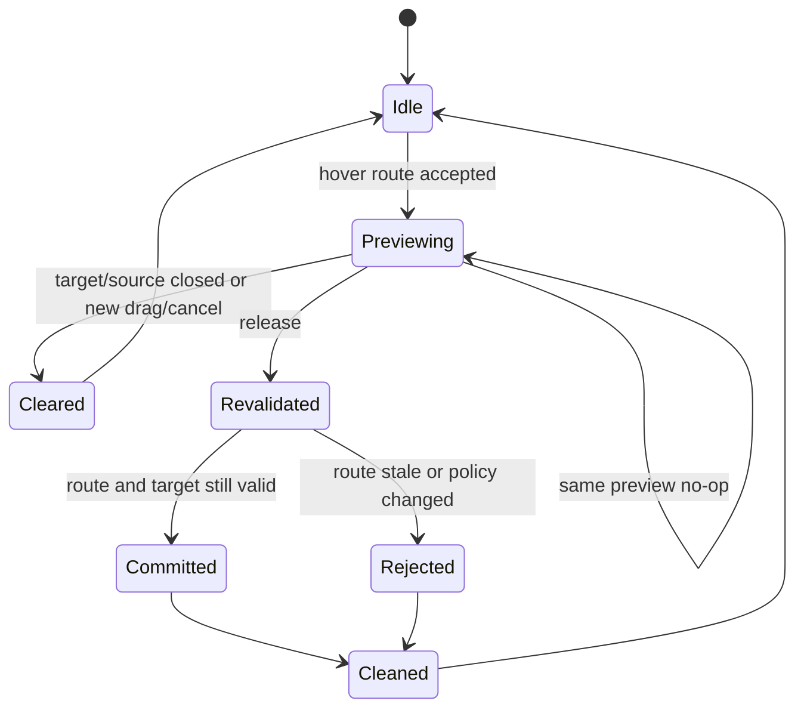

# Docking Viewport Contract Refactor - Plan

## Goal Capsule

| Field | Value |
|---|---|
| Objective | Finish the fearless docking refactor by making `DockSurface` the ordinary app surface, deleting legacy viewport/runtime teaching APIs, hardening multi-viewport route and cleanup contracts, and updating tests/docs against the latest `open-gpui` and ImGui docking references. |
| Authority | User request, repository `AGENTS.md`, ADR 0013/0072/0075/0132/0155/0158/0159, current Fret source, `repo-ref/open-gpui` `71b42a39`, `repo-ref/imgui` docking `4be08b1ec`, local code audit, and subagent research. |
| Execution profile | Deep, breaking, deletion-biased refactor. Direct internal code copying/porting from user-owned references is allowed when provenance and Fret-native tests are recorded. No migration shims are required for obsolete public APIs. |
| Stop conditions | Stop if platform/window handles enter `crates/fret-core`, if preview and commit use different drop decisions, if common examples still teach driver/runtime/manual-flush seams, if close/cancel paths can lose panels, or if stale docs continue to contradict current retained-bridge/runtime ownership. |
| Tail ownership | Goal execution owns implementation, focused tests, docs/ADR updates, code review, cleanup of abandoned compatibility code, and conventional commits at useful module boundaries. |

---

## Product Contract

### Summary

The previous docking surface refactor created the right direction: `DockSurface`, resolved drop transactions, viewport sessions, and docking-owned runtime commands.
This plan removes the remaining shallow seams that still leak into ordinary app code and adds the multi-viewport tests needed to make the design durable.

The intended final shape is:

- Common apps use `DockSurface` and typed sessions.
- Advanced integrations explicitly opt into low-level driver/runtime/model APIs.
- `crates/fret-core` stays a pure durable graph/layout/persistence layer.
- `ecosystem/fret-docking` owns host lifecycle, route authority, preview cleanup, close/merge behavior, and diagnostics.
- First-party examples and tests teach the new surface, not the old manager/driver assembly.

### Problem Frame

Current Fret docking has good internals but still exposes old edges in the taught path.
`DockSurface::driver()` is a normal method, examples call `surface.driver().on_*` and `flush_runtime_commands_to_effects`, cookbook tests protect that teaching pattern, `DockManager` still has legacy viewport rect APIs, `DockViewportOverlayHooks::paint` keeps a hidden fallback hook, and core still carries the legacy `SetSplitFractionTwo` convenience operation.

The latest `open-gpui` docking update strengthens the same lesson: the common surface is facade-first, route/runtime/diagnostics are advanced/internal, cross-window drop release is revalidated from fresh route authority rather than trusting old preview, and preview cleanup is covered by fine-grained multi-viewport tests.
ImGui reinforces a compatible principle: docking is runtime authority plus persistent settings plus platform viewport lifecycle, not just a layout tree.

The correct Fret response is not a compatibility layer.
The user has explicitly allowed breakage and deletion, so obsolete ordinary-path APIs should be removed once the replacement is tested.

### Requirements

**Common Surface and Public API**

- R1. Ordinary app code uses `DockSurface` and typed sessions for panel registration, layout seeding/restoring, host mounting, runtime callbacks, tear-off requests, close handling, and command draining.
- R2. Common examples and cookbook snippets no longer call `surface.driver()`, `DockSurfaceDriver`, `DockRuntimeCommand`, `DockManager`, low-level service globals, or free runtime helpers.
- R3. Low-level graph/model/runtime access remains available only through explicit advanced APIs for framework tests, diagnostics, and custom integrations.
- R4. Public-surface tests fail when common root/prelude signatures expose `DockGraph`, `DockOp`, `DockManager`, `DockSurfaceDriver`, runtime command types, or route internals.
- R5. Advanced escape hatches remain viable, but they are not the default documentation, cookbook, or starter-app path.

**Legacy Deletion**

- R6. Delete `DockManager::viewport_content_rect` and `DockManager::set_viewport_content_rect`; tests must use `DockViewportLayout`/explicit-unit APIs instead.
- R7. Delete the legacy `DockViewportOverlayHooks::paint` fallback and require `paint_with_layout`.
- R8. Retire `DockOp::SetSplitFractionTwo` and its apply/mutate/test/doc references; callers use `SetSplitFractions`.
- R9. Collapse checked/unchecked layout import APIs so errors are not reported through bool-returning core helpers.
- R10. Remove stale docs and comments that describe retained-bridge or old runtime paths as current behavior.

**Runtime and Host Lifecycle**

- R11. `DockSurface` owns the ordinary host lifecycle wrapper for dock ops, `window_created`, `before_close_window`, cancel/close callbacks, and operation-local command flushing.
- R12. Runtime command draining must flush only commands produced by the current operation and must not accidentally drain preexisting host commands.
- R13. Duplicate tear-off suppression is scoped correctly by panel/source window; canceling one pending create must not remove unrelated pending creates.
- R14. Missing manager, stale `window_created`, canceled pending request, disabled multi-window, disabled tear-off, and invalid close merge target must fail closed without panel loss.
- R15. `Effect::Dock` remains durable graph-op-only; OS-window create/close/correlation stays in docking-owned runtime commands.

**Multi-Viewport Route and Cleanup**

- R16. Drop delivery is split into route authority selection and local dock target resolution.
- R17. Release/drop revalidates current route facts and current policy; old hover/preview facts are not commit authority.
- R18. Route decisions record source, selected target window, selection source, unavailable/rejection reason, and whether the result is commit-capable.
- R19. Preview cleanup is tested for target replacement, target close, source close, source vacate, new drag, cancel/Escape, same-preview no-op, and hover moving from one window to another.
- R20. Close handling clears affected viewport layouts, routed previews, hover/capture/diagnostics, and refreshes surviving windows.

**Drop Transaction and Diagnostics**

- R21. Preview, diagnostics, and commit consume the same resolved drop transaction.
- R22. Matrix tests cover the canonical required rows in the "Required Test Matrix" table; the plan does not imply a full Cartesian product.
- R23. Diagnostics expose payload kind, source/current window, route selection source, target id, zone, insert index, policy decision, commit-capable flag, resolved command/no-op, cleanup reason, and arbitration outcome.

**Testing and Maintainability**

- R24. Split giant docking tests into focused modules with shared harnesses; behavior must not change during the mechanical split.
- R25. Add public-root external-style consumer tests that prove normal docking does not require advanced imports.
- R26. Keep `crates/fret-core` free of UI, platform, viewport runtime, and event-route facts.
- R27. Update ADR implementation evidence and stale workstream/checklist docs for every hard contract touched.

### Acceptance Examples

- AE1. A normal docking example registers panels, seeds layout, mounts hosts, handles dock ops, receives `window_created`, handles `before_close_window`, and drains commands without calling `surface.driver()`.
- AE2. Public-surface tests reject root/prelude exposure of `DockSurfaceDriver`, `DockRuntimeCommand`, `DockManager`, route internals, or raw graph mutation helpers.
- AE3. A legacy viewport rect setter/getter search returns no production API definitions or first-party callers.
- AE4. An overlay hook implementation cannot rely on `paint`; it implements `paint_with_layout`.
- AE5. A binary split update uses `SetSplitFractions`, and `SetSplitFractionTwo` no longer exists in core ops, apply, mutate, tests, examples, or current ADR evidence except historical notes marked superseded.
- AE6. Releasing a drag after the hovered target disappears refuses commit, clears preview, records a rejection reason, and leaves the graph unchanged.
- AE7. A routed preview in window A is cleared when hover moves to window B, and a stale preview cannot be committed later.
- AE8. Closing a floating viewport merges panels back or reports a typed non-lossy fallback; stale layout/preview/capture facts are cleaned.
- AE9. Two pending tear-offs for different panels/source windows can coexist; canceling one does not cancel the other.
- AE10. `cargo nextest run -p fret-docking --no-fail-fast` passes after the test split and added route/cleanup matrix.

### Required Test Matrix

This is the minimum required matrix for this plan. It is intentionally not a Cartesian product; additional combinations are follow-up work unless implementation reveals an untested branch in the same code path.

| ID | Payload | Route/target condition | Expected outcome | Primary owner |
|---|---|---|---|---|
| M1 | item | current target became stale before release | no commit, preview cleared, rejection diagnostics | route revalidation |
| M2 | item | hover moves from window A to window B | A preview cleared, B preview active, stale A cannot commit | preview cleanup |
| M3 | item | source window closes/vacates during drag | no commit, source-scoped cleanup, graph unchanged | preview cleanup |
| M4 | item | policy denies current target | no commit-capable preview, denial reason diagnostics | transaction diagnostics |
| M5 | item | no target under release | no commit, cleanup reason diagnostics | route revalidation |
| M6 | item | tear-off requested but multi-window disabled | degraded in-window floating or no-op outcome, no OS create command | runtime/degrade |
| M7 | tabs | valid center or tab target | graph mutation matches preview target and diagnostics | drop transaction |
| M8 | tabs | valid root/leaf edge target | graph mutation matches preview target and diagnostics | drop transaction |
| M9 | item | target window closes before commit | route rejection, preview/layout cleanup, graph unchanged | close cleanup |
| M10 | item | duplicate pending tear-off from different panel/source | unrelated pending request preserved | runtime pending |

### Scope Boundaries

In scope:

- Breaking and deleting obsolete `fret-docking` and `fret-core` docking APIs.
- Migrating first-party examples, cookbook code, tests, and public-surface gates.
- Adding pure route planner/revalidation logic if needed for release correctness.
- Adding or reshaping diagnostics payloads needed by tests.
- Splitting large tests into focused modules.
- Updating ADRs, implementation alignment, and stale docking docs.
- Copying or closely porting donor implementation ideas into Fret-owned modules when provenance and tests are recorded.

Deferred follow-up:

- A separately published headless docking crate.
- Full visual redesign of docking chrome.
- Full OS-specific manual QA across macOS/Windows/Wayland beyond automated unit/fixture/diagnostic coverage available locally.
- Complete DockBuilder-grade API parity if the immediate public-surface cleanup does not require it.

Out of scope:

- Treating `repo-ref/open-gpui` or `repo-ref/imgui` as dependencies.
- Copying GPUI entity ownership or ImGui global immediate-mode frame state into Fret.
- Moving docking UI policy or platform lifecycle facts into `crates/fret-core`.
- Preserving old shallow APIs only for compatibility.

---

## Planning Contract

### Research Inputs

| Source | Pinned state | Planning impact |
|---|---|---|
| `repo-ref/open-gpui` | `71b42a39 refactor(docking): split viewport preview cleanup tests` | Adopt facade-first public surface, typed viewport sessions, route authority vs local target split, release revalidation, and preview cleanup tests. |
| `repo-ref/imgui` | docking branch `4be08b1ec` | Adopt principles: dockspace liveness, runtime authority, settings/lifecycle separation, platform viewport callback contract, and preview/commit consistency. |
| Current Fret audit | branch `refactor/docking-surface-architecture` | Keep `fret-core` pure; focus deletion on common-surface leaks, legacy viewport APIs, old overlay hook, legacy split op, and bool import helpers. |
| Institutional docs | ADRs/workstreams, no `docs/solutions/` | Follow ADR 0072/0075/0132/0155/0158/0159; treat old retained-bridge audit notes as historical unless current ADRs say otherwise. |

### Key Technical Decisions

| ID | Decision | Rationale |
|---|---|---|
| KTD1 | Make `DockSurface` the ordinary app seam and remove `DockSurface::driver()` from common teaching. | Current examples and tests protect a low-level lifecycle pattern. The replacement must hide command flushing and runtime callback ordering for ordinary apps. |
| KTD2 | Keep low-level driver/runtime/model access explicit under advanced APIs. | Framework tests and custom integrations still need escape hatches, but callers should opt into them deliberately. |
| KTD3 | Delete legacy APIs after the replacement gate exists. | The user authorized breakage, but deletion must be backed by public-surface gates and first-party migrations. |
| KTD4 | Split route authority from local dock target resolution. | `open-gpui` shows that cross-window drop correctness depends on proving which window may receive release before resolving geometry inside that window. |
| KTD5 | Revalidate release from current facts; do not trust latched preview. | Preview is a visual hint. Commit authority must come from fresh route facts, current policy, and current scene/lifecycle state. |
| KTD6 | Preserve `fret-core` purity. | Durable graph/layout/persistence belongs in core; OS-window, route, hover, drag, and UI policy facts belong above it. |
| KTD7 | Treat resolved drop transaction as the behavior test seam. | Preview, diagnostics, and commit must agree by construction. |
| KTD8 | Use explicit cleanup/invalidation outcomes. | Preview/capture/hover/diagnostic stale state is a common source of multi-viewport bugs; cleanup needs typed reasons and tests. |
| KTD9 | Mechanically split large tests before large behavior edits in those areas. | Smaller test modules make route and cleanup regressions reviewable and keep future agent work localized. |
| KTD10 | Keep copied reference code behind Fret-owned modules with provenance. | The reference repos are user-owned, but Fret still needs maintainable boundaries and tests instead of donor architecture leakage. |

### Proposed Architecture







### Risk Register

| Risk | Mitigation |
|---|---|
| Example migrations hide behavior regressions by only changing strings. | Add lifecycle tests on `DockSurface` host/session outcomes before removing old calls. |
| Deleting `DockSurface::driver()` breaks advanced tests. | Provide an explicit advanced constructor/access path and migrate only ordinary examples away from the common method. |
| Route planner abstraction becomes too big. | Start as pure data plus tests for route authority only; local geometry/drop target logic stays in existing drop resolver. |
| Preview cleanup tests are brittle against layout details. | Assert target window/source/payload/commit-capable cleanup outcomes, not pixel-perfect visuals. |
| Test split creates noisy diffs. | Commit mechanical splits separately before behavior changes. |
| Docs preserve historical stale references. | Update current docs/ADR alignment and mark old workstream notes as historical instead of rewriting history. |

---

## Implementation Units

### Execution Phases

The implementation is fearless, but it is not open-ended. Each phase must be independently committable and verifiable.

| Phase | Units | Merge boundary |
|---|---|---|
| A. Public surface and deletion | U0, U0.5, U1, U2, U8 scoped helpers | Common examples stop teaching driver/runtime/manual flush; tests touched later are split first; legacy viewport/overlay/split APIs are gone; public-surface gates pass. |
| B. Runtime lifecycle safety | U3 | Pending create, stale callback, cancel, close, degrade, and merge behavior are non-lossy and command-queue isolated. |
| C. Route, cleanup, diagnostics | U4, U5, U6 | Required matrix M1-M10 is covered; release revalidates route facts; diagnostics and commit share resolved transaction outcomes. |
| D. Documentation and closeout | U9 plus closeout gate | ADR/docs evidence, verification, and final review are complete for touched contracts. |

### U0. Baseline Gates and Source Policy

**Goal:** Lock in the desired public surface and deletion targets before implementation starts.

**Files likely touched**

- `ecosystem/fret-docking/tests/public_surface_policy.rs`
- `ecosystem/fret-docking/tests/dock_surface_external_api.rs`
- `apps/fret-examples/tests/*surface*.rs`
- `apps/fret-cookbook/src/lib.rs`

**Work**

- Add failing/updated gates that reject common-surface references to `surface.driver()`, `DockSurfaceDriver`, `DockRuntimeCommand`, legacy viewport rect APIs, and `DockViewportOverlayHooks::paint`.
- Gate the common `impl DockSurface` signatures so they do not return `DockSurfaceDriver`.
- Add/refresh an external-style consumer gate using only common `fret_docking` imports for ordinary docking setup.
- Record donor provenance when code is copied or closely ported.

**Done when**

- The gates describe the intended common/advanced split even if implementation is temporarily red.

### U0.5. Mechanical Test Split

**Goal:** Split the docking tests that U3-U6 will touch before large behavior edits land.

**Files likely touched**

- `ecosystem/fret-docking/src/dock/tests/dock_space.rs`
- New focused modules under `ecosystem/fret-docking/src/dock/tests/`
- Optional follow-up only: `crates/fret-core/src/dock/tests.rs`

**Work**

- Split the parts of `dock_space.rs` that cover drag/drop, tear-off, viewport, preview, and diagnostics into focused modules with a shared harness.
- Leave core test splitting optional unless U2/U8 edits make it necessary.
- Keep the mechanical split in its own commit before route/cleanup/diagnostics behavior edits.

**Done when**

- Test names and coverage for the moved docking tests are preserved, and U3-U6 can add tests in narrow files.

### U1. Common Host Lifecycle Facade

**Goal:** Give ordinary apps a `DockSurface` lifecycle wrapper so examples do not manually call driver/runtime/flush APIs.

**Files likely touched**

- `ecosystem/fret-docking/src/facade.rs`
- `ecosystem/fret-docking/src/facade/driver.rs`
- `ecosystem/fret-docking/src/facade/viewport.rs`
- New `ecosystem/fret-docking/src/facade/host.rs` or equivalent
- `ecosystem/fret-docking/src/lib.rs`
- `ecosystem/fret/src/lib.rs` or equivalent app-kit extension point
- `crates/fret-launch/src/runner/common/fn_driver.rs` only if a generic hook shape must be widened without depending on `fret-docking`
- First-party docking examples and cookbook snippets

**Work**

- Add an explicit advanced constructor such as `advanced::DockSurfaceDriver::new(surface)` or `advanced::dock_surface_driver(surface)`.
- Delete `DockSurface::driver()` from the common surface once the advanced constructor and common host session are available.
- Add a common host/session API for `on_dock_op`, `on_window_created`, `before_close_window`, cancel/close, and operation-local command draining.
- Provide a normal-app hook adapter that hides `DockOp`/`CreateWindowRequest` in examples. The adapter may live in `fret-docking` as generic free functions/traits or in `ecosystem/fret` as a builder extension; `fret-launch` must not depend on `fret-docking`.
- Keep `DockSurfaceDriver` available through explicit advanced construction.
- Migrate first-party examples/cookbook code away from `surface.driver()` and manual `flush_runtime_commands_to_effects`.
- Add tests proving operation-local flush semantics and no accidental draining of preexisting commands.

**Done when**

- Common examples compile without `surface.driver()` or advanced imports.
- Runtime command handoff remains fully testable through advanced APIs.

### U2. Delete Legacy Viewport and Split APIs

**Goal:** Remove obsolete compatibility APIs now that replacements exist.

**Files likely touched**

- `ecosystem/fret-docking/src/dock/manager.rs`
- `ecosystem/fret-docking/src/dock/mod.rs`
- `ecosystem/fret-docking/src/dock/paint/viewport_surface.rs`
- `ecosystem/fret-docking/src/dock/tests/*`
- `crates/fret-core/src/dock/op.rs`
- `crates/fret-core/src/dock/apply.rs`
- `crates/fret-core/src/dock/mutate.rs`
- First-party demos using `SetSplitFractionTwo`

**Work**

- Delete `viewport_content_rect` and `set_viewport_content_rect`.
- Replace tests with `DockViewportLayout` / `set_viewport_layout` / explicit-unit helpers.
- Delete `DockViewportOverlayHooks::paint`.
- Replace `DockOp::SetSplitFractionTwo` with `SetSplitFractions`, then delete the variant, apply arm, mutate helper, docs, and tests.

**Done when**

- `rg "viewport_content_rect|set_viewport_content_rect|SetSplitFractionTwo"` finds no current production API use except historical docs explicitly marked as historical.
- A targeted check confirms the `DockViewportOverlayHooks` trait no longer contains the legacy `paint` method, without banning unrelated internal `paint` functions.
- A compile-style test proves a hook implementing only legacy `paint` no longer satisfies the trait.

### U3. Runtime Pending/Close Hardening

**Goal:** Prove lifecycle safety before deeper route changes.

**Files likely touched**

- `ecosystem/fret-docking/src/runtime/*`
- `ecosystem/fret-docking/src/facade/tests.rs`
- `ecosystem/fret-docking/src/runtime/tests.rs`

**Work**

- Add tests for multiple panels/source windows pending simultaneously.
- Ensure canceling or completing one pending request does not remove unrelated requests.
- Cover stale `window_created`, missing manager, invalid merge target, unknown window, main window close, empty floating window close, and close-with-preexisting-commands.
- Tighten typed outcomes if current APIs cannot express the difference between no-op, merge-back, retain, prevent, and close.

**Done when**

- Lifecycle tests prove non-lossy behavior and command queue isolation.

### U4. Route Authority Extension and Release Revalidation

**Goal:** Separate cross-window drop authority from local dock target geometry.

**Files likely touched**

- New private `ecosystem/fret-docking/src/dock/drop_resolve/route_authority.rs` or equivalent, only if the existing transaction modules need it
- `ecosystem/fret-docking/src/dock/declarative/drag_resolve.rs`
- `ecosystem/fret-docking/src/dock/drop_resolve/*`
- `ecosystem/fret-docking/src/dock/tests/*`

**Work**

- Extend the existing `drop_resolve` transaction/diagnostics model rather than creating a public route framework.
- If a route module is needed, keep it private and limit initial consumers to declarative hover/release and diagnostics projection.
- Define route authority inputs as runtime-projected facts only: source window, event receiver, `DragSession.current_window`, `window_under_cursor_source`, `window_under_moving_window`, manager liveness, current policy result, and current scene target availability.
- Do not let `fret-docking` query runner/window handles, platform z-order, or backend focus directly.
- On release, re-resolve route authority from current facts before using local target resolution.
- Add tests that old preview/hover cannot commit when scene, target window, route authority, or policy changed.

**Done when**

- Cross-window commit requires current route authority and current local target validity.

### U5. Preview Cleanup and Multi-Viewport Matrix

**Goal:** Bring Fret closer to the latest open-gpui preview cleanup coverage.

**Files likely touched**

- `ecosystem/fret-docking/src/dock/declarative/drag_preview.rs`
- `ecosystem/fret-docking/src/dock/declarative/drag_resolve.rs`
- `ecosystem/fret-docking/src/dock/drop_resolve/diagnostics.rs`
- `ecosystem/fret-docking/src/dock/tests/*`
- `ecosystem/fret-docking/src/runtime/before_close.rs`

**Work**

- Add tests for target close/replacement, source close/vacate, new drag, Escape/cancel, same-preview no-op, and hover A-to-B cleanup.
- Cover the preview/cleanup rows from the required matrix, especially M1, M2, M3, M5, and M9.
- Ensure stale preview is visually clearable and never commit authority.
- Ensure close handling clears preview, hover, capture, diagnostics, and affected viewport layouts.

**Done when**

- The matrix covers both successful graph mutation and rejected/no-op cleanup paths.

### U6. Drop Transaction Diagnostics Matrix

**Goal:** Make preview, diagnostics, and commit consume one resolved transaction contract.

**Files likely touched**

- `ecosystem/fret-docking/src/dock/drop_resolve/transaction.rs`
- `ecosystem/fret-docking/src/dock/drop_resolve/target.rs`
- `ecosystem/fret-docking/src/dock/drop_resolve/diagnostics.rs`
- `ecosystem/fret-docking/src/dock/tests/*`

**Work**

- Add a resolved-outcome table for valid commit, policy denied, no target, cancel, in-window float, OS-window tear-off, and degraded tear-off.
- Assert diagnostics fields for payload kind, source/current window, route selection source, target, zone, insert index, policy decision, commit-capable flag, command/no-op, cleanup reason, and arbitration outcome.
- Cover the diagnostics/commit rows from the required matrix, especially M4, M6, M7, M8, and M10.
- Remove duplicated event-side command assembly where transaction output should be used instead.

**Done when**

- Preview/commit/diagnostics disagreement requires changing a single transaction test.

### U8. Persistence and Raw Model API Cleanup

**Goal:** Remove error-swallowing and raw graph teaching paths where they remain shallow.

**Files likely touched**

- `crates/fret-core/src/dock/persistence.rs`
- `crates/fret-core/src/dock/tests.rs` or split modules
- `ecosystem/fret-docking/src/facade.rs`
- `ecosystem/fret-docking/src/dock/manager.rs`
- Cookbook/examples if they use raw graph mutation

**Work**

- Collapse bool-returning import helpers into checked APIs or confine conveniences to high-level facade methods.
- Limit this unit to concrete call sites caught by U0 gates: layout import bool helpers, facade import wrappers, and first-party teaching examples that still use raw graph mutation.
- Leave broader raw graph API policy for a follow-up unless it is necessary to make the public-surface gates pass.

**Done when**

- Invalid layouts cannot be silently reported as `false` from core import helpers in the current API.

### U9. Docs, ADR Alignment, and Closeout

**Goal:** Align durable documentation with the new contract.

**Files likely touched**

- `docs/adr/IMPLEMENTATION_ALIGNMENT.md`
- `docs/adr/0013-docking-ops-and-persistence.md`
- `docs/adr/0072-docking-interaction-arbitration-matrix.md`
- `docs/adr/0075-docking-layering-b-route-and-retained-bridge.md`
- `docs/adr/0132-*`
- `docs/adr/0155-docking-tab-dnd-contract.md`
- `docs/docking-imgui-parity-matrix.md`
- `docs/docking-arbitration-checklist.md`
- Historical workstream notes that need explicit superseded status

**Work**

- Update implementation evidence anchors for changed contracts.
- Fix stale path references from old `dock.rs`/`dock_op.rs` era to current module paths.
- Mark old retained-bridge audits as historical if they conflict with current ADRs and code.
- Document the current common/advanced docking public surface.

**Done when**

- A future reader can discover the new docking contract from ADRs/docs without following stale retained-bridge or legacy-runtime notes.

### Closeout Gate. Final Review, Verification, and Commits

**Goal:** Ship the refactor with evidence and independent review.

**Work**

- Run required verification gates.
- Spawn final review agents for correctness, testing, maintainability, project standards, and adversarial architecture review over touched files/contracts.
- Fix P0/P1 review findings in scope for touched files/contracts; record lower-priority or broad architecture findings as residual risks instead of expanding scope.
- Create conventional commits at coherent unit boundaries.

**Done when**

- The worktree is clean except intentional uncommitted user changes, and the final response lists changed contracts, tests, docs, commits, and any residual risks.

---

## Verification Contract

Minimum local gates:

```sh
cargo fmt --check
git diff --check
cargo check -p fret-core --all-targets
cargo check -p fret-docking --all-targets
cargo nextest run -p fret-core dock:: --no-fail-fast
cargo nextest run -p fret-docking --no-fail-fast
cargo check -p fret-examples --all-targets
cargo check -p fret-cookbook --all-targets
python3 tools/check_layering.py
```

Focused gates added or updated by this plan:

- Public-surface policy tests for common vs advanced docking API.
- External-style consumer test using common `fret_docking` imports.
- Runtime/facade lifecycle tests for operation-local flushing and pending request isolation.
- Route authority tests for release revalidation and stale-preview rejection.
- Preview cleanup tests for source/target/window lifecycle changes.
- Drop transaction diagnostics matrix tests.
- Source string gates for removed legacy APIs.

Optional but valuable when local environment supports it:

```sh
cargo run -p fretboard -- diag run tools/diag-scripts/docking/arbitration/multiwindow*.ron
cargo run -p fretboard -- diag run tools/diag-scripts/docking/arbitration/preview*.ron
```

---

## Definition of Done

- `DockSurface` is the ordinary docking API in examples, cookbook code, and public-root consumer tests.
- `surface.driver()` is no longer taught in normal app paths; advanced driver access remains explicit.
- Legacy viewport rect APIs, legacy overlay `paint`, and `SetSplitFractionTwo` are removed from current APIs.
- Runtime lifecycle tests prove duplicate suppression, cancel isolation, stale callback fail-closed behavior, close/merge non-loss, and operation-local command draining.
- Drop route authority and local target resolution are separated enough that release revalidates current facts.
- Preview cleanup and multi-viewport route tests cover stale/replaced/closed source and target windows.
- Drop preview, diagnostics, and commit agree through one resolved transaction contract.
- The docking tests touched by route/cleanup/diagnostics work are split into focused modules with no behavior loss.
- ADR/docs evidence is updated and stale historical notes are marked or corrected.
- Verification gates pass, final subagent review is resolved, and commits use Conventional Commits.

---

## Implementation Notes for Goal Execution

- Use the previous plan `docs/plans/2026-07-08-001-refactor-docking-surface-architecture-plan.md` as context, not as a replacement. This plan is the continuation and cleanup pass.
- Keep implementation scoped to docking unless a narrow upstream runtime hook is required.
- Do not preserve old APIs through deprecation shims. If a replacement is present and tests cover it, delete the old code.
- Prefer characterization tests before risky route/runtime changes, and separate mechanical test moves from behavior commits.
- If a direct donor code copy is used, add a short source/provenance comment or doc note near the ported internal module, then keep the public API Fret-native.
