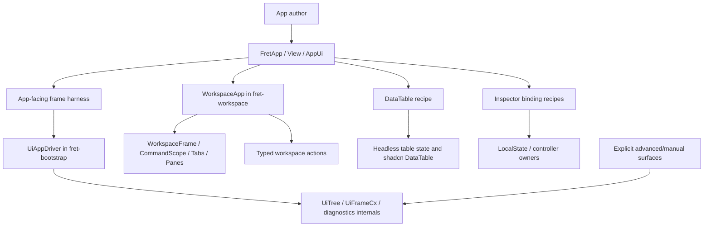
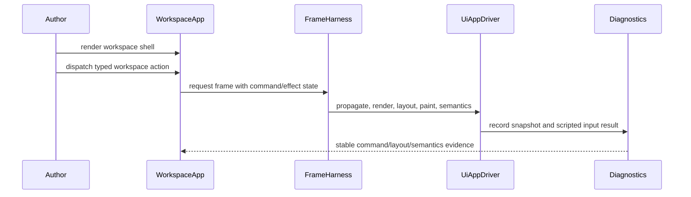
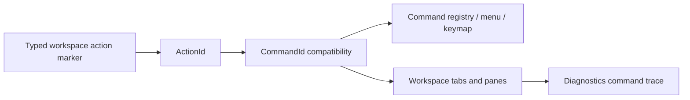

# GPUI Ergonomics Boundary Refactor - Plan

## Goal Capsule

| Field | Value |
|---|---|
| Objective | Turn the GPUI ergonomics audit into app-facing Fret modules that remove `FnDriver`, `UiTree`, manual frame staging, raw model-store ownership, and string command construction from ordinary second-hour app authoring while preserving explicit advanced/raw seams. |
| Authority | User request, repository `AGENTS.md`, `docs/audits/gpui-ergonomics-boundary-audit-2026-07.md`, ADR 0066/0110/0135/0148/0156/0307/0327, `docs/plans/2026-06-30-001-refactor-ui-framework-architecture-plan.md`, current source policy gates, current examples, and pinned GPUI reference files under `repo-ref/zed`. |
| Execution profile | Deep, breaking, deletion-biased refactor. Obsolete ordinary-path APIs and tests may be removed after replacement gates exist. No compatibility shims are required, but public/developer-facing breaks must have replacement docs/examples or explicit non-public/advanced classification evidence. Advanced interfaces may stay when they are explicit and tested as advanced. |
| Stop conditions | Stop if the work flattens Fret into a broad GPUI-style root, moves policy-heavy workspace/table/editor behavior into `crates/fret-ui`, reopens the docking-core refactor already owned by the docking plans, weakens source-policy gates, or makes `fret-app` depend on backend/window/render policy. |
| Tail ownership | Goal execution owns implementation, focused tests, source-policy gates, diagnostics scripts, docs/ADR alignment, cleanup of obsolete code, code review, and conventional commits at useful module boundaries. |

---

## Product Contract

### Summary

Fret's first-contact app interface is directionally right: `FretApp`, `View`, `AppUi`,
`LocalState`, typed actions, and the curated `fret::app::prelude::*` give app authors a clean
default lane. The gap exposed by the GPUI audit is in realistic second-hour surfaces:
workspace shells, data-heavy admin tables, editor inspector binding, and app-facing frame tests
still make authors learn runtime seams too early.

This plan deepens ecosystem-level authoring modules instead of widening the core root surface.
It should make real app probes easier to copy while keeping mechanism tests and custom integrations
free to use explicit advanced/raw APIs.

The outcome is not just "raw seams disappeared from source." At least one workspace, table, and
editor-inspector path must become a concise, copyable public authoring slice that shows the same
core flow through app-facing APIs. Source-policy gates and diagnostics are enforcement evidence,
not substitutes for an author-facing result.

### Problem Frame

Current evidence shows three different things that should not be collapsed:

- Default app authoring is already good enough to keep as the public mental model.
- Mechanism-level tests still need raw `UiTree`, `RenderRootContext`, and `UiFrameCx` staging.
- Real app probes such as `workspace_shell_demo` and `datatable_demo` are app-shaped, but still
  teach manual driver and retained-tree ownership because the app-facing modules are not deep enough.

GPUI is useful as a reference for short, productive authoring interfaces and tests that exercise
the same surface authors use. It is not the architecture target for Fret's root module. Fret should
borrow deep modules and authoring compression, not GPUI's broad root prelude or all-purpose `div`
surface.

The highest-risk trap is doing a small local cleanup that leaves the next app probe with the same
manual seams. The right refactor is bigger: create the missing app-facing layer, migrate probes to
it, then delete or quarantine the old ordinary-path permissions.

### Requirements

**App-Facing Frame And Workspace**

- R1. A normal second-hour app can drive a `View` or workspace shell through a public app-facing
  frame/diagnostics harness without owning `FnDriver`, `UiTree`, `RenderRootContext`, or manual
  `UiFrameCx` ordering.
- R2. The workspace shell authoring path uses a `WorkspaceApp`, `WorkspaceWorkbench`, or equivalent
  `fret-workspace` public module for frame driving, command routing, dirty-close policy,
  diagnostics snapshots, and lifecycle hooks.
- R3. Manual driver/runtime seams remain available only under explicit advanced/manual imports,
  classifications, or mechanism-test harnesses.
- R4. `fret-bootstrap` owns generic frame-pipeline helpers; `fret-workspace` owns workspace shell
  policy; `ecosystem/fret` only exposes narrow app/startup glue.

**Typed Workspace Commands**

- R5. Workspace command authoring uses typed/action-first wrappers over ADR 0307 `ActionId` /
  `CommandId` compatibility.
- R6. Workspace command metadata, keymaps, menus, and diagnostics keep `CommandId` compatibility,
  but ordinary workspace app code should not construct string command IDs directly.
- R7. Workspace tab/pane commands at least cover close, close others, close left/right, preview
  commit/open, pin/toggle pin, pane focus, pane split, and move active tab flows.
- R8. Command diagnostics preserve source, scope, target, blocked dirty-close state, and applied
  outcome after typed wrappers are introduced.

**State Binding And Editor Inspector**

- R9. Common controlled inspector flows use app-facing local-state/controller binding recipes
  rather than direct `ModelStore` mutation in the default app code path.
- R10. Raw `ModelStore` owners may remain for explicit advanced surfaces, migration scaffolding,
  or isolated mechanism tests, but source-policy gates must classify them.

**Data Table Recipes**

- R11. A normal admin data table has a compact recipe/builder that composes table state, columns,
  row keys, toolbar, pagination, output model, stable debug IDs, and common text roles.
- R12. Low-level headless/shadcn table composition remains available for custom tables.
- R13. The recipe must not hide essential state in an opaque mega-helper. It should reduce
  repetitive wiring while keeping table state and output inspectable.

**Facade And Boundary Hygiene**

- R14. `ecosystem/fret/src/lib.rs` is split into internal modules for app surface, component
  surface, advanced/raw lanes, builder glue, assets, text helpers, and docs-policy tests while
  preserving intended public paths.
- R15. Default examples, templates, and docs are gated against `FnDriver`, `UiTree`,
  `RenderRootContext`, `UiFrameCx`, `surface.driver()`, broad advanced preludes, and raw
  `ModelStore` unless explicitly classified as advanced/manual or mechanism-test surfaces.
  Real/public app-facing probes may keep temporary raw seams only with owner, allowed-seam, and
  retirement notes during migration.
- R16. Runtime re-export and `Effect` cleanup is limited to narrow, tested quarantine work in this
  plan. If a work unit proves broad effect-envelope redesign is required, stop and create a
  follow-up plan or ADR before starting it.
- R17. Current docking core work stays out of scope except for docs links and source-policy
  classification. Docking graph, route, drop transaction, and multi-viewport lifecycle are owned by
  the 2026-07-08 and 2026-07-09 docking plans.
- R18. Breaking public surface changes in this plan must either point to replacement authoring
  docs/examples or be explicitly classified as non-public, advanced/manual, mechanism-test, or
  temporary real-probe cleanup. This is documentation and classification, not compatibility shims.

### Acceptance Examples

- AE1. `workspace_shell_demo` no longer teaches `FnDriver`, raw `UiTree`, manual
  `RenderRootContext`, or hand-written diagnostics frame plumbing in its common authoring module.
- AE2. The workspace shell still proves left/right rails, center pane, tab switching, tab close,
  dirty-close save/discard/cancel, command scope trace, focus/semantics, and stable `test_id`
  selectors through tests or diagnostics scripts.
- AE3. Workspace command call sites use typed wrappers or `fret-workspace` command helpers, not
  direct string `CommandId::new(Arc::<str>::from(...))` construction in ordinary app code.
- AE4. `datatable_demo` or a new equivalent data-table public slice uses a compact recipe/builder
  while preserving explicit table state/output and stable debug IDs.
- AE5. `editor_notes_demo` inspector draft/summary flows use app-facing controller/local-state
  binding recipes for the default path and no longer expose raw `ModelStore` as the first lesson.
- AE6. Source-policy gates fail if a default or public app-facing probe reacquires unclassified
  `FnDriver`, `UiTree`, `RenderRootContext`, `UiFrameCx`, or raw model-store seams.
- AE7. Advanced/manual probes that still need raw seams are explicitly classified with owner,
  allowed seams, and retirement notes in the existing policy gates.
- AE8. `ecosystem/fret/src/lib.rs` becomes a facade over smaller modules, and public-surface tests
  still prove the curated app prelude and advanced prelude budgets.
- AE9. Representative `fretboard-dev diag` coverage exercises the new app-facing workspace/frame
  path with stable selectors instead of relying only on source string gates.
- AE10. Workspace, DataTable, and editor-inspector closeout each include a concise copyable
  authoring slice or example that uses the public app-facing path.
- AE11. Any public/developer-facing break has replacement guidance or explicit non-public/advanced
  classification evidence.

### Scope Boundaries

In scope:

- Polish and land the GPUI ergonomics audit docs already present in the working tree if they remain
  coherent with implementation evidence.
- Add or reshape app-facing frame helpers in `fret-bootstrap` and the `fret` app surface.
- Add `WorkspaceApp` or equivalent public workspace-workbench layer in `fret-workspace`.
- Add typed workspace command wrappers and migrate ordinary workspace shell command call sites.
- Add data-table recipe compaction in `fret-ui-shadcn` or the appropriate recipe layer.
- Add editor inspector binding recipes in `fret-ui-editor` and/or `ecosystem/fret`.
- Split the `fret` facade file and keep public paths tested.
- Strengthen existing source-policy tests and diagnostics scripts.

Deferred follow-up:

- Node graph command/searcher authoring proof.
- Complete runtime `Effect` envelope redesign.
- A separately published headless docking crate.
- Full migration of every manual chart/renderer proof away from raw `UiTree`.
- Broad GPUI-style root prelude or all-purpose core element.

Out of scope:

- Rewriting current docking graph/route/drop-transaction internals.
- Moving workspace, table, editor, or overlay policy into `crates/fret-ui`.
- Making `fret-app` depend on renderer, window, backend, workspace, or diagnostics policy.
- Preserving old ordinary-path APIs only for compatibility after replacements and gates exist.

---

## Planning Contract

### Research Inputs

| Source | Evidence | Planning impact |
|---|---|---|
| GPUI audit | `docs/audits/gpui-ergonomics-boundary-audit-2026-07.md` | Default app interface is good; deepen frame/workspace/table/editor modules. |
| Existing UI framework plan | `docs/plans/2026-06-30-001-refactor-ui-framework-architecture-plan.md` | Keep mechanism/policy split, app ladder, and `fret-framework` advanced/manual role. |
| Docking plans | `docs/plans/2026-07-08-001-refactor-docking-surface-architecture-plan.md`, `docs/plans/2026-07-09-001-refactor-docking-viewport-contract-plan.md` | Do not reopen docking core here; only classify and route docs. |
| Current app runtime | `ecosystem/fret/src/app_entry.rs`, `ecosystem/fret/src/view/runtime.rs` | `FretApp + View` already routes through `UiAppDriver`; use it as the app-facing base. |
| Current frame pipeline | `ecosystem/fret-bootstrap/src/ui_app_driver.rs` | `UiAppDriver` already owns `UiTree`, model/global propagation, layout, paint, a11y, diagnostics, and hot reload. Wrap or reuse it instead of duplicating frame order. |
| Current workspace crate | `ecosystem/fret-workspace/src/lib.rs`, `commands.rs`, `command_scope.rs`, `frame.rs`, `tabs.rs`, `panes.rs` | `fret-workspace` is the right owner for workspace shell policy and typed command wrappers. |
| Current source policy gates | `tools/check_surface_policy.py`, `tools/examples_source_tree_policy/*`, `apps/fret-examples/tests/*_surface.rs`, `ecosystem/fret/tests/*surface.rs` | Extend existing gates instead of inventing an untracked checker. |
| GPUI reference | `repo-ref/zed/crates/gpui/README.md`, `repo-ref/zed/crates/gpui/src/gpui.rs`, `repo-ref/zed/crates/gpui/examples/data_table.rs` | Borrow compact authoring modules and same-interface tests; do not borrow broad root shape. |

### Key Technical Decisions

| ID | Decision | Rationale |
|---|---|---|
| KTD1 | Prioritize the workspace-workbench app-facing path as P0. | It is the largest real app authoring gap and forces `FnDriver`, `UiTree`, command routing, dirty-close policy, and diagnostics into one probe. |
| KTD2 | Use existing `FretApp`, `View`, `AppUi`, and `UiAppDriver` machinery rather than a GPUI-style root redesign. | The default app surface is already coherent; missing depth belongs in ecosystem modules. |
| KTD3 | Keep `WorkspaceApp` policy in `fret-workspace`, generic frame hooks in `fret-bootstrap`, and launch glue in `ecosystem/fret`. | This respects current ownership and avoids moving policy into `fret-ui` or backend logic into `fret-app`. |
| KTD4 | Add typed workspace actions as marker/wrapper types over existing `CommandId` compatibility. | ADR 0307 already defines `ActionId = CommandId`; a global command rewrite is unnecessary. |
| KTD5 | Use DataTable only as a bounded frame/recipe proof after the workspace smoke gate, not as a substitute for Workspace P0. | `datatable_demo` is lower risk, but workspace authoring is the primary user-value gate. If U2 already proves workspace frame viability, start U4 before deepening U3 recipe polish. |
| KTD6 | Keep data-table recipe state explicit. | The goal is less boilerplate, not an opaque mega-helper that hides table state/output from app authors and diagnostics. |
| KTD7 | Treat editor binding as a controller/local-state recipe, not a `ModelStore` rewrite. | Existing raw model owners are useful internally; the gap is the default inspector authoring shape. |
| KTD8 | Delete or reclassify old ordinary-path permissions after replacements pass. | The user authorized breakage and deletion. Keeping stale permissions would preserve the wrong lesson. |
| KTD9 | Strengthen existing gates instead of adding parallel policy tooling. | The repo already has source-policy and surface tests; new rules should land where maintainers already run them. |
| KTD10 | Leave docking core stable in this plan. | Current docking work already has its own refactor plan, ADR evidence, and tests. |

### Dependency And Feature Matrix

| Owner | Allowed role | Must not do | Cargo / feature touchpoints |
|---|---|---|---|
| `fret-bootstrap` | Own generic frame harness APIs over `UiAppDriver`, behind existing app-driver/diagnostics features. | Depend on workspace, editor, table, or app facade policy. | `ecosystem/fret-bootstrap/Cargo.toml`, `ui-app-driver`, `diagnostics`. |
| `fret-workspace` | Own workspace shell policy, command wrappers, tabs, panes, dirty-close, keyboard/semantics expectations. | Depend on `fret-bootstrap` or `ecosystem/fret` unless a reviewed feature edge proves no cycle and no policy leak. | `ecosystem/fret-workspace/Cargo.toml`, optional shadcn context-menu feature. |
| `ecosystem/fret` | Compose app startup, optional bootstrap integration, and public authoring facades. | Become a broad GPUI-style root or own workspace/table/editor policy internally. | `ecosystem/fret/Cargo.toml`, `desktop`, `diagnostics`, `shadcn`, `editor`. |
| `fret-ui-shadcn` | Own shadcn-style DataTable recipe and controls. | Hide table ownership/output behind opaque state or depend on app runtime policy. | `ecosystem/fret-ui-shadcn/Cargo.toml`, `app-integration`. |
| `fret-ui-editor` | Own editor-control recipes that are independent of app startup. | Reach into raw app model stores for default authoring when `ecosystem/fret` can adapt with `LocalState`. | `ecosystem/fret-ui-editor/Cargo.toml`, `imui`, shadcn integration. |

If implementation requires a dependency edge outside this table, stop and either narrow the helper
behind a trait bridge or update the plan/ADR before coding the new edge.

### Execution Dependency Order

The unit numbers identify work packages, not strict execution order. Use this order unless
implementation evidence forces a narrower split:

1. U1: audit docs, source-policy baseline, architecture falsification gate, and abstraction budget.
2. U2: app-facing frame harness plus a minimal workspace smoke proof for command dispatch,
   dirty-close blocking, diagnostics snapshot capture, and frame sequencing.
3. U5: typed workspace command identity contract and the minimal skeleton needed by U4.
4. U4: WorkspaceApp/workbench P0 migration and diagnostics proof.
5. U3: DataTable recipe compaction and app-facing migration, unless U2 explicitly needs a
   time-boxed table spike to expose frame-helper gaps.
6. U6: editor inspector binding recipes.
7. U7/U8: constrained facade split and narrow runtime quarantine only where earlier units touched
   those surfaces.
8. U9: diagnostics, ADR alignment, final gate run, and obsolete-code/allowance deletion.

### Abstraction Budget

Every new public helper or module proposed by this plan must earn its keep before landing.

| Candidate | Current consumers required before public status | Raw seam removed | Required deletion or gate |
|---|---|---|---|
| App-facing frame harness | At least one workspace smoke proof and one app/test consumer. | Manual render/layout/paint/semantics/diagnostics ordering. | Raw frame staging removed from ordinary app-facing tests or classified as mechanism-only. |
| `WorkspaceApp` / workbench harness | `workspace_shell_demo` ordinary path. | `FnDriver`, `UiTree`, manual diagnostics, command/effect plumbing. | Old workspace ordinary-path launch helpers and policy allowances deleted or advanced-classified. |
| Typed workspace commands | Workspace shell, registry/menu/keymap tests, tab/pane state tests. | Direct string `CommandId::new(...)` construction in ordinary workspace code. | Dynamic string helpers named lower-level/advanced and gated. |
| DataTable recipe/builder | `datatable_demo` or a new equivalent public table slice. | Repetitive output/column/toolbar/pagination/debug-id wiring. | Recipe tests prove state/output/row keys/debug IDs remain inspectable. |
| Editor inspector binding recipe | `editor_notes_demo` inspector path. | Raw `ModelStore` as the first lesson for draft/summary/status updates. | Source-policy gate rejects raw default inspector signatures. |
| Fret facade modules | Surfaces touched by this plan. | Oversized root-file coupling that blocks app/advanced budget tests. | Untouched assets/text/docs-policy splits remain deferred unless earlier units prove a blocker. |

### Proposed Architecture







---

## Implementation Units

### U1. Audit Docs And Policy Baseline

**Intent:** Convert the current GPUI audit from a loose note into implementation evidence and make
the existing source-policy gates name the real app probes precisely.

**Primary files:**

- `docs/audits/gpui-ergonomics-boundary-audit-2026-07.md`
- `docs/audits/README.md`
- `docs/examples/README.md`
- `docs/ui-ergonomics-and-interop.md`
- `tools/check_surface_policy.py`
- `tools/examples_source_tree_policy/*`
- `apps/fret-examples/tests/*_surface.rs`

**Work:**

- Keep the current audit docs, but anchor them to the implementation plan and remove any wording
  that implies broad GPUI root adoption.
- Make the probe taxonomy explicit: default, second-hour, real probe, advanced/manual,
  mechanism-test.
- Add an early falsification gate for KTD2: name the concrete app-probe evidence that would show
  `FretApp`/`View`/`AppUi` are insufficient, the threshold that requires a revised plan or ADR,
  and the evidence that confirms ecosystem-module deepening remains the right boundary.
- Document the enforcement model: source-string gates catch direct raw-seam usage, while public API
  surface tests catch re-exported, aliased, or facade-smuggled raw access.
- Update policy gates so `workspace_shell_demo` and `datatable_demo` have owner, allowed seams,
  and retirement notes that point to this plan.
- Add failing expectations for the desired end state where useful, but avoid making impossible
  gates block the first intermediate commit before replacement code exists.

**Test scenarios:**

- `python3 tools/check_surface_policy.py`
- `python3 tools/gate_examples_source_tree_policy.py` as a baseline audit only; this gate is
  currently red across unrelated example source markers and is repaired under U7/U9 before final
  DoD.
- Targeted surface tests that already include workspace/datatable examples.
- Public API surface tests fail on both direct raw imports and re-exported/aliased raw access from
  ordinary app-facing examples.

**Acceptance links:** R15, R18, AE6, AE7, AE11.

### U2. App-Facing Frame Harness

**Intent:** Add the smallest generic app-facing frame helper needed to stop real app probes from
owning manual propagation, render, layout, paint, semantics, and diagnostics ordering.

**Primary files:**

- `ecosystem/fret-bootstrap/src/ui_app_driver.rs`
- Possible new `ecosystem/fret-bootstrap/src/app_frame_harness.rs`
- `ecosystem/fret-bootstrap/src/lib.rs`
- `ecosystem/fret/src/app_entry.rs`
- `ecosystem/fret/src/view/runtime.rs`
- `ecosystem/fret/tests/*app_render*`

**Work:**

- Reuse `UiAppDriver` as the source of frame-order truth.
- Expose a narrow helper for app-facing tests and workspace shell integration that owns frame
  sequencing and diagnostics record/snapshot hooks.
- Keep raw `UiTree` staging available for mechanism tests and explicit advanced code.
- Add characterization tests before changing existing custom-driver behavior.
- Add a U2 exit gate before U3/U4 rely on the helper: a minimal workspace smoke proof must drive
  command dispatch, dirty-close blocking, diagnostics snapshot capture, and frame sequencing
  through the new harness.

**Test scenarios:**

- Frame helper runs render, layout, paint, semantics, and diagnostics in the same order as
  `UiAppDriver`.
- Minimal workspace smoke covers command dispatch, dirty-close block, diagnostics snapshot, and
  frame sequencing through the harness.
- Mechanism tests can still use raw staging explicitly.
- Default app-facing tests no longer need to call `layout_all` or `paint_all` directly.

**Acceptance links:** R1, R3, R4, AE1, AE6, AE9.

### U3. DataTable App-Facing Migration And Recipe Proof

**Intent:** Use `datatable_demo` as the lower-risk proof that a realistic app can move onto the
app-facing frame path and compact repetitive table wiring.

**Scheduling:** Execute after the U2 workspace smoke gate. Do not let this unit delay U4's
Workspace P0 path unless U2 explicitly needs a time-boxed table spike to expose generic frame gaps.

**Primary files:**

- `apps/fret-examples/src/datatable_demo.rs`
- `apps/fret-examples/tests/datatable_demo_surface.rs`
- `ecosystem/fret-ui-shadcn/src/data_table.rs`
- `ecosystem/fret-ui-shadcn/src/data_table_recipes.rs`
- `ecosystem/fret-ui-shadcn/src/data_table_controls.rs`
- `tools/check_surface_policy.py`

**Work:**

- Introduce or improve a data-table recipe/builder that keeps `TableState`,
  `DataTableViewOutput`, columns, row keys, toolbar, pagination, and debug IDs explicit but less
  repetitive.
- Move `datatable_demo` away from manual `FnDriver`/`UiTree` ownership if the frame harness is
  sufficient.
- Preserve existing table text-role and output `LocalState` surface tests.
- Reclassify or remove the datatable advanced/manual allowance once the demo no longer needs raw
  seams.
- Add a table interaction-state matrix: populated, empty data, no-results after toolbar/filter
  actions when filtering is supported, pagination first/last/disabled states, row focus/selection
  when supported, sort/filter behaviors or explicit out-of-scope notes, semantics, and stable
  debug-id assertions.
- Make recipe explicitness measurable: caller-owned or inspectable `TableState`, output model,
  row keys, columns, pagination, and debug IDs must remain externally visible after recipe
  construction.

**Test scenarios:**

- `datatable_demo_surface` proves table output stays app-facing and fixed table text keeps app text
  roles.
- Source policy rejects unclassified `FnDriver`/`UiTree` reintroduction for `datatable_demo`.
- DataTable recipe tests cover toolbar, pagination, output state, row key, and debug-id defaults.
- DataTable recipe tests cover the state matrix and prove explicit state/output/debug identity is
  inspectable from the app-facing caller.

**Acceptance links:** R11, R12, R13, R15, AE4, AE6, AE10.

### U4. WorkspaceApp / Workspace Workbench Harness

**Intent:** Add the app-facing workspace shell layer that hides manual launch, retained tree, frame
lifecycle, diagnostics, and command/effect plumbing from ordinary workspace authors.

**Dependency:** Execute after U2's workspace smoke gate and the minimal U5 typed-command identity
contract. U4 may include the smallest typed-command skeleton needed to avoid landing a command-less
workspace authoring path, but broader command coverage stays in U5.

**Primary files:**

- Possible new `ecosystem/fret-workspace/src/app.rs`
- Possible new `ecosystem/fret-workspace/src/harness.rs`
- `ecosystem/fret-workspace/src/lib.rs`
- `ecosystem/fret-workspace/src/frame.rs`
- `ecosystem/fret-workspace/src/command_scope.rs`
- `ecosystem/fret-workspace/src/tabs.rs`
- `ecosystem/fret-workspace/src/panes.rs`
- `apps/fret-examples/src/workspace_shell_demo/*`
- `apps/fret-examples/tests/workspace_shell_*_surface.rs`
- `tools/diag-scripts/suites/ui-gallery-workspace-shell/suite.json`
- `tools/diag-scripts/workspace/*` or the current workspace diagnostics script location

**Work:**

- Define the public workspace app/workbench module with an intentionally small authoring surface.
- Keep `WorkspaceFrame`, `WorkspaceCommandScope`, tab/pane state, dirty-close policy, and pane
  layout as explicit workspace-owned concepts.
- Move frame and diagnostics sequencing behind the app-facing harness.
- Migrate the demo incrementally so state and dirty-close owners remain explicit while launch and
  frame plumbing move out of the ordinary authoring file.
- Delete old helper functions or advanced allowances that no longer have first-party callers.
- Add a workspace keyboard/semantics matrix covering tab, pane, rail, dirty-close dialog, and
  command flows. The matrix must name roles, focus order or roving-focus rules, keyboard commands,
  dirty-close focus trap/restore behavior, and diagnostics assertions.

**Test scenarios:**

- Workspace shell opens, renders rails and center pane, switches tabs, closes tabs, and keeps stable
  selectors.
- Dirty-close save/discard/cancel behavior remains equivalent.
- Command dispatch trace still records source, command/action, target, and blocked/applied outcome.
- Keyboard and semantics tests cover tab switching/closing/splitting/moving, pane/rail focus, and
  dirty-close focus trap/restore.
- Diagnostics suite captures layout sidecar, screenshot, command trace, and semantics evidence.

**Acceptance links:** R1, R2, R3, R4, R8, AE1, AE2, AE9, AE10.

### U5. Typed Workspace Command Surface

**Intent:** Make workspace command authoring action-first without breaking command registry, menu,
keymap, or diagnostics compatibility.

**Primary files:**

- `ecosystem/fret-workspace/src/commands.rs`
- `ecosystem/fret-workspace/src/menu.rs`
- `ecosystem/fret-workspace/src/command_scope.rs`
- `ecosystem/fret-workspace/src/tabs.rs`
- `apps/fret-examples/src/workspace_shell_demo/*`
- `apps/fret-examples/tests/workspace_shell_*_surface.rs`

**Work:**

- Extend the existing `act` module with typed markers and helper constructors for tab/pane
  commands that still lower to `CommandId`.
- Specify the identity contract before migration: every typed wrapper lowers to a canonical
  `CommandId`; registry, keymap, menu, and command-scope lookup round-trip through that ID;
  diagnostics record the underlying ID plus typed source when available; dynamic string helpers are
  explicitly named and classified lower-level/advanced.
- Add API that lets ordinary workspace code dispatch or bind typed workspace actions without
  constructing string IDs by hand.
- Keep string command helpers only where dynamic IDs are necessary and classify them as lower-level
  or advanced when exposed.
- Preserve command metadata registration and default keybinding behavior.
- Include keyboard/semantics expectations from U4 for commands that move focus, split panes, move
  tabs, or open dirty-close UI.

**Test scenarios:**

- Every command listed in R7 has a typed wrapper or explicit dynamic helper.
- Existing `WorkspaceTabs::apply_command*` behavior is unchanged for dirty, preview, pinned,
  close-left/right, close-others, move, and pane focus flows.
- Workspace shell ordinary path contains no direct `CommandId::new(Arc::<str>::from("workspace..."))`
  construction.
- Typed wrappers, `ActionId`, `CommandId`, registry metadata, menus, keymaps, and diagnostics
  round-trip through the same canonical identity.

**Acceptance links:** R5, R6, R7, R8, AE2, AE3.

### U6. Editor Inspector Binding Recipes

**Intent:** Move common inspector draft/summary/status binding into app-facing controller recipes so
editor-grade examples do not teach raw model-store ownership first.

**Primary files:**

- `apps/fret-examples/src/editor_notes_demo.rs`
- `apps/fret-examples/tests/editor_notes_*_surface.rs`
- `ecosystem/fret-ui-editor/src/*`
- `ecosystem/fret/src/view/*`
- `tools/check_surface_policy.py`
- `tools/examples_source_tree_policy/app_facing.py`

**Work:**

- Identify the repeated inspector flow: draft text, summary/status update, activation or submit
  action, and theme/control binding.
- Add a controller/local-state binding helper in the narrowest owner crate that can express the
  flow without raw `ModelStore` at the app call site.
- Migrate `editor_notes_demo` default inspector code to the helper.
- Leave advanced/raw owner helpers only where they remain necessary and classified.
- Define the user-state lifecycle: initial clean state, dirty draft edits, submit/apply success,
  cancel or revert behavior, validation/error/status handling when applicable, focus restoration
  after submit/cancel, and semantic labels for inspector controls.

**Test scenarios:**

- Editor notes surface tests prove reusable panels still use generic app-facing context access.
- Default inspector path does not expose raw `ModelStore` signatures.
- Existing device shell and editor rail tests stay green.
- Inspector tests cover clean/dirty/submit/cancel/status/focus/semantics states.

**Acceptance links:** R9, R10, R15, AE5, AE6, AE10.

### U7. Fret Facade Split

**Intent:** Reduce `ecosystem/fret/src/lib.rs` coupling without changing intended public paths.

**Primary files:**

- `ecosystem/fret/src/lib.rs`
- Possible new `ecosystem/fret/src/facade/*`
- `ecosystem/fret/src/app/*`
- `ecosystem/fret/src/advanced/*`
- `ecosystem/fret/tests/advanced_prelude_surface.rs`
- `ecosystem/fret/tests/backend_free_app_authoring_profile.rs`
- `ecosystem/fret/tests/*surface.rs`

**Work:**

- Split implementation into smaller modules for app surface, component surface, advanced/raw
  surface, and builder glue directly touched by this plan.
- Preserve public imports that tests intentionally protect.
- Move tests that depend on string slices of `lib.rs` to stable markers or module-level source
  includes where needed.
- Delete stale compatibility re-exports that are no longer used or explicitly advanced.
- Defer untouched assets, text, and docs-policy splits unless an earlier unit proves they block the
  boundary goals.

**Test scenarios:**

- App prelude remains curated and backend-free.
- Advanced prelude stays explicit and does not smuggle component/authoring nouns.
- No default docs or examples reacquire broad advanced preludes.

**Acceptance links:** R14, R15, AE8.

### U8. Runtime Public-Surface Quarantine

**Intent:** Apply narrow runtime cleanup only where this plan exposes confusing public surface.

**Primary files:**

- `crates/fret-runtime/src/lib.rs`
- `crates/fret-runtime/src/action.rs`
- `ecosystem/fret/tests/*surface.rs`
- `tools/check_surface_policy.py`

**Work:**

- Audit runtime root re-exports used by default app examples and docs.
- Move or document runner/window/diagnostic-heavy exports under explicit modules only if the change
  is narrow and testable.
- Do not redesign `Effect` broadly in this unit. If effect cleanup becomes necessary, write a
  follow-up plan or ADR before starting.

**Test scenarios:**

- Runtime action alias behavior remains compatible with ADR 0307.
- Default app examples do not import runtime root seams directly.
- Any moved exports have explicit advanced or compat tests.

**Acceptance links:** R16, AE6, AE7.

### U9. Diagnostics And Closeout Gates

**Intent:** Prove the new authoring path with the same kind of real-app evidence the audit used to
identify the problem.

**Primary files:**

- `tools/diag-scripts/suites/ui-gallery-workspace-shell/suite.json`
- `tools/diag-scripts/*workspace*`
- `tools/check_diag_scripts_registry.py`
- `docs/adr/IMPLEMENTATION_ALIGNMENT.md`
- `docs/examples/README.md`
- `docs/audits/README.md`
- `docs/ui-ergonomics-and-interop.md`

**Work:**

- Add or update deterministic diagnostics scripts for the app-facing workspace/frame path.
- Ensure selectors use stable `test_id` values and capture layout, screenshot, command, and
  semantics evidence.
- Diagnostics must assert the workspace keyboard/semantics matrix from U4/U5, not only screenshot
  or layout sidecar existence.
- Update ADR implementation alignment for changed hard contracts.
- Finalize docs so onboarding, real probes, and advanced/manual surfaces are distinct.
- Remove obsolete code, docs, tests, and policy allowances that the new path supersedes.

**Test scenarios:**

- Workspace diagnostics suite passes locally or has a documented platform skip.
- `python3 tools/check_diag_scripts_registry.py` passes.
- ADR alignment rows include evidence anchors for frame/workspace/action contracts touched here.

**Acceptance links:** R15, R17, AE2, AE6, AE7, AE9.

---

## Verification Contract

Run the smallest targeted gate after each implementation unit, then the broader gate before
claiming the plan done.

Targeted gates:

```bash
cargo fmt --check
python3 tools/check_layering.py
python3 tools/check_surface_policy.py
python3 tools/gate_examples_source_tree_policy.py
python3 tools/check_diag_scripts_registry.py
cargo nextest run -p fret-bootstrap --no-fail-fast
cargo nextest run -p fret-workspace --no-fail-fast
cargo nextest run -p fret-ui-shadcn --no-fail-fast
cargo nextest run -p fret --no-fail-fast
cargo nextest run -p fret-examples --no-fail-fast
```

Representative diagnostics:

```bash
cargo run -p fretboard-dev -- diag suite ui-gallery-workspace-shell --launch -- cargo run -p fret-ui-gallery --release
```

If a diagnostics command or package name has drifted, update the plan execution notes and use the
repo's current `fretboard-dev diag` entry point rather than bypassing diagnostics coverage.

## Risk Register

| Risk | Mitigation |
|---|---|
| Workspace shell migration changes frame/diagnostics ordering. | Characterize current ordering first and route new helper through `UiAppDriver` instead of duplicating sequencing. |
| Typed commands lose command registry/keymap/menu compatibility. | Lower typed wrappers to existing `ActionId`/`CommandId` and keep registry metadata tests. |
| DataTable recipe becomes an opaque mega-helper. | Keep `TableState`, output, row keys, and columns explicit; recipe only removes repetitive composition. |
| Facade split breaks string-slice surface tests. | Update tests to stable module markers without weakening the public-surface budget. |
| Source-policy gates block incremental commits before replacements exist. | Land gates in the same unit as replacements or classify temporary advanced seams with retirement notes. |
| Docking work leaks back into this plan. | Treat docking docs as references only and defer docking core changes to the active docking plans. |

## Landing Strategy

- Work in dependency order, but commit at module boundaries when tests are meaningful.
- Prefer conventional commits such as `docs(audit): ...`, `feat(workspace): ...`,
  `refactor(app): ...`, `test(examples): ...`.
- Do not rewrite the plan file during execution except for clear clerical fixes. Track progress in
  commits, implementation notes, or the final closeout.
- If implementation proves a public crate split or broad runtime `Effect` redesign is required,
  stop and create a new plan/ADR rather than expanding this one silently.

## Definition Of Done

- The GPUI audit docs are linked, coherent, and aligned with the implemented boundaries.
- `workspace_shell_demo` ordinary authoring path no longer teaches manual launch/tree/frame
  plumbing.
- Workspace command authoring has typed/action-first wrappers with diagnostics compatibility.
- DataTable and editor-inspector probes have app-facing recipe/controller paths with pass/fail
  source-policy and behavior evidence. If a blocker remains, this plan is not done until a
  follow-up plan or ADR explicitly removes that work from scope.
- `ecosystem/fret/src/lib.rs` is split enough that the app facade, advanced/raw lanes, and builder
  glue touched by this plan are no longer all maintained in one large root file.
- Existing source-policy gates classify real probes and fail on unclassified raw seams in default
  or public app-facing surfaces.
- Representative diagnostics and nextest gates pass or have documented platform-specific skips.
- Public/developer-facing breaking changes have replacement authoring docs/examples or explicit
  non-public/advanced classification evidence.
- Obsolete ordinary-path APIs, tests, docs, and policy allowances introduced only for the old shape
  are deleted.
