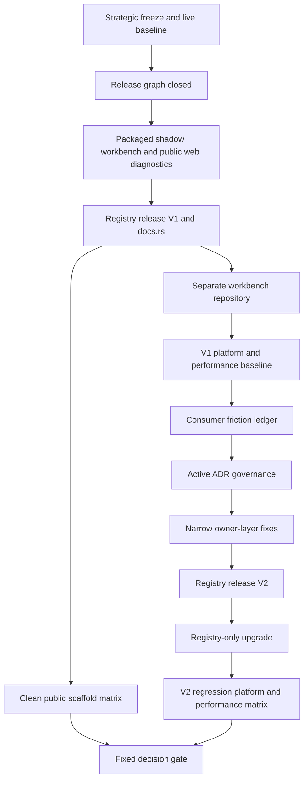
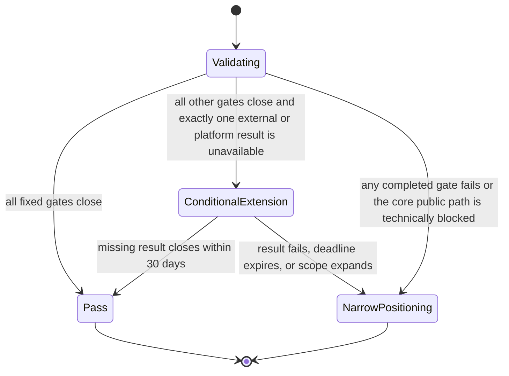

# External Workbench Validation - Plan

**Target repos:** this Fret repository and a separate `fret-workbench-validation` Git repository whose paths are relative to that repository where explicitly labeled.

## Goal Capsule

| Field | Value |
| --- | --- |
| Objective | By 2026-10-10, either prove or falsify that Fret's published crates can support an independently versioned, realistic native/web workbench without monorepo-only dependencies or ordinary-path framework seams, or enter the one qualifying extension whose terminal decision is due by 2026-11-09. |
| Authority | User direction; `STRATEGY.md`; repository `AGENTS.md`; Accepted ADRs 0039, 0066, 0109, 0308, 0319, 0327, and 0328; `docs/plans/2026-06-30-001-refactor-ui-framework-architecture-plan.md`; `docs/plans/2026-07-09-002-refactor-gpui-ergonomics-boundary-plan.md`; current release and diagnostics contracts. |
| Execution profile | Deep, release-first, evidence-gated refactor with horizontal capability expansion frozen. Delete obsolete public aliases and shallow facades when replacement evidence exists; preserve advanced seams when they remain explicit and tested. |
| Stop conditions | Stop and revise this plan before rewriting `UiTree`, changing frame-stage ordering, moving policy into `fret-ui`, adding a broad GPUI-style root, weakening registry-only constraints, or changing public positioning before the final decision gate. |
| Tail ownership | This plan owns release closure, public scaffold verification, the external consumer, consumer-driven API corrections, governance gates, platform/performance evidence, a real cross-version upgrade, and the final positioning decision. |

---

## Product Contract

### Summary

Freeze horizontal framework expansion and close the path from published Fret crates to one realistic workbench in a separate repository.
Use that consumer's release, authoring, upgrade, platform, and performance evidence to decide whether Fret continues as a general-purpose framework or narrows the claims that failed, up to and including an internal GPU UI research platform when the public framework loop itself fails.

### Problem Frame

Fret has substantive GPU, text, overlay, docking, native/web, diagnostics, and frame/cache mechanisms, and the prior GPUI ergonomics boundary plan's U9 proved the in-repo `WorkspaceApp` path through real behavior suites.
That evidence does not prove that an application outside the monorepo can resolve the published graph, use the documented authoring path, survive an upgrade, or run across the platforms Fret claims to support.

The current release graph contains 54 crates and seven internal dependency errors.
Public scaffolds emit versioned dependencies but compile coverage still uses repo-local path mode, the top-level `fret 0.1.0` docs.rs build failed, and current usage documents mix released and HEAD-only instructions.
Continuing to add crates, component breadth, and micro-ADRs before closing this loop would increase maintenance surface without answering the product question.

### Actors

- A1. Fret maintainer - closes the public release graph, responds to consumer friction, and owns the final decision evidence.
- A2. Workbench maintainer - develops and upgrades the separate consumer using only public artifacts and records ordinary app-author experience.
- A3. Release operator - publishes ordered crate waves and verifies registry/docs.rs state without relying on workspace path resolution.
- A4. Cold framework evaluator - has not contributed to Fret or the workbench implementation, and uses only released artifacts and public documentation to run, change, and upgrade the consumer.

### Requirements

**Stop line and release truth**

- R1. New crates, broad features, component families, and micro-ADRs remain frozen unless they are required by release closure, the external workbench, a regression or security fix, or a hard cross-crate contract; every exception names the blocked requirement or acceptance example, proves the existing public surface is insufficient, proposes the smallest public change, and defines its close/remove condition.
- R2. The release-scope checker reports zero internal dependency issues and zero version-line issues for every supported feature reachable from a published manifest.
- R3. A coherent post-`0.1.0` release is published in dependency order, and every taught entry crate plus every crate used by the workbench has a successful docs.rs build or an explicitly fixed upstream docs.rs infrastructure incident.
- R4. Release documentation distinguishes historical `0.1.0` evidence, current HEAD state, and current registry state without presenting dated counts as live truth.

**Public scaffolds and independent consumption**

- R5. Every public starter generated by the published `fretboard` release builds in a clean temporary directory against crates.io with no path, Git, workspace, source replacement, or `[patch]` dependency.
- R6. Registry-only scaffold verification runs after publication in CI and fails on a stale generated version, missing crate, unsupported feature, or docs/API mismatch.
- R7. The workbench lives in a separate Git repository with its own lockfile, CI, release history, diagnostics artifacts, and issue history; it cannot invoke `fretboard-dev` or read files from the Fret repository.
- R8. A fresh clone of the workbench completes native and browser build instructions using the published `fretboard` and released crates only.

**Real workbench behavior**

- R9. The workbench implements a release-readiness review job: starting from a versioned project snapshot and checklist, a user edits the review document, runs an asynchronous validation pass, triages findings in a filterable table, records decisions, changes validation settings, arranges panes, and saves a persisted readiness report.
- R10. The workflow has stable selectors and public diagnostics that prove keyboard/focus behavior, command ownership, document save/failure behavior, settings persistence, asynchronous start/cancel/success/error/retry, table loading/empty/filter/selection behavior, dynamic accessibility announcements, and a screenshot/layout result.
- R11. Ordinary workbench modules contain none of `FnDriver`, `UiTree`, `ModelStore`, `UiAppDriver`, raw frame-stage types, `ElementContext`, or string-built `CommandId::new`; any necessary low-level integration is isolated under an explicitly named advanced module and counted in evidence.
- R12. The consumer repository remains an application rather than a copied framework fork: no Fret source files, unpublished compatibility shims, or private monorepo tooling are vendored into it.

**Consumer-driven convergence**

- R13. A friction ledger records each framework workaround with the user task, public surface attempted, raw seam reached, owner layer, changed call sites, and disposition.
- R14. The ordinary app language remains `View -> AppUi -> Ui`, and reusable components teach `IntoUiElement`/`into_element_in`; `Render`/`RenderOnce` remain advanced-public unless a versioned ADR migration formally supersedes that contract.
- R15. `AppUi` and reusable component capabilities expose only the methods required by ordinary helpers; one workbench or public-surface reproduction may tighten those app/component facades, while a `fret-ui` mechanism change still requires the same gap in two independent public entry paths and proof that it cannot be solved above the mechanism layer.
- R16. A crate is merged, split, or removed only when release closure or consumer evidence shows that it lacks an independent version contract, target-isolation role, or second real consumer; single-consumer status or line count alone is insufficient.

**Governance, upgrade, and runtime evidence**

- R17. An active-decision registry is derived from ADR metadata, validates bidirectional supersession for touched/current decisions, and distinguishes current contracts from historical text without rewriting archives mechanically.
- R18. A second real registry release is consumed by upgrading the workbench from its first pinned Fret release; the migration records elapsed time, changed files, changed call sites, dependency delta, registry-fetch time, clean build time, no-op incremental check time, and fixed-leaf-edit incremental check time under a frozen measurement protocol.
- R19. Runtime evidence covers macOS native, Windows 11 native, Linux X11, Linux Wayland, and Chromium WebGPU/wasm using named environments and archived diagnostics artifacts.
- R20. Each reference environment passes its frozen script-level `frame_p95` and `top` thresholds and any stricter existing contract; 16.67 ms p95 and 33.33 ms non-startup maximum are outer loss-of-control limits, while V2 may regress at most 10% for raw measured p95 and 20% for raw measured maximum against the comparable V1 run.
- R21. The 2026-10-10 decision is exactly one of Pass, Conditional Extension, or Narrow Positioning, using criteria fixed in this plan rather than a redefined success story.
- R22. Pass requires zero unresolved Blocker/High friction entries, zero advanced exceptions used to compensate for a missing ordinary API, a V1-to-V2 migration within eight engineer-hours and ten framework-caused non-test call-site edits with no feature redesign or consumer compatibility shim, and no more than 20% regression in same-environment clean-build median or fixed-leaf-edit p95; these budgets freeze before U6.
- R23. A4 completes one cold V1 onboarding change and one clean-room V1-to-V2 upgrade using only released artifacts and public documentation, with elapsed time, first failures, blocked steps, and undocumented knowledge recorded before A1/A2 assist.

### Key Flows

- F1. Release closure - A1 resolves every release-scope edge and runs the packaged shadow-consumer/public-browser preflight, A3 publishes ordered waves, then registry and docs.rs checks establish the version available to consumers.
- F2. Clean starter - A4 installs the released `fretboard`, generates each public starter outside the monorepo, and builds it against crates.io without source overrides.
- F3. Workbench delivery - A2 builds the connected workbench workflow, runs public diagnostics, and reports framework friction rather than patching around it privately.
- F4. Consumer correction - A1 reproduces a friction entry against public APIs, changes the narrow owner layer, publishes a new version, and removes the workaround from the consumer.
- F5. Upgrade - A4 starts from the immutable V1 consumer tag and upgrades to V2 from public migration docs without source overrides; A2 then re-runs the workflow and platform matrix after the cold result is recorded.
- F6. Decision - A1 compares the fixed success criteria with the evidence ledger and updates public positioning according to the decision state.

### Acceptance Examples

- AE1. Given a machine with no Fret checkout, when `fretboard` generates `hello`, `simple-todo`, `todo`, `workbench-lite`, and `mutation-workbench`, then every project resolves and builds only registry sources.
- AE2. Given the sample project snapshot and release checklist, when a user edits and saves the review, runs and cancels/retries validation, triages findings, changes settings, and rearranges a pane, then the saved readiness report and last successful document state survive restart while public diagnostics prove focus, semantics, command, and visual outcomes.
- AE3. Given an ordinary workbench module, when the consumer surface gate scans imports and calls, then any raw runtime/tree/model/driver context or string command construction fails with the owning public replacement named.
- AE4. Given consumer release V1 and released Fret V2, when the dependency version changes without a source override, then the upgraded workbench completes the same workflow and its migration/build evidence is recorded.
- AE5. Given an unavailable Windows, X11, Wayland, or browser runtime result at the deadline, when the final decision is evaluated, then the plan cannot report Pass; it may use the single bounded extension only if every non-platform gate is already closed.
- AE6. Given a failure to build or maintain the workbench through published crates, when the deadline arrives, then a public-API minimal reproduction and independent root-cause review determine the failed claim, and README/ADR positioning is narrowed at that scope rather than replacing missing evidence with in-repo harness results.
- AE7. Given immutable V1 and V2 consumer tags, when A4 follows only public onboarding and migration documentation, then the evaluator can make one documented change and complete the upgrade within R22 budgets, or every first failure and hidden-knowledge dependency remains a failed gate.

### Success Criteria

| Signal | Pass threshold | Evidence owner |
| --- | --- | --- |
| Release graph | 0 internal dependency issues; 0 version-line issues; all supported optional lanes package | Fret release CI |
| Public docs | Successful docs.rs build for all taught and consumer-used crates | Registry evidence ledger |
| Public scaffolds | All five starters build registry-only from clean temporary directories | Fret post-publish CI |
| Workbench behavior | All connected workflow diagnostics pass with stable selectors and semantics | Consumer CI and bundles |
| Ordinary surface | 0 forbidden raw seams in ordinary modules; 0 workaround-driven advanced exceptions | Consumer surface gate |
| Authoring and upgrade cost | 0 open Blocker/High friction; migration/build budgets in R22 pass | Friction ledger and upgrade report |
| Cold onboarding | A4 completes the V1 change and clean-room V2 upgrade without private help | Cold-evaluation report |
| Upgrade | One V1 -> V2 registry-only upgrade completes without feature redesign or a compatibility shim | Consumer upgrade report |
| Platforms | Native macOS/Windows/X11/Wayland and Chromium WebGPU/wasm runtime evidence passes | Platform matrix |
| Performance | Frozen per-environment `frame_p95`/`top` thresholds and V2/V1 raw-measurement limits pass; every worst frame over budget has attribution | Perf baselines and bundles |
| Governance | Active-decision registry and touched-anchor/supersession checks pass | Fret docs CI |

### Decision Mapping

Apply the table with explicit precedence: the internal-platform row wins whenever it applies;
otherwise combine every applicable claim-scoped narrowing. Platform/performance or capability-only
rows apply only when every core release, scaffold, release-readiness, ordinary-authoring,
cold-upgrade, and governance gate is green.

| Evidence at the deadline | Required decision effect |
| --- | --- |
| Every fixed gate passes | Pass; retain the Experimental warning and general-purpose hypothesis without claiming market adoption |
| Exactly one result is unavailable for an external service, cold evaluator, or platform-access reason, and every other Pass gate is green | Conditional Extension for that result only, ending no later than 2026-11-09 |
| One or more completed platform/runtime/performance gates fail while every core gate named above passes | Narrow supported platform or performance claims to the verified matrix; do not infer that the GPU/runtime core failed |
| A capability claim outside the completed release-readiness job fails while every core gate named above passes | Narrow the taught capability/domain claim to the evidence actually closed |
| Release/registry/scaffold, release-readiness job, ordinary-authoring, cold-upgrade, or governance gates fail with attributable evidence | Narrow to an internal GPU UI research platform until a later strategy supplies new external evidence |

### Scope Boundaries

**In scope**

- Release graph and manifest corrections for the public entry crates and workbench-required ecosystem lanes.
- Public `fretboard` generation, native/web development, and diagnostics paths used from outside the monorepo.
- A packaged shadow consumer and a public loopback WebSocket diagnostics/session path required to avoid publishing an unusable V1.
- The separate workbench repository and narrow framework fixes directly evidenced by it.
- Authoring/conversion/capability cleanup, ADR lifecycle tooling, release/docs truth, cross-version upgrade, platform runs, and performance attribution.

**Deferred to Follow-Up Work**

- Additional independent third-party consumers after the first external repository proves the engineering path.
- Broad ecosystem extraction into a separate components repository.
- Mobile runtime validation, unless it becomes a declared public target in a separate strategy change.
- Crate merges unrelated to the release graph or consumer friction ledger.

**Outside this plan**

- Rewriting `UiTree`, the frame pipeline, text shaping, renderer topology, or backend architecture without crossing an existing falsification threshold.
- Expanding Material, shadcn, ImUi, AI, chart, node-graph, or visual-effect breadth solely to increase catalog coverage.
- Treating a maintainer-built external repository as proof of independent market adoption or production maturity.
- Reclassifying Fret before the final gate, except to preserve the existing Experimental warning.

### Dependencies

- crates.io and docs.rs availability for two release cycles.
- Access to named Windows 11, Linux X11, Linux Wayland, macOS, and WebGPU-capable browser environments.
- Public diagnostics features sufficient to run consumer-owned scripts without `fretboard-dev`.
- Release credentials and Git hosting for the independent consumer repository.
- One cold evaluator who did not implement Fret or the workbench; evaluator unavailability can consume the single external-result extension but cannot be silently waived.

---

## Planning Contract

### Assumptions

- The consumer is a release-readiness workbench whose versioned project snapshot and checklist feed an editable review, asynchronous validation, a triage table, recorded decisions, and a persisted readiness report.
- The consumer repository may begin private, but must be independently clonable and publish its source and evidence by the final decision unless legal or security constraints are documented before implementation starts.
- At least two coherent post-`0.1.0` validation versions can be published during the window; a partial or unusable publication does not become V1/V2 evidence, and exact versions follow semver and release-plz state.
- A platform unavailable for reasons outside Fret may qualify for the single extension, but simulated compile-only evidence cannot replace the required runtime result.
- Existing stricter checked-in performance thresholds take precedence over R20; looser historical thresholds do not silently weaken R20.

### Key Technical Decisions

- KTD1. Freeze by default, allow the minimum evidence-backed change - a new manifest, public feature, component family, or ADR exception must cite its blocked R/AE ID, show why current public surfaces fail, define the smallest change, name an owner, and state when the exception closes or is removed; a `hard-contract` label alone is insufficient.
- KTD2. Registry state is the admissible dependency/provenance boundary - local paths and package dry runs are preflight evidence, while only published versions, crates.io resolution, and docs.rs records close public consumption; ADRs remain authoritative for behavior, layering, and stability.
- KTD3. Separate repository, not a subdirectory - the workbench has its own Git history, lockfile, CI, diagnostics, and releases so monorepo conveniences cannot mask downstream cost.
- KTD4. One default teaching language, layered public contracts - app authors learn `View -> AppUi -> Ui`, reusable components learn `IntoUiElement`/`into_element_in`, and `Render`/`RenderOnce` stay advanced-public until an ADR, replacement evidence, and versioned migration justify a different classification; U6 runs one bounded no-new-API comparison before reaffirming or superseding this choice.
- KTD5. Consumer evidence controls refactors - scaffold/docs/facade friction belongs to `fret` or `fretboard`, interaction defaults and recipes belong to ecosystem/domain crates, and a mechanism change enters `fret-ui` only after the same gap appears through two different public entry points and call chains, each with its own minimal reproduction and no shared consumer adapter that duplicates the symptom, and cannot be solved above the mechanism layer.
- KTD6. Owner crates publish before root proxies expand - the consumer depends directly on required workspace, mutation, and editor owners; a new `fret` root feature requires a stable teaching story, while every new release node first passes keep/merge/delete review.
- KTD7. ADR files remain canonical - the active registry is generated or checked from ADR lifecycle metadata and alignment evidence, not maintained as a competing manual truth.
- KTD8. Two releases and a clean-room upgrade prove maintenance - a fresh build proves installation, while A4's registry-to-registry upgrade tests whether public contracts and migration guidance work without maintainer foreknowledge.
- KTD9. The final state machine is fixed - Pass continues the general-purpose hypothesis, Conditional Extension adds at most 30 days for exactly one unavailable external/platform result, and Narrow Positioning changes only claims falsified by the Decision Mapping; every narrowing remains a transactional contract migration that does not finish until its ADR, public docs, scaffolds, crate docs, release whitelist, and alignment evidence agree.
- KTD10. Performance comparisons are environment-local and paired - V1 freezes the comparable script, data, seed policy, environment fingerprint, and raw measurements plus a preregistered holdout with different data scale, interaction order, and seeds; V2 compares raw values on the same environment and must also pass the holdout outer limits, never threshold headroom or unrelated cross-platform numbers.
- KTD11. Consumer failure requires causal attribution - before a consumer failure can force internal-platform positioning, reduce it to a public-API minimal reproduction and obtain an independent review that the root cause is a Fret public contract and no reasonable consumer architecture satisfying R9 avoids it; mechanical registry/release failures are already direct evidence.

### High-Level Technical Design





### Phased Delivery

| Window | Outcome | Units |
| --- | --- | --- |
| 2026-07-12 to 2026-07-25 | Stop line, minimal active-decision registry, live baseline, zero release-closure defects, packaged consumer/browser preflight | U1-U2, U11 |
| 2026-07-26 to 2026-08-22 | Published V1, clean public scaffolds, frozen V1 runtime baseline, connected external workbench workflow | U3, U10, U4-U5 |
| 2026-08-23 to 2026-09-19 | Active ADR governance and consumer-driven authoring/capability/crate decisions | U7, U6 |
| 2026-09-20 to 2026-10-10 | Published V2, upgrade, platform/performance matrix, final decision | U8-U9 |

### System-Wide Impact

- Public manifests and release-plz waves may expand for consumer-required ecosystem crates or contract when unsupported root aliases are removed.
- Public authoring changes may be breaking and must include replacements in scaffolds, docs, migration notes, and the consumer upgrade.
- CI gains registry-dependent post-publish jobs and non-worsening strategic/ADR gates; pull-request CI must not pretend unpublished local packages prove registry state.
- Diagnostics artifacts become cross-repository evidence and therefore need stable public protocols, selectors, and portable paths.
- The public `fretboard` contract gains the minimal loopback WebSocket session owner required for browser diagnostics; maintainer-only suites and catalogs remain outside it.
- A Narrow Positioning result changes README/ADR language and the taught/published surface at the failed claim's scope, but does not delete proven GPU/runtime mechanisms.

---

## Implementation Units

### Unit Index

| Unit | Title | Key files | Depends on |
| --- | --- | --- | --- |
| U1 | Establish stop line and live baseline | strategy, validation baseline, strategic/ADR gates | None |
| U2 | Close supported release graph | manifests, release-plz, release closure | U1 |
| U11 | Preflight packaged consumer and public web diagnostics | shadow workbench, public WS session, packaged diagnostics | U2 |
| U3 | Publish validation release V1 | release workflow, changelog, registry status | U11 |
| U10 | Gate public scaffolds against registry V1 | fretboard scaffold tests, registry consumer workflow | U3 |
| U4 | Bootstrap independent workbench | consumer manifest/CI/source gates, environment protocol | U3 |
| U5 | Deliver connected workbench workflow and V1 baselines | consumer features, diagnostics, V1 perf/platform evidence | U4 |
| U7 | Complete active ADR governance | ADR registry/lifecycle/alignment gates | U1, U5 |
| U6 | Converge authoring and capabilities from evidence | app/component surfaces and consumer friction decisions | U5, U7 |
| U8 | Publish V2 and verify upgrade/runtime regressions | release V2, migration, V2 matrix | U6-U7 |
| U9 | Execute fixed strategic decision | decision evidence and public positioning | terminal failure, or U8 and U10 results |

### U1. Establish The Stop Line And Live Baseline

- **Goal:** Make horizontal freeze exceptions and the 2026-07-12 release/docs/consumer baseline machine-reviewable.
- **Requirements:** R1, R4, R13, R17, R21.
- **Dependencies:** None.
- **Files:** `STRATEGY.md`; `docs/roadmap.md`; `docs/README.md`; `docs/adr/ACTIVE_DECISIONS.md`; current ADR lifecycle metadata; `docs/validation/external-workbench/BASELINE.md`; `tools/strategic_freeze_baseline.json`; `tools/check_strategic_freeze.py`; `tools/test_check_strategic_freeze.py`; `tools/check_adr_lifecycle.py`; `tools/test_check_adr_lifecycle.py`; `.github/workflows/release-guards.yml`.
- **Approach:** Snapshot crate manifests, public feature names, numbered ADRs, taught entry crates, and a minimal current ADR registry, then require each addition exception to cite its blocked R/AE ID, insufficiency proof, smallest change, owner, and close/remove condition while allowing deletion and internal refactoring.
- **Execution note:** Start with failing fixtures for an unexplained new crate, public feature, and ADR; keep historical files outside the live scan.
- **Patterns to follow:** `tools/release_closure_check.py`; `tools/check_surface_policy.py`; baseline-plus-exception policy in existing source gates.
- **Test scenarios:**
  - An unchanged inventory passes and reports the baseline counts without modifying the baseline.
  - A new crate, public feature, component family registration, or numbered ADR without an allowed reason fails.
  - A release/workbench/regression/security/hard-contract exception passes only with a blocked R/AE ID, evidence that the current public surface fails, a minimum-change argument, an owner, and a close/remove condition.
  - A broad feature request or bare `hard-contract` label fails when a narrower existing surface can close the same gate.
  - Removing an obsolete crate, feature, or ADR index entry does not require an expansion exception.
  - Archive and historical workstream text does not trigger live-surface failures.
  - A new/touched ADR with a missing or one-way lifecycle link fails before later authoring ADR changes can land.
- **Verification:** The stop-line gate is deterministic on macOS/Linux CI and the baseline document records the current 54-crate release graph, seven closure errors, registry/docs state, and absence of a named independent consumer.

### U2. Close And Package The Supported Release Graph

- **Goal:** Reach a zero-defect release graph whose supported optional lanes can be packaged and published in order.
- **Requirements:** R2-R4, R16.
- **Dependencies:** U1.
- **Files:** `release-plz.toml`; `Cargo.toml`; `Cargo.lock`; `ecosystem/fret/Cargo.toml`; `crates/fret-ui/Cargo.toml`; `ecosystem/fret-ui-shadcn/Cargo.toml`; consumer-required ecosystem manifests; `crates/fret-mechanism-harness/Cargo.toml`; `tools/release_closure_check.py`; `tools/pre_release.py`; `.github/workflows/release-guards.yml`; `docs/release/v0.1.0-release-checklist.md`; `docs/release/release-plz-adoption-analysis.md`; generated historical and validation-release publish order/waves.
- **Approach:** Close the current taught surface first; publish only owner crates directly required by R9, remove or demote unsupported root aliases rather than shipping dangling optional dependencies, and classify `fret-mechanism-harness` as test support before deciding whether its package-time contract publishes or its dev-dependency edges disappear.
- **Execution note:** Treat each of the seven current closure errors as a red packaging case and close the graph before changing scaffold or workbench code.
- **Patterns to follow:** Selected whitelist and version group in `release-plz.toml`; `tools/release_closure_check.py`; the schema of historical `docs/release/v0.1.0-publish-waves.txt`, written to a validation-version-specific manifest rather than reused as live state.
- **Test scenarios:**
  - The full release scope reports zero internal dependency and version-line issues.
  - Every supported optional feature resolves using package archives without workspace-only dependencies.
  - An unsupported optional alias cannot remain in the published `fret` manifest with a missing registry dependency.
  - Package verification includes dev-dependency handling for `fret-ui` and `fret-ui-shadcn`.
  - Recomputed order and waves are deterministic and contain every required dependency before its consumer.
  - The validation V1 wave manifest's crate set exactly equals `release-plz.toml` at its release commit; the historical v0.1.0 wave file cannot satisfy this check.
- **Verification:** All release-scope crates package, the release guard is green, and the historical release docs clearly label old counts rather than overwriting them as current facts.

### U11. Preflight The Packaged Consumer And Public Web Diagnostics

- **Goal:** Falsify package and browser-tooling gaps before the first immutable validation release without treating local evidence as public acceptance.
- **Requirements:** R3, R7-R10, R19-R20.
- **Dependencies:** U2.
- **Files:** `crates/fretboard/Cargo.toml`; `crates/fretboard/src/dev/web.rs`; `crates/fretboard/src/diag.rs`; `crates/fretboard/src/scaffold/templates.rs`; `crates/fret-diag/Cargo.toml`; `crates/fret-diag/src/cli/`; `crates/fret-diag/src/diag_run.rs`; `crates/fret-diag/src/diag_perf.rs`; `crates/fret-diag-ws/`; public CLI contract tests; `crates/fretboard/tests/`; `docs/ui-diagnostics-and-scripted-tests.md`; `.github/workflows/release-guards.yml`.
- **Approach:** Build a disposable shadow version of the R9 workflow from package archives or a local registry, and promote the existing loopback server/client pieces into one public `fretboard diag web-session` supervisor. The supervisor owns the WS server, Trunk, headless Chromium, credential injection, behavior/perf execution, bounded session evidence, and cleanup while delegating script/perf semantics to `fret-diag`; no parent shell parses logs or coordinates blocking child commands.
- **Execution note:** This unit may add only the minimum public session ownership and packaged-consumer glue required by R8/R19. Its local-registry results are preflight evidence and never satisfy AE1, AE4, or the post-publish gates.
- **Patterns to follow:** `fret_diag::DiagCliMode::PublicAppAuthor`; `fret-diag-ws` client/server feature split; current `--devtools-ws-url`/token/session contracts; package-archive scaffold tests.
- **Test scenarios:**
  - The shadow release-readiness flow builds against packaged manifests with no workspace-only dependency and exercises the same owner crates planned for V1.
  - `fretboard diag web-session` binds loopback only, generates a token, starts Trunk and headless Chromium, waits for the app session, runs behavior and perf scripts, and tears every child down on success, failure, timeout, and interrupt.
  - The supervisor writes a bounded machine-readable descriptor/evidence record, never exports credentials through human log scraping, and removes or redacts live tokens before artifacts are archived.
  - The supervisor produces browser bundles plus a baseline through the public `dev web` and `diag run/perf` implementations without invoking any repo-only binary.
  - Public help, scaffold READMEs, and docs contain no `fretboard-dev`, `apps/fret-devtools-ws`, or monorepo `tools/diag-scripts/` instruction for the external path.
  - A package/local-registry success is labeled preflight and cannot unlock U4 or count as registry proof.
- **Verification:** The exact V1 package set and public browser diagnostics contract pass native/web shadow-consumer tests, so U3 publishes a version already capable of producing the required external evidence.

### U3. Publish Validation Release V1

- **Goal:** Publish the first validation release and establish registry/docs.rs visibility before any registry consumer gate runs.
- **Requirements:** R3-R4.
- **Dependencies:** U11.
- **Files:** `.github/workflows/release-plz.yml`; `release-plz.toml`; release-scope manifests; `CHANGELOG.md`; `tools/pre_release.py`; `tools/release_wave_registry_status.py`; local rustdoc preflight configuration; immutable validation-release publish order/waves and `docs/release/` evidence.
- **Approach:** Run ordered packaging/dry-run preflight, publish V1 through the canonical release workflow, wait for every wave to become registry-visible, and poll docs.rs for taught and consumer-required crates before triggering U10 or U4.
- **Execution note:** A package archive or dry run never advances U10/U4. After any unexpected partial-publish failure, halt the wave, inventory immutable published artifacts, and resume only missing crates whose prepared artifacts and dependency versions still match; otherwise mark that version unusable and start a new coherent version-group release.
- **Patterns to follow:** release-plz release/release-pr split; deterministic publish waves; `tools/release_wave_registry_status.py`.
- **Test scenarios:**
  - Every publish wave is package/dry-run clean before its first crate is released.
  - Registry visibility polling blocks when a dependency wave or version is absent.
  - Registry polling consumes the immutable V1 wave manifest and fails if its crate set differs from `release-plz.toml` at the release commit.
  - A simulated partial publish resumes only byte-for-byte compatible missing artifacts; a changed artifact or dependency version forces a new coherent validation version.
  - Local rustdoc preflight fails on the same taught feature profile docs.rs will build.
  - docs.rs success/failure is recorded per taught and consumer-required crate without treating a queued build as success.
- **Verification:** One coherent V1 is fully visible on crates.io, docs.rs results are classified, partial attempts are explicitly unusable, and immutable registry/version evidence unlocks U10 and U4.

### U10. Gate Public Scaffolds Against Registry V1

- **Goal:** Prove every public starter outside the monorepo after V1 exists in the registry.
- **Requirements:** R5-R6, R8.
- **Dependencies:** U3.
- **Files:** `crates/fretboard/src/scaffold/mod.rs`; `crates/fretboard/src/scaffold/templates.rs`; scaffold tests in those modules and `crates/fretboard/tests/`; `tools/check_registry_scaffolds.py`; `tools/test_check_registry_scaffolds.py`; `.github/workflows/registry-consumer.yml`; `docs/first-hour.md`; `docs/crate-usage-guide.md`; `docs/examples/todo-app-golden-path.md`; `README.md`.
- **Approach:** Keep repo mode for contributor speed, add a post-publish public-mode compile matrix that installs V1 `fretboard`, generates into a system temporary directory, rejects source overrides, and resolves the exact released version from crates.io.
- **Execution note:** Local-registry or package-archive tests remain preflight; this unit runs only after U3 registry visibility succeeds.
- **Patterns to follow:** `NewMode::Public`; public template version injection; `default_onboarding_templates_generate_projects_that_compile`; public project-facing `fretboard dev native/web` contracts.
- **Test scenarios:**
  - Covers AE1. Hello, simple-todo, todo, workbench-lite, mutation-workbench, and supported Radix variants build from clean directories with registry sources only.
  - The generated manifest uses the installed CLI's compatible Fret version and contains no path, Git, workspace, patch, or source replacement.
  - Generated README files name only public project commands and do not reference `fretboard-dev` or monorepo `tools/diag-scripts/` paths.
  - A missing registry crate, stale generated version, or unsupported feature fails with the template and dependency named.
  - Native project discovery plus terminating wasm/Trunk builds work from the generated project root; browser process orchestration remains U11's responsibility.
- **Verification:** Registry-consumer CI can be rerun from a clean runner and archived evidence identifies the CLI version, crate versions, source registry, template, target, and result.

### U4. Bootstrap The Independent Workbench Repository

- **Goal:** Create the separate repository and its anti-monorepo contract before building product behavior.
- **Requirements:** R7-R8, R11-R13, R23.
- **Dependencies:** U3.
- **Files (consumer repo):** `Cargo.toml`; `Cargo.lock`; `rust-toolchain.toml`; `README.md`; `src/main.rs`; `src/app.rs`; `tests/public_surface.rs`; `tools/check_dependency_sources.py`; checker tests; `.github/workflows/ci.yml`; `.github/workflows/platform-runtime.yml`; `diag/`.
- **Files (Fret repo):** `docs/validation/external-workbench/CONSUMER_CONTRACT.md`; `docs/validation/external-workbench/FRICTION_LEDGER.md`; `docs/validation/external-workbench/ENVIRONMENT_AND_ARTIFACT_PROTOCOL.md`; `docs/validation/external-workbench/COLD_EVALUATION_PROTOCOL.md`.
- **Approach:** Pin V1 registry dependencies, give the consumer an independent CI/release lifecycle, reserve hosted/self-hosted/manual runtime environments, define evidence upload/fingerprinting and Blocker/High/Medium/Low friction severity, establish the A4 no-assistance protocol, and fail on source overrides, Fret checkout references, maintainer-only commands, vendored framework source, or ordinary raw seams.
- **Execution note:** Land the dependency/source and public-surface gates before the first workbench screen so later shortcuts fail immediately.
- **Patterns to follow:** Fret source-policy scanners; public `fretboard` help contracts; external-style compile tests without importing monorepo modules.
- **Test scenarios:**
  - A clean clone resolves only registry sources and builds without a sibling Fret checkout.
  - Adding a path, Git, workspace, `[patch]`, source replacement, or Fret source copy fails the consumer gate.
  - Covers AE3. Adding a forbidden raw seam to an ordinary module fails and points to the public owner surface.
  - An explicitly advanced module is counted, justified, and prevented from re-exporting its raw seam into ordinary modules.
  - Native and web project commands use the published `fretboard`, never `fretboard-dev`.
  - Missing runner credentials, artifact uploads, or environment identity fail before a platform result can be counted.
  - A4's protocol records first failures and blocked steps before maintainer help, and prevents A1/A2-authored notes from being presented as a cold result.
- **Verification:** The repository can be cloned into an empty parent directory and its CI passes without any Fret repository credential or filesystem path.

### U5. Deliver The Connected Workbench Workflow

- **Goal:** Build a realistic application slice and freeze its V1 platform/performance/build baselines before consumer-driven framework changes.
- **Requirements:** R9-R13, R22.
- **Dependencies:** U4.
- **Files (consumer repo):** `src/workbench/`; `src/editor/`; `src/tasks/`; `src/settings/`; `src/table/`; `src/report/`; `tests/workbench_flow.rs`; `tests/accessibility.rs`; `diag/workbench-smoke.json`; `diag/workbench-error-retry.json`; `diag/workbench-persistence.json`; `diag/workbench-perf.json`; `diag/workbench-perf-holdout.json`; V1 platform/perf/build baselines under `docs/` and `diag/`.
- **Files (Fret repo):** `docs/validation/external-workbench/FRICTION_LEDGER.md`.
- **Approach:** Implement the R9 release-readiness job end to end: edit and save a review for a versioned project snapshot, run asynchronous validation, triage/filter findings and record decisions, persist settings/layout, and save a readiness report. Define document states `Clean`, `Dirty`, `Saving`, and `SaveFailed`; task states `Idle`, `Running`, `Succeeded`, `Failed`, `Cancelling`, and `Cancelled`; and table states `InitialEmpty`, `Loading`, `Loaded`, `NoMatches`, and `LoadFailed` before scripting the flow.
- **Execution note:** U5 is consumer-and-evidence only. Record and minimally reproduce nonblocking framework friction for U6; if a stop-ship public gap prevents V1 from running, return to U11/U3 and publish a replacement coherent V1. That replacement invalidates every prior U10/U4/U5 artifact: rerun `U3 -> (U10 and U4) -> U5`, repin the consumer, and regenerate every affected baseline before continuing.
- **Patterns to follow:** `WorkspaceApp` and `WorkspaceWorkbench`; app-facing DataTable recipes; editor inspector bindings; public `fretboard diag run/perf`; stable `test_id` conventions.
- **Test scenarios:**
  - Covers AE2. The user produces a readiness report, and restart restores the last successfully saved review, decisions, settings, and pane state.
  - Dirty close prevents silent data loss; save failure preserves the dirty review, exposes a retryable error, and restart never presents an unsaved draft as committed output.
  - Running disables duplicate submission, exposes busy/status semantics, and supports cancellation; failure/retry/cancel/leave/restart never produces duplicate or ghost completion.
  - Keyboard-only navigation reaches editor, table, command surface, settings, and panes with correct roles, names, focus trap, and restore.
  - Table initial-empty/loading/loaded/no-match/failure states are distinguishable; hiding a selected row clears that selection and keeps focus on the filter instead of targeting invisible data.
  - Task start/success uses a noninterrupting status announcement, task failure uses an alert associated with retry, and public diagnostics capture those dynamic semantics plus command source/scope/owner, layout, screenshot, and final app state.
  - Every framework workaround has a friction-ledger entry before it can land in the consumer.
  - V1 freezes scripts, data set, seed policy, environment fingerprints, raw measurements, R22 budgets, and build-measurement protocol before U6 changes begin; the preregistered holdout uses a different data scale, interaction order, and seed set and cannot be edited during U6.
- **Verification:** Consumer CI and real GUI artifacts pass the connected workflow without ordinary raw seams or private framework code. Comparable V1 baselines exist for every available required environment; at most one externally unavailable environment/evaluator result is recorded as a blocking evidence entry that may flow through U7/U6/U8 to U9, while any completed-but-failed result remains a Narrow Positioning trigger.

### U7. Complete Active ADR And Evidence Governance

- **Goal:** Extend the U1 current-decision baseline into reliable supersession and evidence governance before U6 changes authoring ADRs.
- **Requirements:** R1, R4, R17.
- **Dependencies:** U1, U5.
- **Files:** `docs/adr/README.md`; `docs/adr/ACTIVE_DECISIONS.md`; current ADR lifecycle metadata; `docs/adr/IMPLEMENTATION_ALIGNMENT.md`; `tools/check_adr_lifecycle.py`; `tools/test_check_adr_lifecycle.py`; `.github/workflows/release-guards.yml`.
- **Approach:** Require structured lifecycle metadata for touched/current ADRs, validate bidirectional supersession and current evidence anchors, and resolve the known conflicting decision pairs explicitly without building a natural-language overlap detector.
- **Execution note:** Start with the known conflicting decision pairs and current Accepted/Proposed surface; do not mechanically modernize historical prose.
- **Patterns to follow:** Stable ADR numbers; `IMPLEMENTATION_ALIGNMENT.md`; current-doc-only obsolete-name policy; generated indexes backed by canonical files.
- **Test scenarios:**
  - A current Accepted decision appears once in the active registry with owner area and alignment evidence.
  - A one-way or cyclic supersession link fails with every involved ADR named.
  - Each known conflicting decision pair is resolved through explicit lifecycle metadata or documented as the single current contract; no similarity heuristic becomes a gate.
  - A broken current evidence anchor fails; a historical/archive anchor remains reportable but does not block unrelated work.
  - A new micro-ADR without a hard-contract freeze exception fails the strategic gate.
- **Verification:** Registry generation/checking is deterministic, known lifecycle conflicts are resolved or explicitly current, and docs entry points link the active registry instead of relying on the full numeric index alone.

### U6. Converge Authoring And Capability Boundaries From Consumer Evidence

- **Goal:** Leave one ordinary authoring language and remove only the shallow abstractions the consumer proves costly.
- **Requirements:** R13-R16.
- **Dependencies:** U5, U7.
- **Files:** `ecosystem/fret/src/view/context.rs`; `ecosystem/fret/src/view/shell.rs`; `ecosystem/fret/src/authoring_surface_policy_tests.rs`; `ecosystem/fret/tests/surface_policy/`; `ecosystem/fret-ui-kit/src/ui_builder.rs`; `crates/fret-ui/src/element.rs`; `tools/check_surface_policy.py`; `tools/gate_examples_source_tree_policy.py`; `docs/authoring-golden-path.md`; `docs/adr/0039-component-authoring-model-render-renderonce-and-intoelement.md`; `docs/adr/0308-view-authoring-runtime-and-hooks-v1.md`; `docs/adr/0319-public-authoring-state-lanes-and-identity-contract-v1.md`; `docs/adr/IMPLEMENTATION_ALIGNMENT.md`; `docs/validation/external-workbench/CRATE_DECISIONS.md`.
- **Approach:** Fix only reproduced friction-ledger entries in their owner layer, keep `View -> AppUi -> Ui` plus `IntoUiElement`/`into_element_in` as the default teaching path, move accidentally reachable raw element access behind an explicit advanced extension, and require a separate hard-contract exception before mechanism or crate-boundary work not proven by those entries. Before reaffirming KTD4, time-box a no-new-API fixture that implements one stateful view and one reusable component through both the canonical and advanced-public paths and compares call sites, capability leakage, test complexity, and migration cost.
- **Execution note:** Characterize the V1 consumer call sites before breaking the API; the comparison fixture is evidence, not a second taught path, and replacement docs plus the V2 migration must land with each deletion.
- **Patterns to follow:** Alias-aware facade tests; two-layer source/API surface enforcement; explicit `advanced::raw` extensions; ADR alignment evidence anchors.
- **Test scenarios:**
  - Ordinary app and reusable-helper examples compile using the canonical app/component paths without raw context access.
  - Removed or advanced-only aliases fail compile/source-policy tests with the replacement path documented.
  - A component cannot obtain driver/tree/model/frame capabilities through a narrow context unless its declared contract includes them.
  - Low-level mechanism tests continue to use `Render`/element contexts without those names returning to first-hour or ordinary component docs.
  - The bounded KTD4 comparison either supports the canonical teaching path or supplies the formal ADR/replacement/migration evidence required to change it; it cannot add another conversion contract.
  - A proposed crate merge with no consumer/release evidence is rejected by the decision record; a proven shallow facade has imports/tests migrated before deletion.
- **Verification:** The consumer workaround is gone, the ordinary authoring surface has one documented path, advanced seams remain explicit, and all affected ADR rows cite current tests and consumer evidence.

### U8. Publish V2, Upgrade The Consumer, And Run The Runtime Matrix

- **Goal:** Prove maintenance and cross-platform behavior through a real registry-to-registry upgrade.
- **Requirements:** R18-R20, R22-R23.
- **Dependencies:** U6-U7.
- **Files (consumer repo):** `Cargo.toml`; `Cargo.lock`; `MIGRATION.md`; `docs/upgrade-report.md`; `docs/platform-matrix.md`; `docs/performance.md`; `.github/workflows/ci.yml`; platform diagnostics and perf baselines under `diag/`.
- **Files (Fret repo):** release manifests/config; immutable V2 publish order/waves; `CHANGELOG.md`; migration docs; `docs/validation/external-workbench/UPGRADE_AND_RUNTIME_EVIDENCE.md`; public diagnostics source/tests if consumer execution exposes a missing public capability.
- **Approach:** Publish V2 with migration notes; have A4 upgrade the immutable V1 tag before maintainer assistance; measure registry fetch plus clean/no-op/fixed-edit builds under the frozen protocol; then replay the frozen comparable and preregistered holdout scripts on the same macOS, Windows, X11, Wayland, and Chromium WebGPU environments.
- **Execution note:** Preserve the V1 lockfile/tag and baseline artifacts before upgrading; record A4's first failures before A1/A2 intervene, and compare identical scripts and reference environments.
- **Patterns to follow:** `fretboard diag perf`; checked-in perf baseline schema; worst-bundle attribution; platform capability/degradation diagnostics.
- **Test scenarios:**
  - Covers AE4. V1 and V2 each resolve from crates.io, and V2 completes the same behavior suite after documented migration.
  - Covers AE7. A4 completes the V1 change and V2 upgrade from public docs within R22 budgets, or the cold-onboarding/upgrade gate fails before maintainer corrections are applied.
  - Migration metrics distinguish framework call-site edits from application feature work; clean builds run at least three times and report median, while no-op/fixed-edit incremental checks run at least seven times and report p50, p95, and median absolute deviation.
  - Each required runtime environment runs the workflow rather than reporting compile-only success.
  - Wayland degradation remains intentional and observable where OS tear-off is unavailable; it cannot silently reuse X11 evidence.
  - Browser WebGPU runs public diagnostics without native-only filesystem or runner assumptions.
  - Perf comparison uses raw `measured_p95`/`measured_max` on the same environment, never threshold headroom; changed scripts/data are replayed on the V1 tag or marked incomparable.
  - The unchanged holdout passes its outer p95/max limits with a different scale/order/seed set; it is reported separately and cannot replace the comparable V1-to-V2 result.
  - Every perf threshold failure links a bundle, phase/CPU-cycle ranking, and owner span or reason code; unknown attribution remains a failed gate.
- **Verification:** The cold upgrade report, platform matrix, and perf artifacts are reproducible from released tags and satisfy every available non-deferred threshold. At most one externally unavailable result may flow to U9 as a Conditional Extension candidate; a completed failure cannot be deferred.

### U9. Execute The Fixed Strategic Decision

- **Goal:** End the validation lane with a defensible Pass, one bounded extension, or narrowed public positioning.
- **Requirements:** R21 and all success criteria.
- **Dependencies:** Start immediately on terminal Pass-blocking evidence; otherwise require terminal U8 and U10 results.
- **Files:** `docs/validation/external-workbench/DECISION.md`; `STRATEGY.md`; `CONTEXT.md`; `README.md`; `docs/README.md`; `docs/roadmap.md`; `docs/first-hour.md`; crate/scaffold docs; `docs/adr/0328-product-language-and-ecosystem-positioning.md`; `docs/adr/IMPLEMENTATION_ALIGNMENT.md`; release teaching-surface docs/config if positioning narrows.
- **Approach:** Audit every fixed threshold and publish the evidence table; Pass continues the general-purpose hypothesis without claiming market adoption, Conditional Extension names exactly one unavailable external/platform result and a deadline no later than 2026-11-09, and Narrow Positioning applies the Decision Mapping so only falsified claims change while proven internals remain. Before a consumer failure forces internal-platform positioning, satisfy KTD11's public minimal-reproduction and independent root-cause review.
- **Execution note:** The decision document is outcome-first and links immutable registry releases, consumer tags, CI runs, and diagnostics bundles; no new capability work can be opened to avoid a failed gate.
- **Patterns to follow:** ADR supersession/alignment workflow; closeout evidence tables; explicit known-gap language.
- **Test scenarios:**
  - A full evidence set selects Pass and retains the Experimental maturity warning.
  - Covers AE5. Exactly one unavailable external/platform result with all other gates green selects Conditional Extension and fixes the single deadline.
  - Covers AE6. A release, consumer, ordinary-surface, cold-upgrade, governance, or completed runtime/performance failure selects the evidence-specific Narrow Positioning row; an unavailable result is not mislabeled as a failure.
  - A consumer integration mistake cannot force internal-platform positioning without the KTD11 causal reproduction and independent review.
  - The decision cannot count in-repo apps, path-mode scaffolds, package dry runs, or compile-only platform jobs as substitutes for required external/runtime evidence.
  - Public README, strategy, roadmap, ADR positioning, and release teaching surface agree with the selected state.
- **Verification:** The decision is mechanically traceable to all success criteria, public docs contain no contradictory positioning, and temporary overrides, shims, aliases, or experimental implementations introduced or made obsolete by this plan are absent from both repositories.

---

## Verification Contract

**Fret pull-request and pre-publish gates**

```bash
cargo fmt --all -- --check
python3 tools/check_strategic_freeze.py
python3 tools/release_closure_check.py --config release-plz.toml
python3 tools/check_adr_lifecycle.py
python3 -m unittest tools.test_check_strategic_freeze tools.test_check_registry_scaffolds tools.test_check_adr_lifecycle
python3 tools/check_layering.py
python3 tools/check_consumption_profiles.py
python3 tools/check_surface_policy.py
python3 tools/gate_examples_source_tree_policy.py
python3 tools/check_diag_scripts_registry.py
cargo nextest run -p fretboard -p fret-diag -p fret -p fret-workspace -p fret-ui-kit -p fret-ui-shadcn --no-fail-fast
cargo clippy --workspace --all-targets -- -D warnings
```

Release execution additionally requires taught-crate local rustdoc preflight and ordered package/publish dry runs before V1/V2.
Dry runs never satisfy the registry-only acceptance examples.

**Post-publish registry gates**

```bash
test -n "$PUBLISHED_FRET_VERSION"
test -n "$PUBLISHED_WAVES_FILE"
python3 tools/release_wave_registry_status.py --waves-file "$PUBLISHED_WAVES_FILE" --version "$PUBLISHED_FRET_VERSION" --require-visible
python3 tools/check_registry_scaffolds.py
```

`PUBLISHED_FRET_VERSION` and `PUBLISHED_WAVES_FILE` are populated from the immutable U3/U8 release evidence, never inferred from a later workspace version or the historical v0.1.0 wave file.
Post-publish evidence also records docs.rs results for every taught and consumer-required crate; queued or missing builds are not success.

**Consumer repository gates**

```bash
cargo fmt --all -- --check
cargo check --locked
cargo check --locked --target wasm32-unknown-unknown
trunk build index.html
cargo nextest run --locked --no-fail-fast
cargo clippy --all-targets -- -D warnings
python3 tools/check_dependency_sources.py
python3 -m unittest tools.test_check_dependency_sources
fretboard diag run ./diag/workbench-smoke.json --launch -- cargo run --release --locked
fretboard diag perf ./diag/workbench-perf.json --repeat 15 --warmup-frames 5 --launch -- cargo run --release --locked
```

Browser runtime gates use the single public supervisor established by U11; it owns every blocking
process and credential handoff rather than expecting sequential shell commands to coordinate them:

```bash
fretboard diag web-session --manifest-path ./Cargo.toml --browser chromium --run ./diag/workbench-smoke.json --perf ./diag/workbench-perf.json --repeat 15 --warmup-frames 5 --perf-baseline-out ./diag/perf.web.baseline.json
```

The supervisor archives a redacted bounded session descriptor and must not import
`apps/fret-devtools-ws` or leave server, Trunk, or browser processes running after the gate.

The platform matrix runs the consumer behavior and performance scripts on named real environments.
Every run records repository tag, Cargo.lock hash, Fret version, OS/windowing/backend/browser/GPU identity, result, artifact location, and skip reason when a skip is permitted.

---

## Risks And Dependencies

- **Publishing rate limits or docs.rs incidents:** Preflight locally, publish in waves, and distinguish an externally verified service incident from a crate build failure; only one unresolved external incident may use Conditional Extension.
- **Partial publication:** Stop on non-propagation failures, inventory immutable artifacts, and never relabel a mixed or changed version set as coherent V1/V2 evidence.
- **Self-authored consumer bias:** Keep the repository and CI independent, require A4's cold onboarding/upgrade, record every workaround, and describe Pass as engineering validation rather than market adoption.
- **Freeze bypass through renamed surfaces:** Gate manifest/API inventories and actual consumer source, not only forbidden spellings.
- **Workbench scope inflation:** The connected workflow is fixed by R9 and AE2; missing framework capability becomes a friction entry, while unrelated product features remain out of scope.
- **Platform access:** Reserve environments during U1; compile-only CI does not replace runtime evidence.
- **Performance noise or benchmark overfitting:** Compare environment-local raw measurements with frozen scripts/data/seeds and full environment fingerprints; use at least 15 repeats for cross-run p95 or the maximum of seven repeats, keep the holdout immutable through U6, and keep unknown worst-frame attribution failed.
- **Goalpost movement:** The final state machine, thresholds, and extension limit are version-controlled in this plan before implementation begins.
- **Release graph expansion:** Consumer-required crates may enlarge the closure; unsupported aliases must be removed rather than publishing every incubation crate by default.

---

## Sources And Research

- `STRATEGY.md` defines the product problem, guiding approach, metrics, tracks, and 2026-10-10 milestone.
- `docs/plans/2026-06-30-001-refactor-ui-framework-architecture-plan.md` requires second-hour app slices before more component breadth.
- `docs/plans/2026-07-09-002-refactor-gpui-ergonomics-boundary-plan.md` and `docs/audits/gpui-ergonomics-boundary-audit-2026-07.md` prove the in-repo app-facing boundary and name its limits.
- `tools/release_closure_check.py` reports the 54-crate, seven-error baseline used by U1/U2.
- `crates/fretboard/src/scaffold/mod.rs` proves repo/path scaffold compilation; `crates/fretboard/src/scaffold/templates.rs` proves only the current versioned manifest shape.
- `crates/fretboard/src/diag.rs` exposes `DiagCliMode::PublicAppAuthor`, and `crates/fret-diag/src/diag_run.rs` / `diag_perf.rs` already carry WebSocket client paths, while the loopback server remains a non-published `apps/fret-devtools-ws` binary; U11 closes that ownership gap without promoting maintainer suites.
- `docs/release/v0.1.0-release-checklist.md` and `docs/release/release-plz-adoption-analysis.md` preserve historical release strategy but contain dated closure state.
- `docs/ui-diagnostics-and-scripted-tests.md` and checked-in perf baselines define public diagnostics, repeated perf, threshold, and worst-bundle evidence patterns.
- Cargo's official dependency documentation establishes that published crates and local path/version development use different resolution boundaries: `https://doc.rust-lang.org/cargo/reference/specifying-dependencies.html`.
- crates.io/docs.rs records confirm Fret entry crates exist at `0.1.0`, while the top-level `fret` docs build failed; registry presence alone does not prove an external application workflow.
- GPUI/Zed official source demonstrates a compact authoring vocabulary and real-product pressure, but Zed consumes GPUI inside its workspace and therefore does not replace Fret's registry-only proof.

---

## Definition Of Done

**Common closeout**

- Every reachable implementation unit has a terminal verification result; a failed or unreachable unit carries immutable evidence and is never rewritten as passed.
- U9 publishes exactly one decision by 2026-10-10, or records the one qualifying unavailable result and publishes the terminal Pass/Narrow decision no later than 2026-11-09.
- The active ADR registry, lifecycle checks, alignment evidence, strategy, roadmap, release docs, and public positioning agree with that decision.
- Temporary source overrides, consumer-only framework shims, obsolete aliases, dead ends, and experiments introduced or made obsolete by this plan or an accepted friction disposition are removed from both repositories.

**Pass**

- The release graph, docs.rs set, public scaffold matrix, cold onboarding, release-readiness workflow, ordinary surface, clean-room upgrade, platform matrix, R22 cost budgets, and comparable/holdout performance gates all pass.
- Pass is described as validation of the framework engineering hypothesis, not proof of market adoption or production maturity.

**Conditional Extension**

- Exactly one external service, evaluator, or platform-access result is unavailable, every other Pass gate is green, no completed gate failed, and the decision names only that result plus a deadline no later than 2026-11-09.
- The extension terminates in Pass or Narrow Positioning; it cannot add capability scope or redefine a threshold.

**Narrow Positioning**

- Each failed gate has immutable evidence and, for a consumer-caused internal-platform verdict, the KTD11 causal reproduction and independent review.
- README, ADR 0328, `CONTEXT.md`, onboarding, crate/scaffold docs, release whitelist, and alignment evidence transactionally implement the applicable Decision Mapping row or rows, using its precedence rule, without discarding proven GPU/runtime assets.
